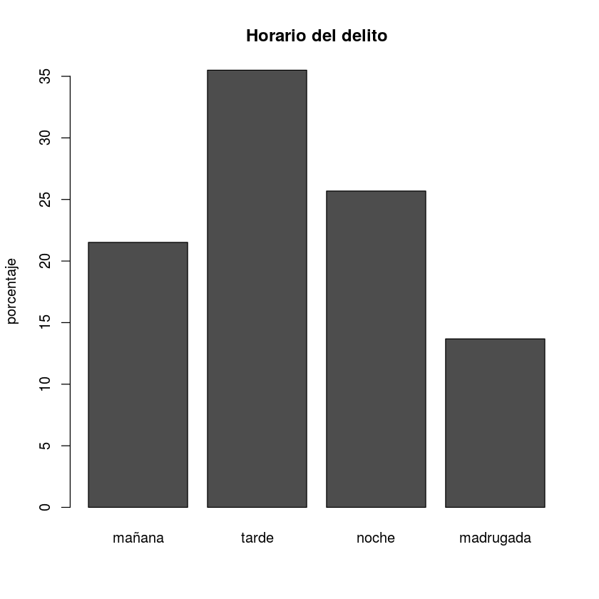
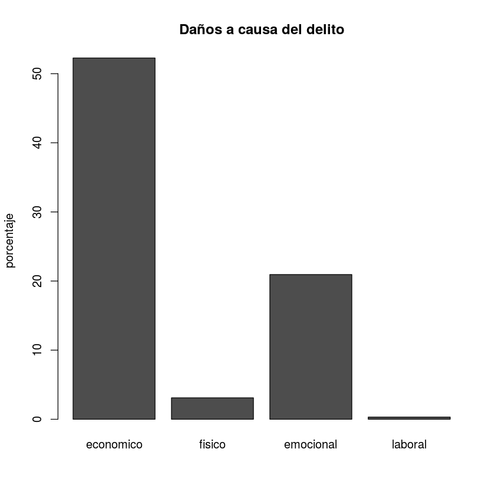
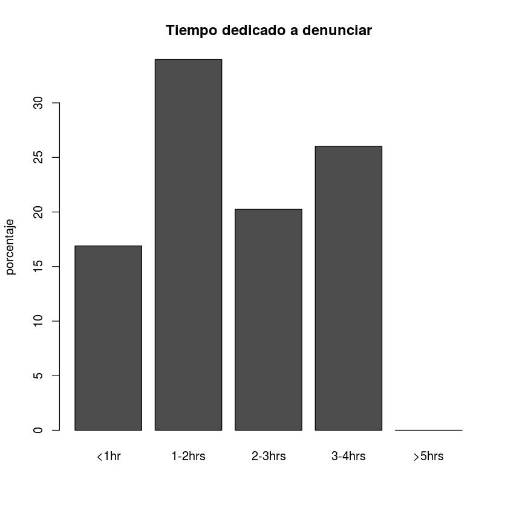
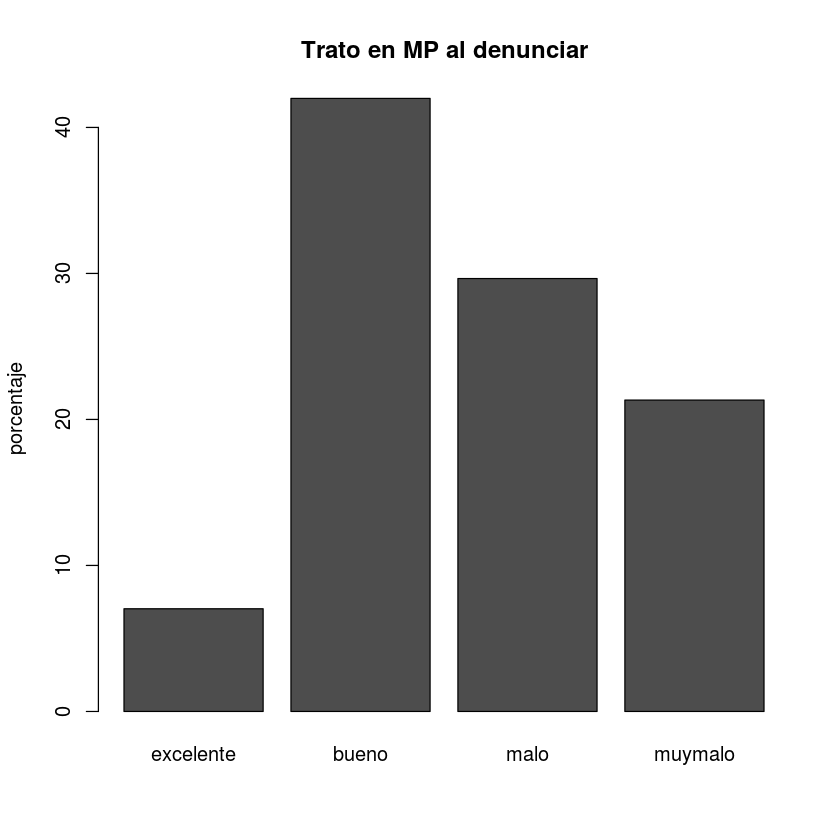

## FICHA TECNICA v1 : ENVIPE III DELITO Y PROCESO DE DENUNCIA

_ROSA MARTHA PERALTA BLANCO_
 
  _INEGI_

### Descripción

El código que se muestra a continuación, muestra el proceso que se le dió a los datos de la _Encuesta Nacional de Victimización y Percepción sobre Seguridad Pública 2017_, en la cual el ciudadano da cuenta del horario del delito y los daños a causa de él; así mismo se proporcionan datos del proceso de denuncia como el tiempo que toma levantarla y el trato recibido.

### Inputs

Debido a que esta tabla se focaliza en las personas, la distribución espacial no se incluye. No obstante, como se observa en la siguiente figura, la tabla con datos de personas se encuentra relacionada con otras que incluyen la distribución espacial, por lo cual deben relacionarse.

<center></center>

La figura muestra el modelo lógico que estructura la base de datos de la ENVIPE, en la cual, las tablas resaltadas con el color rojo representan las bases de datos utilizadas: _TModVic_ contiene los datos necesarios para el análisis, mientras que _TPerVic_ contiene la distribución espacial. En este caso la llave que permite la concatenación es el campo __ID_PER__.

A continuación se agregan las bases de datos correspondientes. La estructura subsecuente, presenta unicamente los campos de la tabla que deben utilizarse:

__TModVic__ :INCLUYE Caracteristicas correspondientes a los delitos captados por el módulo sobre victimización.


```R
delitobase<- read.csv("/home/rosa/Descargas/BASE_DE_DATOS_ENVIPE_2017_en/VI_TMod_Vic.csv")
```

| Campo|| Descripción|| Tipo || Ejemplo |
| --- | --- | --- | --- | --- | --- | --- |
| __ID_PER__  || Identificador de la persona || Texto || "0160114.20.01.01" |
| __BP1_4__  || Horario en que se cometió el delito || Entero || 2 |
| __BP1_33__  || Daño principal sufrido por el delito || Entero || 3 |
| __BP1_27__  || Tiempo ocupado para realizar el trámite de denuncia ante el Ministerio Público || Entero || 3 |
| __BP1_29__  || Trato recibido en la Agencia del Ministerio Público al denunciar || Entero || 4 |

__TPerVic__: INCLUYE Variables que hacen posible la representación espacial


```R
sydesem<- read.csv("/home/rosa/Descargas/BASE_DE_DATOS_ENVIPE_2017_en/IV_TPerVic1.csv")
```

| Campo|| Descripción|| Tipo || Ejemplo |
| --- | --- | --- | --- | --- | --- | --- |
| __CVE_ENT__  || Clave INEGI del Estado || Entero || 1 |
| __CVE_MUN__  || Clave INEGI del Municipio || Entero || 1 |
| __ID_PER__  || Identificador de la persona || Texto || "0100008.01.01.01" |

### Fórmulas sistematizadas
  
  Scripts para convertir la clave INEGI de la entidad de número (1) a texto ("01") y para convertir la clave INEGI del municipio de número (1) a texto ("001")


```R
claveEnt<-function(x) {
  estado<-c()
  for (i in 1:length(CVE_ENT))
  {
    largo<-nchar(CVE_ENT[i])
    if(largo == 1){
      union<-paste("0",CVE_ENT[i], sep= "")
      estado[i]<-rbind(union) }
    else{
      estado[i]<-rbind(CVE_ENT[i]) }
  }
  return(estado)
}

claveMun<-function(x) {
  municipio<-c()
  for (j in 1:length(CVE_MUN))
  {
    largo<-nchar(CVE_MUN[j])
    switch (largo,
            "1" = {union<-paste("00",CVE_MUN[j], sep= "")},
            "2" = {union<-paste("0",CVE_MUN[j], sep= "")},
            "3" = {union<-CVE_MUN[j]}
    )
    municipio[j]<-rbind(union) 
  }
  return(municipio)
}

claveEntMun<-function(x) {
  estmun<-c()
  for (i in 1:length(CVEGEO))
  {
    largo<-nchar(CVEGEO[i])
    if(largo == 4){
      union<-paste("0",CVEGEO[i], sep= "")
      estmun[i]<-rbind(union) }
    else{
      estmun[i]<-rbind(CVEGEO[i]) }
    #if(largo == 1){replace("0",CVE_ENT, sep= "")}
  }
  return(estmun)
}
```

### Preparación de datos
  
  
  1. ___Distribución espacial___: Se prepara la base de georeferencia (sydesem) para crear la clave de concatenación


```R
attach(sydesem)
CVE_ENT<-claveEnt(CVE_ENT) #CONVERSION A TEXTO DE CAMPO
CVE_MUN<-claveMun(CVE_MUN)
CVEGEO<-paste(CVE_ENT,CVE_MUN,sep="")
sydesem3<-data.frame(CVEGEO,NOM_MUN,ID_PER)
detach(sydesem)
head(sydesem3)
```


<table>
<thead><tr><th scope=col>CVEGEO</th><th scope=col>NOM_MUN</th><th scope=col>ID_PER</th></tr></thead>
<tbody>
	<tr><td>01001           </td><td>Aguascalientes  </td><td>0100008.01.01.01</td></tr>
	<tr><td>01001           </td><td>Aguascalientes  </td><td>0100008.02.01.02</td></tr>
	<tr><td>01001           </td><td>Aguascalientes  </td><td>0100008.04.01.01</td></tr>
	<tr><td>01001           </td><td>Aguascalientes  </td><td>0100008.05.01.01</td></tr>
	<tr><td>01001           </td><td>Aguascalientes  </td><td>0100022.01.01.03</td></tr>
	<tr><td>01001           </td><td>Aguascalientes  </td><td>0100022.02.01.01</td></tr>
</tbody>
</table>


  2. ___Datos de personas___: Se prepara la base de victimas para crear la concatenación


```R
attach(delitobase)
delitobase<-data.frame(ID_PER,BP1_4,BP1_33,BP1_27,BP1_29)
detach(delitobase)
head(delitobase)
```


<table>
<thead><tr><th scope=col>ID_PER</th><th scope=col>BP1_4</th><th scope=col>BP1_33</th><th scope=col>BP1_27</th><th scope=col>BP1_29</th></tr></thead>
<tbody>
	<tr><td>0100172.02.01.02</td><td>2               </td><td>3               </td><td>NA              </td><td>NA              </td></tr>
	<tr><td>0100931.01.01.01</td><td>3               </td><td>5               </td><td>NA              </td><td>NA              </td></tr>
	<tr><td>0160114.20.01.01</td><td>2               </td><td>1               </td><td> 3              </td><td> 4              </td></tr>
	<tr><td>0100208.04.01.01</td><td>4               </td><td>1               </td><td>NA              </td><td>NA              </td></tr>
	<tr><td>1409568.04.01.01</td><td>9               </td><td>9               </td><td>NA              </td><td>NA              </td></tr>
	<tr><td>0101929.05.01.04</td><td>9               </td><td>3               </td><td>NA              </td><td>NA              </td></tr>
</tbody>
</table>


  3. ___Join___: Se adjuntan los datos de georeferencia


```R
delitobase<- merge(x = sydesem3, y = delitobase , by = "ID_PER", all = FALSE)
colnames(delitobase)<-c("ID_PER","CVEGEO","NOM_MUN","Horario","Dano","tiempoDen ","tratoMP")
delitobase[is.na(delitobase)]<-0
head(delitobase)
```


<table>
<thead><tr><th scope=col>ID_PER</th><th scope=col>CVEGEO</th><th scope=col>NOM_MUN</th><th scope=col>Horario</th><th scope=col>Dano</th><th scope=col>tiempoDen </th><th scope=col>tratoMP</th></tr></thead>
<tbody>
	<tr><td>0100008.05.01.01</td><td>01001           </td><td>Aguascalientes  </td><td>1               </td><td>3               </td><td>0               </td><td>0               </td></tr>
	<tr><td>0100022.01.01.03</td><td>01001           </td><td>Aguascalientes  </td><td>4               </td><td>1               </td><td>0               </td><td>0               </td></tr>
	<tr><td>0100022.02.01.01</td><td>01001           </td><td>Aguascalientes  </td><td>4               </td><td>1               </td><td>0               </td><td>0               </td></tr>
	<tr><td>0100022.05.01.03</td><td>01001           </td><td>Aguascalientes  </td><td>3               </td><td>1               </td><td>0               </td><td>0               </td></tr>
	<tr><td>0100022.05.01.03</td><td>01001           </td><td>Aguascalientes  </td><td>4               </td><td>1               </td><td>0               </td><td>0               </td></tr>
	<tr><td>0100059.01.01.03</td><td>01001           </td><td>Aguascalientes  </td><td>4               </td><td>1               </td><td>0               </td><td>0               </td></tr>
</tbody>
</table>


### Horario del delito

Se obtiene el procentaje correspondiente al horario en el que sucedió el delito, esta variable tiene las siguientes opciones:
 - __1__ : En la mañana (de 6:01 a 12:00 hrs.)
 - __2__ : En la tarde (de 12:01 a 18:00 hrs.)
 - __3__ : En la noche (de 18:01 a 24:00 hrs.)
 - __4__ : En la madrugada (de 00:01 a 6:00 hrs.)
 - __9__ : No sabe / no responde
 
 Una vez identificados las opciones se procede a eliminar ceros de la variable _Horario_, ya que este valor no se aplica a esta variable, se obtienen los municipios y se crea la tabla contenedor para los horarios. En esta categoría se tienen datos de 650 municipios de 1131, es decir, el 57.47%


```R
delito<-subset(delitobase, delitobase$Horario !=0) 
municipios<-as.character(droplevels.factor(sort(unique(delito$CVEGEO),decreasing = FALSE)))
horario<-data.frame(matrix(0,length(unique(delito$CVEGEO)),9))
colnames(horario)<-c("conca","manana","mananaprc","tarde","tardeprc","noche","nocheprc","madrugada","madrugadaprc")
head(horario)
```


<table>
<thead><tr><th scope=col>conca</th><th scope=col>manana</th><th scope=col>mananaprc</th><th scope=col>tarde</th><th scope=col>tardeprc</th><th scope=col>noche</th><th scope=col>nocheprc</th><th scope=col>madrugada</th><th scope=col>madrugadaprc</th></tr></thead>
<tbody>
	<tr><td>0</td><td>0</td><td>0</td><td>0</td><td>0</td><td>0</td><td>0</td><td>0</td><td>0</td></tr>
	<tr><td>0</td><td>0</td><td>0</td><td>0</td><td>0</td><td>0</td><td>0</td><td>0</td><td>0</td></tr>
	<tr><td>0</td><td>0</td><td>0</td><td>0</td><td>0</td><td>0</td><td>0</td><td>0</td><td>0</td></tr>
	<tr><td>0</td><td>0</td><td>0</td><td>0</td><td>0</td><td>0</td><td>0</td><td>0</td><td>0</td></tr>
	<tr><td>0</td><td>0</td><td>0</td><td>0</td><td>0</td><td>0</td><td>0</td><td>0</td><td>0</td></tr>
	<tr><td>0</td><td>0</td><td>0</td><td>0</td><td>0</td><td>0</td><td>0</td><td>0</td><td>0</td></tr>
</tbody>
</table>


Inicia el loop para obtener el porcentaje de los Horarios

_Funcionamiento_: Se calcula un contador, y el loop evalua el caso de cada municipio, se obtiene el subconjunto de registros de un mismo municipio y se excluyen los valores "cero". El bucle anidado y obtiene los porcentajes de cada horario y excluye en valor "nueve" cono categoría. El condicional indica que si la tabla de porcentajes tiene uno o mas registros el horario y porcentaje sean agregados a la tabla contenedora a partir de las coordenadas indicadas [count, 2*vari] donde el count corresponde a la coordenada de la fila y vari (que es la categoría) a la coordenada de la columna


```R
count<-1
for (x in municipios) 
{
  delito2<-subset(delito[4],delito$CVEGEO==x)
  delito2<-subset(delito2, delito2 !=0)
  
  for (y in 1)
  {
    contador<-as.data.frame(round(prop.table(table(delito2[y]))*100,1))
    contador<-contador[contador$Var1 != 9,]
    
    if (nrow(contador)>=1)
    {
      for (f in 1:nrow(contador))
      {
        vari<-as.numeric(as.character(droplevels.factor(contador$Var1[f])))
        freq<-as.numeric(as.character(droplevels.factor(contador$Freq[f])))
        horario[count,2*vari]<-cbind(vari)
        horario[count,2*vari+1]<-cbind(freq)
      }
    }
  }
  horario[count,1]<-cbind(x)
  count<-count+1
}
head(horario)
```


<table>
<thead><tr><th scope=col>conca</th><th scope=col>manana</th><th scope=col>mananaprc</th><th scope=col>tarde</th><th scope=col>tardeprc</th><th scope=col>noche</th><th scope=col>nocheprc</th><th scope=col>madrugada</th><th scope=col>madrugadaprc</th></tr></thead>
<tbody>
	<tr><td>01001</td><td>1    </td><td>16.3 </td><td>2    </td><td> 27.1</td><td>3    </td><td>25.0 </td><td>4    </td><td>27.3 </td></tr>
	<tr><td>01002</td><td>0    </td><td> 0.0 </td><td>2    </td><td>100.0</td><td>0    </td><td> 0.0 </td><td>0    </td><td> 0.0 </td></tr>
	<tr><td>01003</td><td>1    </td><td> 2.5 </td><td>2    </td><td> 22.5</td><td>3    </td><td>25.0 </td><td>4    </td><td>47.5 </td></tr>
	<tr><td>01004</td><td>0    </td><td> 0.0 </td><td>2    </td><td> 25.0</td><td>3    </td><td>50.0 </td><td>4    </td><td>25.0 </td></tr>
	<tr><td>01005</td><td>1    </td><td>11.1 </td><td>2    </td><td> 32.5</td><td>3    </td><td>21.4 </td><td>4    </td><td>33.3 </td></tr>
	<tr><td>01006</td><td>1    </td><td> 9.1 </td><td>2    </td><td>  9.1</td><td>3    </td><td>36.4 </td><td>4    </td><td>45.5 </td></tr>
</tbody>
</table>


### HISTOGRAMA: Datos Nacionales del Horario de los delitos


```R
horario$indice<-1
histograma<-aggregate(horario[2:9],by=list(horario$indice),FUN = mean)
histograma<-as.matrix(data.frame(histograma$mananaprc,histograma$tardeprc,histograma$nocheprc,histograma$madrugadaprc))
barplot(histograma,main="Horario del delito",ylab = "porcentaje",names.arg = c("mañana","tarde","noche","madrugada"))
horario$indice<-NULL
```





### Daño ocasionado por el delito

Se obtiene el procentaje correspondiente los daños que el delito ocasionó a la persona, donde se tienen las siguientes categorías
 - __1__ : Económico
 - __2__ : Físico
 - __3__ : Emocional o psicológico
 - __4__ : Laboral
 - __5__ : Ninguno 
 - __9__ : No sabe / no responde
 
 Una vez identificados las opciones se procede a eliminar ceros de la variable _Daño_, ya que este valor no se aplica a esta variable, se obtienen los municipios y se crea la tabla contenedor para los daños. En esta categoría se tienen datos de 1085 municipios de 1131, es decir, el 95.93%


```R
delito<-subset(delitobase, delitobase$Dano !=0) #se eliminan ceros ya que este valor no se aplica a esta variable
municipios<-as.character(droplevels.factor(sort(unique(delito$CVEGEO),decreasing = FALSE)))
dano<-data.frame(matrix(0,length(unique(delito$CVEGEO)),9))
colnames(dano)<-c("conca","economico","economicoprc","fisico","fisicoprc","emocional","emocionalprc","laboral","laboralprc")
```

Inicia el loop para obtener el porcentaje de los Daños

_Funcionamiento_: Se calcula un contador; el loop evalua el caso de cada municipio; se obtiene el subconjunto de registros de un mismo municipio y se excluyen los valores "cero". El bucle anidado y obtiene los porcentajes de cada daño y excluye en valor "nueve" cono categoría. El condicional indica que si la tabla de porcentajes tiene uno o mas registros el daño y porcentaje sean agregados a la tabla contenedora a partir de las coordenadas indicadas [count, 2*vari] donde el count corresponde a la coordenada de la fila y vari (que es la categoría) a la coordenada de la columna


```R
count<-1
for (x in municipios)
{
  delito2<-subset(delito[5],delito$CVEGEO==x)
  for (y in 1)
  {
    contador<-as.data.frame(round(prop.table(table(delito2[y]))*100,1))
    contador<-contador[contador$Var1 != 5,]
    contador<-contador[contador$Var1 != 9,]
    if (nrow(contador)>= 1)
    {
      for (f in 1:nrow(contador))
      {
        vari<-as.numeric(as.character(droplevels.factor(contador$Var1[f])))
        freq<-as.numeric(as.character(droplevels.factor(contador$Freq[f])))
        dano[count,2*vari]<-cbind(vari)
        dano[count,2*vari+1]<-cbind(freq)
      }
    }
  }
  dano[count,1]<-cbind(x)
  count<-count+1
}
head(dano)
```


<table>
<thead><tr><th scope=col>conca</th><th scope=col>economico</th><th scope=col>economicoprc</th><th scope=col>fisico</th><th scope=col>fisicoprc</th><th scope=col>emocional</th><th scope=col>emocionalprc</th><th scope=col>laboral</th><th scope=col>laboralprc</th></tr></thead>
<tbody>
	<tr><td>01001</td><td>1    </td><td>60.1 </td><td>2    </td><td>2.7  </td><td>3    </td><td>18.6 </td><td>4    </td><td>0.1  </td></tr>
	<tr><td>01002</td><td>1    </td><td>33.3 </td><td>0    </td><td>0.0  </td><td>3    </td><td>33.3 </td><td>0    </td><td>0.0  </td></tr>
	<tr><td>01003</td><td>1    </td><td>62.5 </td><td>2    </td><td>2.5  </td><td>3    </td><td>15.0 </td><td>0    </td><td>0.0  </td></tr>
	<tr><td>01004</td><td>1    </td><td>50.0 </td><td>0    </td><td>0.0  </td><td>3    </td><td>25.0 </td><td>0    </td><td>0.0  </td></tr>
	<tr><td>01005</td><td>1    </td><td>64.1 </td><td>2    </td><td>3.4  </td><td>3    </td><td>20.5 </td><td>0    </td><td>0.0  </td></tr>
	<tr><td>01006</td><td>1    </td><td>72.7 </td><td>0    </td><td>0.0  </td><td>3    </td><td> 9.1 </td><td>0    </td><td>0.0  </td></tr>
</tbody>
</table>


### HISTOGRAMA: Datos Nacionales del Daño ocasionado por los delitos


```R
dano$indice<-1
histograma<-aggregate(dano[2:9],by=list(dano$indice),FUN = mean)
histograma
histograma<-as.matrix(data.frame(histograma$economicoprc,histograma$fisicoprc,histograma$emocionalprc,histograma$laboralprc))
barplot(histograma,main="Daños a causa del delito",ylab = "porcentaje",names.arg = c("economico","fisico","emocional","laboral"))
dano$indice<-NULL
```


<table>
<thead><tr><th scope=col>Group.1</th><th scope=col>economico</th><th scope=col>economicoprc</th><th scope=col>fisico</th><th scope=col>fisicoprc</th><th scope=col>emocional</th><th scope=col>emocionalprc</th><th scope=col>laboral</th><th scope=col>laboralprc</th></tr></thead>
<tbody>
	<tr><td>1        </td><td>0.9087558</td><td>52.27272 </td><td>0.637788 </td><td>3.1      </td><td>2.211982 </td><td>20.93751 </td><td>0.3207373</td><td>0.318341 </td></tr>
</tbody>
</table>





### Tiempo empleado en denunciar

Se obtiene el procentaje correspondiente al tiempo que se ocpó para levantar una denuncia, donde se tienen las siguientes categorías
 - __1__ : Menos de 1 hora
 - __2__ : De 1 a 2 horas
 - __3__ : De 2 a 3 horas
 - __4__ : De 3 a 4 horas
 - __5__ : Más de 4 horas 
 - __9__ : No sabe / no responde
 
Una vez identificados las opciones se procede a obtiener los municipios y se crea la tabla contenedor para el tiempo. En esta categoría se tienen datos de 1085 municipios de 1131, es decir, el 95.93%


```R
delito<-subset(delitobase, delitobase$`tiempoDen ` !=0) #se eliminan ceros ya que este valor no se aplica a esta variable
municipios<-as.character(droplevels.factor(sort(unique(delito$CVEGEO),decreasing = FALSE)))
tiempo<-data.frame(matrix(0,length(unique(delito$CVEGEO)),11))
colnames(tiempo)<-c("conca","menos1h","menos1hprc","de1-2h","de1-2hprc","de2-3h","de2-3hprc","de3-4h","de3-4hprc","mas5h","mas5hprc")
count<-1
```

Inicia el loop para obtener el porcentaje del Tiempo empleado en la denuncia

_Funcionamiento_: Se calcula un contador; el loop evalua el caso de cada municipio; se obtiene el subconjunto de registros de un mismo municipio y se excluyen los valores "cero". El bucle anidado y obtiene los porcentajes de cada daño y excluye en valor "nueve" como categoría. El condicional indica que si la tabla de porcentajes tiene uno o mas registros el Tiempo y porcentaje sean agregados a la tabla contenedora a partir de las coordenadas indicadas [count, 2*vari] donde el count corresponde a la coordenada de la fila y vari (que es la categoría) a la coordenada de la columna


```R
#ELABORAR TABULADO CON VALORES DEL TIEMPO EMPLEADO EN DENUNCIA
for (x in municipios)  
{
  delito2<-subset(delito[6],delito$CVEGEO==x)
  for (y in 1)
  {
    contador<-as.data.frame(round(prop.table(table(delito2[y]))*100,1))
    contador<-contador[contador$Var1 != 9,]
    
    if (nrow(contador)>= 1)
    {
      for (f in 1:nrow(contador))
      {
        vari<-as.numeric(as.character(droplevels.factor(contador$Var1[f])))
        freq<-as.numeric(as.character(droplevels.factor(contador$Freq[f])))
        tiempo[count,2*vari]<-cbind(vari)
        tiempo[count,2*vari+1]<-cbind(freq)
      }
    }
  }
  tiempo[count,1]<-cbind(x)
  count<-count+1
}
head(tiempo)
```


<table>
<thead><tr><th scope=col>conca</th><th scope=col>menos1h</th><th scope=col>menos1hprc</th><th scope=col>de1-2h</th><th scope=col>de1-2hprc</th><th scope=col>de2-3h</th><th scope=col>de2-3hprc</th><th scope=col>de3-4h</th><th scope=col>de3-4hprc</th><th scope=col>mas5h</th><th scope=col>mas5hprc</th></tr></thead>
<tbody>
	<tr><td>01001</td><td>1    </td><td> 11.9</td><td>2    </td><td>29.4 </td><td>3    </td><td>22.9 </td><td>4    </td><td>28.4 </td><td>0    </td><td>0    </td></tr>
	<tr><td>01002</td><td>1    </td><td>100.0</td><td>0    </td><td> 0.0 </td><td>0    </td><td> 0.0 </td><td>0    </td><td> 0.0 </td><td>0    </td><td>0    </td></tr>
	<tr><td>01003</td><td>0    </td><td>  0.0</td><td>2    </td><td>66.7 </td><td>0    </td><td> 0.0 </td><td>4    </td><td>33.3 </td><td>0    </td><td>0    </td></tr>
	<tr><td>01005</td><td>1    </td><td>  7.7</td><td>2    </td><td>30.8 </td><td>3    </td><td> 7.7 </td><td>4    </td><td>53.8 </td><td>0    </td><td>0    </td></tr>
	<tr><td>01007</td><td>1    </td><td> 14.3</td><td>2    </td><td>42.9 </td><td>3    </td><td>28.6 </td><td>4    </td><td>14.3 </td><td>0    </td><td>0    </td></tr>
	<tr><td>01009</td><td>1    </td><td>100.0</td><td>0    </td><td> 0.0 </td><td>0    </td><td> 0.0 </td><td>0    </td><td> 0.0 </td><td>0    </td><td>0    </td></tr>
</tbody>
</table>


### HISTOGRAMA: Datos Nacionales del Tiempo empleado en realizar denuncias


```R
tiempo$indice<-1
histograma<-aggregate(tiempo[2:11],by=list(tiempo$indice),FUN = mean)
histograma<-as.matrix(data.frame(histograma$menos1hprc,histograma$`de1-2hprc`,histograma$`de2-3hprc`,histograma$`de3-4hprc`,histograma$mas5hprc))
histograma
barplot(histograma,main="Tiempo dedicado a denunciar",ylab = "porcentaje",names.arg = c("<1hr","1-2hrs","2-3hrs","3-4hrs",">5hrs"))
tiempo$indice<-NULL
```


<table>
<thead><tr><th scope=col>histograma.menos1hprc</th><th scope=col>histograma..de1.2hprc.</th><th scope=col>histograma..de2.3hprc.</th><th scope=col>histograma..de3.4hprc.</th><th scope=col>histograma.mas5hprc</th></tr></thead>
<tbody>
	<tr><td>16.892  </td><td>33.97246</td><td>20.24754</td><td>26.02185</td><td>0       </td></tr>
</tbody>
</table>





### Trato recibido al denunciar

Se obtiene el porcentaje correspondiente al trato que se recibió por parte de las autoridades al momento de  levantar una denuncia, donde se tienen las siguientes categorías
 - __1__ : Excelente
 - __2__ : Bueno
 - __3__ : Malo
 - __4__ : Muy malo
 - __9__ : No sabe / no responde
 
Una vez identificados las opciones se procede a obtener los municipios y se crea la tabla contenedor para el trato. En esta categoría se tienen datos de 650 municipios de 1131, es decir, el 57.47%


```R
delito<-subset(delitobase, delitobase$tratoMP !=0) #se eliminan ceros ya que este valor no se aplica a esta variable
municipios<-as.character(droplevels.factor(sort(unique(delito$CVEGEO),decreasing = FALSE)))
trato<-data.frame(matrix(0,length(unique(delito$CVEGEO)),9))
colnames(trato)<-c("conca","excelente","excelenteprc","bueno","buenoprc","malo","maloprc","muymalo","muymaloprc")
count<-1
```

Inicia el loop para obtener el porcentaje del trato recibido en la denuncia

_Funcionamiento_: Se calcula un contador; el loop evalua el caso de cada municipio; se obtiene el subconjunto de registros de un mismo municipio y se excluyen los valores "cero". El condicional indica que si la tabla de porcentajes tiene uno o mas registros el Tiempo y porcentaje sean agregados a la tabla contenedora a partir de las coordenadas indicadas [count, 2*vari] donde el count corresponde a la coordenada de la fila y vari (que es la categoría) a la coordenada de la columna


```R
for (x in municipios)
{
  delito2<-subset(delito[7],delito$CVEGEO==x)
  for (y in 1)
  {
    contador<-as.data.frame(round(prop.table(table(delito2[y]))*100,1))
    
    if (nrow(contador)>= 1)
    {
      for (f in 1:nrow(contador))
      {
        vari<-as.numeric(as.character(droplevels.factor(contador$Var1[f])))
        freq<-as.numeric(as.character(droplevels.factor(contador$Freq[f])))
        trato[count,2*vari]<-cbind(vari)
        trato[count,2*vari+1]<-cbind(freq)
      }
    }
  }
  trato[count,1]<-cbind(x)
  count<-count+1
}
head(trato)
```


<table>
<thead><tr><th scope=col>conca</th><th scope=col>excelente</th><th scope=col>excelenteprc</th><th scope=col>bueno</th><th scope=col>buenoprc</th><th scope=col>malo</th><th scope=col>maloprc</th><th scope=col>muymalo</th><th scope=col>muymaloprc</th></tr></thead>
<tbody>
	<tr><td>01001</td><td>1    </td><td> 2.8 </td><td>2    </td><td> 48.6</td><td>3    </td><td>30.3 </td><td>4    </td><td> 18.3</td></tr>
	<tr><td>01002</td><td>0    </td><td> 0.0 </td><td>2    </td><td>100.0</td><td>0    </td><td> 0.0 </td><td>0    </td><td>  0.0</td></tr>
	<tr><td>01003</td><td>0    </td><td> 0.0 </td><td>2    </td><td> 16.7</td><td>3    </td><td>16.7 </td><td>4    </td><td> 66.7</td></tr>
	<tr><td>01005</td><td>0    </td><td> 0.0 </td><td>2    </td><td> 30.8</td><td>3    </td><td>61.5 </td><td>4    </td><td>  7.7</td></tr>
	<tr><td>01007</td><td>1    </td><td>14.3 </td><td>2    </td><td> 71.4</td><td>3    </td><td>14.3 </td><td>0    </td><td>  0.0</td></tr>
	<tr><td>01009</td><td>0    </td><td> 0.0 </td><td>0    </td><td>  0.0</td><td>0    </td><td> 0.0 </td><td>4    </td><td>100.0</td></tr>
</tbody>
</table>


### HISTOGRAMA: Datos Nacionales del trato recibido al denunciar


```R
trato$indice<-1
histograma<-aggregate(trato[2:9],by=list(trato$indice),FUN = mean)
histograma
histograma<-as.matrix(data.frame(histograma$excelenteprc,histograma$buenoprc,histograma$maloprc,histograma$muymaloprc))
barplot(histograma,main="Trato en MP al denunciar",ylab = "porcentaje",names.arg = c("excelente","bueno","malo","muymalo"))
trato$indice<-NULL
```


<table>
<thead><tr><th scope=col>Group.1</th><th scope=col>excelente</th><th scope=col>excelenteprc</th><th scope=col>bueno</th><th scope=col>buenoprc</th><th scope=col>malo</th><th scope=col>maloprc</th><th scope=col>muymalo</th><th scope=col>muymaloprc</th></tr></thead>
<tbody>
	<tr><td>1        </td><td>0.2276923</td><td>7.034615 </td><td>1.369231 </td><td>41.98754 </td><td>1.749231 </td><td>29.65077 </td><td>1.907692 </td><td>21.32708 </td></tr>
</tbody>
</table>





### JOIN Y OUTPUT DE DATOS OBTENIDOS

Finalmente se elaboran los joins correspondientes


```R
envipeIII<-merge(x =horario, y = dano, by = "conca", all = TRUE)
envipeIII<-merge(x =envipeIII, y = tiempo, by = "conca", all = TRUE)
envipeIII<-merge(x =envipeIII, y = trato, by = "conca", all = TRUE)
envipeIII[is.na(envipeIII)]<- 0
head(envipeIII)
```


<table>
<thead><tr><th scope=col>conca</th><th scope=col>manana</th><th scope=col>mananaprc</th><th scope=col>tarde</th><th scope=col>tardeprc</th><th scope=col>noche</th><th scope=col>nocheprc</th><th scope=col>madrugada</th><th scope=col>madrugadaprc</th><th scope=col>economico</th><th scope=col>⋯</th><th scope=col>mas5h</th><th scope=col>mas5hprc</th><th scope=col>excelente</th><th scope=col>excelenteprc</th><th scope=col>bueno</th><th scope=col>buenoprc</th><th scope=col>malo</th><th scope=col>maloprc</th><th scope=col>muymalo</th><th scope=col>muymaloprc</th></tr></thead>
<tbody>
	<tr><td>01001</td><td>1    </td><td>16.3 </td><td>2    </td><td> 27.1</td><td>3    </td><td>25.0 </td><td>4    </td><td>27.3 </td><td>1    </td><td>⋯    </td><td>0    </td><td>0    </td><td>1    </td><td>2.8  </td><td>2    </td><td> 48.6</td><td>3    </td><td>30.3 </td><td>4    </td><td>18.3 </td></tr>
	<tr><td>01002</td><td>0    </td><td> 0.0 </td><td>2    </td><td>100.0</td><td>0    </td><td> 0.0 </td><td>0    </td><td> 0.0 </td><td>1    </td><td>⋯    </td><td>0    </td><td>0    </td><td>0    </td><td>0.0  </td><td>2    </td><td>100.0</td><td>0    </td><td> 0.0 </td><td>0    </td><td> 0.0 </td></tr>
	<tr><td>01003</td><td>1    </td><td> 2.5 </td><td>2    </td><td> 22.5</td><td>3    </td><td>25.0 </td><td>4    </td><td>47.5 </td><td>1    </td><td>⋯    </td><td>0    </td><td>0    </td><td>0    </td><td>0.0  </td><td>2    </td><td> 16.7</td><td>3    </td><td>16.7 </td><td>4    </td><td>66.7 </td></tr>
	<tr><td>01004</td><td>0    </td><td> 0.0 </td><td>2    </td><td> 25.0</td><td>3    </td><td>50.0 </td><td>4    </td><td>25.0 </td><td>1    </td><td>⋯    </td><td>0    </td><td>0    </td><td>0    </td><td>0.0  </td><td>0    </td><td>  0.0</td><td>0    </td><td> 0.0 </td><td>0    </td><td> 0.0 </td></tr>
	<tr><td>01005</td><td>1    </td><td>11.1 </td><td>2    </td><td> 32.5</td><td>3    </td><td>21.4 </td><td>4    </td><td>33.3 </td><td>1    </td><td>⋯    </td><td>0    </td><td>0    </td><td>0    </td><td>0.0  </td><td>2    </td><td> 30.8</td><td>3    </td><td>61.5 </td><td>4    </td><td> 7.7 </td></tr>
	<tr><td>01006</td><td>1    </td><td> 9.1 </td><td>2    </td><td>  9.1</td><td>3    </td><td>36.4 </td><td>4    </td><td>45.5 </td><td>1    </td><td>⋯    </td><td>0    </td><td>0    </td><td>0    </td><td>0.0  </td><td>0    </td><td>  0.0</td><td>0    </td><td> 0.0 </td><td>0    </td><td> 0.0 </td></tr>
</tbody>
</table>


### Salva de Output


```R
write.csv(envipeIII, file = "/home/rosa/Descargas/BASE_DE_DATOS_ENVIPE_2017_en/tb/tb-envipeIII.csv", row.names = TRUE)
```
