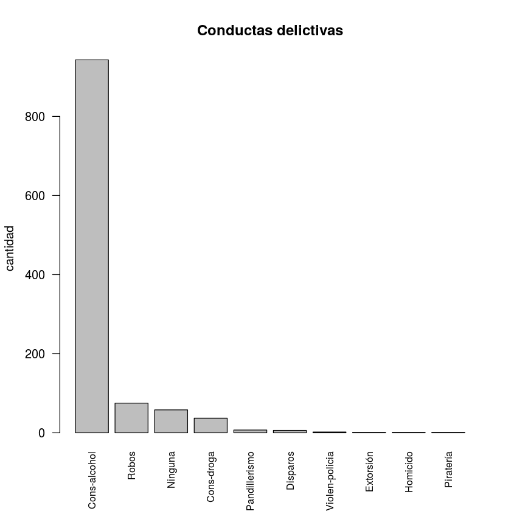
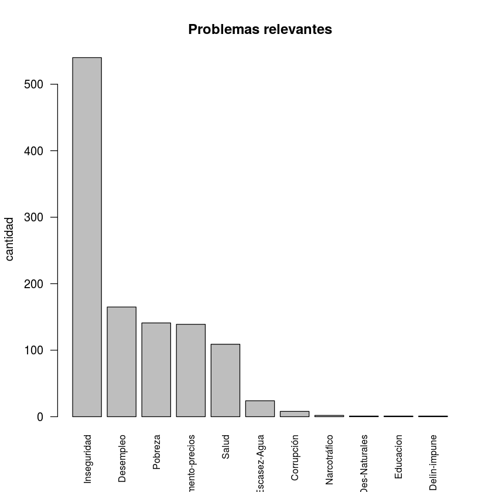
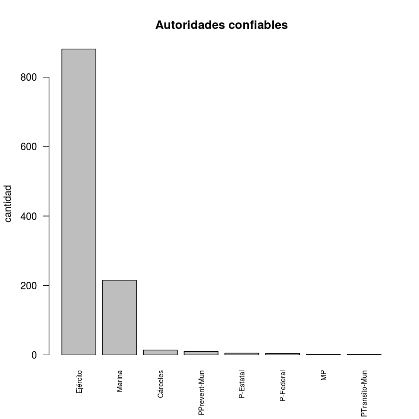

## FICHA TECNICA v1 : ENVIPE II ENTORNO Y AUTORIDADES
 __ROSA MARTHA PERALTA BLANCO__
 
  _INEGI_

### Descripción

El código que se muestra a continuación, contiene el procedimiento bajo el cual se trabajaron los datos correspondientes a los datos de la _Encuesta Nacional de Victimización y Percepción sobre Seguridad Pública 2017_, los cuales tratan la forma en la que el ciudadano percibe su entorno y el trabajo de las autoridades con respecto a temas de seguridad pública.

Las variables con las cuales se trabajó parte de esta sección corresponden a variables cualitativas de contraste, es decir, cuyas respuestas dependen de la interpretación del encuestado con respuestas como _Mucha_, _Alguna_, _Poca_, _Nada_, _No sabe / No responde_.

### Carga de librerías


```R
library(stringr)
library(dplyr)
```

### Inputs

INCLUYE Variables correspondientes a la percepción de seguridad pública y el desempeño institucional. La estructura subsecuente, presenta unicamente los campos de la tabla que deben utilizarse:


```R
sydesem<- read.csv("/home/rosa/Descargas/BASE_DE_DATOS_ENVIPE_2017_en/IV_TPerVic1.csv")
```

Campos de identificación

| Campo|| Descripción|| Tipo || Ejemplo |
| --- | --- | --- | --- | --- | --- | --- |
| __CVE_ENT__  || Clave INEGI del Estado || Entero || 1 |
| __CVE_MUN__  || Clave INEGI del Municipio || Entero || 1 |
| __NOM_MUN__  || Nombre del Municipio || Entero || 1 |
| __ID_PER__  || Identificador de la persona || Texto || "0100008.01.01.01" |

__PREGUNTA__: De los temas que le voy a mostrar, ¿Cuáles son los tres que le preocupan más? __OPCIONES__: __0__ - _No se declaró como opción afirmativa_ y __1__ - _Si_

| Campo|| Descripción|| Tipo || Ejemplo | _Alias de proceso_ |
| --- | --- | --- | --- | --- | --- | --- | --- |
| __AP4_2_01__  || Pobreza || Entero || 0 | _Pobreza_ |
| __AP4_2_02__  || Desempleo || Entero || 1 | _Desempleo_ |
| __AP4_2_03__  || Narcotráfico || Entero || 0 | _Narcotráfico_ |
| __AP4_2_04__  || Aumento de precios || Entero || 0 | _AumentoPrecios_ |
| __AP4_2_05__  || Inseguridad|| Entero || 1 | _Inseguridad_ |
| __AP4_2_06__  || Desastres naturales || Entero || 0 | _DesNaturales_ |
| __AP4_2_07__  || Escasez de agua || Entero || 0 | _EscasezAgua_ |
| __AP4_2_08__  || Corrupción || Entero || 0 | _Corrupcion_ |
| __AP4_2_09__  || Educación|| Entero || 0 | _Educacion_ |
| __AP4_2_10__  || Salud || Entero || 1 | _Salud_ |
| __AP4_2_11__  || Falta de castigo a delincuentes || Entero || 0 | _noCastDel_ |
| __AP4_2_12__  || Otro || Entero || 0 | _Otro_ |
| __AP4_2_99__  || No sabe / no responde || Entero || 0 | _NSNR_ |

__PREGUNTA__: ¿Sabe usted o ha escuchado si en los alrededores de su vivienda suceden o se dan las siguientes situaciones? __OPCIONES__: __0__ - _No se declaró como opción afirmativa_ ; __1__ - _Si_

| Campo|| Descripción|| Tipo || Ejemplo | _Alias de proceso_ |
| --- | --- | --- | --- | --- | --- | --- | --- |
| __AP4_5_01__  || Se consume alcohol en la calle || Entero || 0 | _AlcohConsumo_ |
| __AP4_5_02__  || Existe pandillerismo o bandas violentas || Entero || 0 | _Pandillerismo_ |
| __AP4_5_03__  || Hay riñas entre vecinos || Entero || 0 | _RinaVec_ |
| __AP4_5_04__  || Existe venta ilegal de alcohol || Entero || 0 | _VIleAlc_ |
| __AP4_5_05__  || Se venden productos pirata || Entero || 0 | _Pirateria_ |
| __AP4_5_06__  || Ha habido violencia policiaca contra ciudadanos || Entero || 0 | _ViolPoli_ |
| __AP4_5_07__  || Hay invasión de predios || Entero || 1 | _InvPredio_ |
| __AP4_5_08__  || Se consume droga || Entero || 0 | _DrogaConsumo_ |
| __AP4_5_09__  || Existen robos o asaltos frecuentes|| Entero || 1 | _RobosFrec_ |
| __AP4_5_10__  || Se vende droga  || Entero || 0 | _DrogaVenta_ |
| __AP4_5_11__  || Ha habido disparos frecuentes || Entero || 0 | _Disparos_ |
| __AP4_5_12__  || Hay prostitución || Entero || 0 | _Prostitucion_ |
| __AP4_5_13__  || Ha habido secuestros || Entero || 0 | _Secuestro_ |
| __AP4_5_14__  || Ha habido homicidios || Entero || 0 | _Homicidio_ |
| __AP4_5_15__  || Ha habido extorsiones (o cobro de piso) || Entero || 1 | _Extorsiones_ |
| __AP4_5_16__  || Ninguna || Entero || 0 | _Ninguna_ |
| __AP4_5_99__  || No sabe / no responde || Entero || 0 | _NSNRC_ |

__PREGUNTA__:  ¿Cuánta confianza le inspira la (el) (AUTORIDAD)? (VARIABLE DE CONTRASTE) __OPCIONES__: __0__ - _blanco_ ; __1__ - _Mucha_ ; __2__ - _Algo_ ; __3__ - _Poca_ ; __4__ - _Nada_ ; __9__ - _No sabe / no responde_ ;

| Campo|| Descripción|| Tipo || Ejemplo | _Alias de proceso_ |
| --- | --- | --- | --- | --- | --- | --- | --- |
| __AP5_4_01_C__  || Policía de Tránsito de su Municipio [Tlaxcala (3)] || Entero || 1 | _TransitoMun_ |
| __AP5_4_02_C__  || Policía Preventiva Municipal [DF (3)] || Entero || 2 | _PrevenMun_ |
| __AP5_4_03_C__  || Policía Estatal || Entero || 3 | _PEstatal_ |
| __AP5_4_04_C__  || Policía Federal || Entero || 3 | _PFederal_ |
| __AP5_4_05_C__  || Policía Ministerial o Judicial || Entero || 3 | _PMinistJudi_ |
| __AP5_4_06_C__  || Ministerio Público (MP) y Procuradurías Estatales || Entero || 2 | _MP_ |
| __AP5_4_07_C__  || Procuraduría General de la República (PGR) || Entero || 2 | _PGR_ |
| __AP5_4_08_C__  || Ejército || Entero || 1 | _Ejercito_ |
| __AP5_4_09_C__  || Marina || Entero || 3 | _Marina_ |
| __AP5_4_10_C__  || Jueces || Entero || 0 | _Jueces_ |
| __AP5_8__  || Cárceles y reclusorios || Entero || 3 | _Carceles_ |

__PREGUNTA__:  ¿Qué tan efectivo considera el desempeño de la (del) (AUTORIDAD)? __OPCIONES__: __0__ - _blanco_ ; __1__ - _Muy efectivo_ ; __2__ - _Algo efectivo_ ; __3__ - _Poco efectivo_ ; __4__ - _Nada efectivo_ ; __9__ - _No sabe / no responde_ ;

| Campo|| Descripción|| Tipo || Ejemplo | _Alias de proceso_ |
| --- | --- | --- | --- | --- | --- | --- | --- |
| __AP5_6_01__  || Policía de Tránsito de su Municipio || Entero || 3 | _DesTransitoMun_ |
| __AP5_6_02__  || Existe pandillerismo o bandas violentas || Entero || 2 | _DesPrevenMun_ |
| __AP5_6_03__  || Policía Estatal || Entero || 1 | _DesPEstatal_ |
| __AP5_6_04__  || Policía Federal || Entero || 2 | _DesPFederal_ |
| __AP5_6_05__  || Policía Ministerial o Judicial || Entero || 2 | _DesPMinistJudi_ |
| __AP5_6_06__  || Ministerio Público (MP) y Procuradurías Estatales || Entero || 1 | _DesMP_ |
| __AP5_6_07__  || Procuraduría General de la República (PGR) || Entero || 3 | _DesPGR_ |
| __AP5_6_08__  || Ejército || Entero || 1 | _DesEjercito_ |
| __AP5_6_09__  || Marina|| Entero || 1 | _DesMarina_ |
| __AP5_6_10__  || Jueces || Entero || 2 | _DesJueces_ |

### Fórmulas sistematizadas
  
  Scripts para convertir la clave INEGI de la entidad de número (1) a texto ("01") y para convertir la clave INEGI del municipio de número (1) a texto ("001")


```R
claveEnt<-function(x) {
  estado<-c()
  for (i in 1:length(CVE_ENT))
  {
    largo<-nchar(CVE_ENT[i])
    if(largo == 1){
      union<-paste("0",CVE_ENT[i], sep= "")
      estado[i]<-rbind(union) }
    else{
      estado[i]<-rbind(CVE_ENT[i]) }
  }
  return(estado)
}

claveMun<-function(x) {
  municipio<-c()
  for (j in 1:length(CVE_MUN))
  {
    largo<-nchar(CVE_MUN[j])
    switch (largo,
            "1" = {union<-paste("00",CVE_MUN[j], sep= "")},
            "2" = {union<-paste("0",CVE_MUN[j], sep= "")},
            "3" = {union<-CVE_MUN[j]}
    )
    municipio[j]<-rbind(union) 
  }
  return(municipio)
}

claveEntMun<-function(x) {
  estmun<-c()
  for (i in 1:length(CVEGEO))
  {
    largo<-nchar(CVEGEO[i])
    if(largo == 4){
      union<-paste("0",CVEGEO[i], sep= "")
      estmun[i]<-rbind(union) }
    else{
      estmun[i]<-rbind(CVEGEO[i]) }
    #if(largo == 1){replace("0",CVE_ENT, sep= "")}
  }
  return(estmun)
}
```

### Preparación de datos
  
  
  1. ___Estados y Municipios___: Se prepara la base para crear la clave ce concatenación y se eligen los campos a trabajar


```R
attach(sydesem)
CVE_ENT<-claveEnt(CVE_ENT) #CONVERSION A TEXTO DE CAMPO
CVE_MUN<-claveMun(CVE_MUN)
CVEGEO<-paste(CVE_ENT,CVE_MUN,sep="")
sydesem<-data.frame(CVEGEO,NOM_MUN,AP4_2_01,AP4_2_02,AP4_2_03,AP4_2_04,AP4_2_05,AP4_2_06,AP4_2_07,AP4_2_08,AP4_2_09,AP4_2_10,AP4_2_11,AP4_2_12,AP4_2_99,AP4_5_01,AP4_5_02,AP4_5_03,AP4_5_04,AP4_5_05,AP4_5_06,AP4_5_07,AP4_5_08,AP4_5_09,AP4_5_10,AP4_5_11,AP4_5_12,AP4_5_13,AP4_5_14,AP4_5_15,AP4_5_16,AP4_5_99,AP5_4_01_C,AP5_4_02_C,AP5_4_03_C,AP5_4_04_C,AP5_4_05_C,AP5_4_06_C,AP5_4_07_C,AP5_4_08_C,AP5_4_09_C,AP5_4_10_C,AP5_8,AP5_6_01,AP5_6_02,AP5_6_03,AP5_6_04,AP5_6_05,AP5_6_06,AP5_6_07,AP5_6_08,AP5_6_09,AP5_6_10,ID_PER)
colnames(sydesem)<-c("CVEGEO","NOM_MUN","Pobreza","Desempleo","Narcotráfico ","AumentoPrecios","Inseguridad","DesNaturales","EscasezAgua","Corrupcion","Educacion","Salud","noCastDel","Otro","NSNR","AlcohConsumo","Pandillerismo","RinaVec","VIleAlc","Pirateria","ViolPoli","InvPredio","DrogaConsumo","RobosFrec","DrogaVenta","Disparos","Prostitucion","Secuestro","Homicidio","Extorsiones","Ninguna","NSNRC","TransitoMun","PrevenMun","PEstatal","PFederal","PMinistJudi","MP","PGR","Ejercito","Marina","Jueces","Carceles","DesTransitoMun","DesPrevenMun","DesPEstatal","DesPFederal","DesPMinistJudi","DesMP","DesPGR","DesEjercito","DesMarina","DesJueces","ID_PER")
sydesem[is.na(sydesem)]<-0
detach(sydesem)
head(sydesem)
```

    The following objects are masked from sydesem (pos = 3):
    
        ID_PER, NOM_MUN
    


<table>
<thead><tr><th scope=col>CVEGEO</th><th scope=col>NOM_MUN</th><th scope=col>Pobreza</th><th scope=col>Desempleo</th><th scope=col>Narcotráfico </th><th scope=col>AumentoPrecios</th><th scope=col>Inseguridad</th><th scope=col>DesNaturales</th><th scope=col>EscasezAgua</th><th scope=col>Corrupcion</th><th scope=col>⋯</th><th scope=col>DesPrevenMun</th><th scope=col>DesPEstatal</th><th scope=col>DesPFederal</th><th scope=col>DesPMinistJudi</th><th scope=col>DesMP</th><th scope=col>DesPGR</th><th scope=col>DesEjercito</th><th scope=col>DesMarina</th><th scope=col>DesJueces</th><th scope=col>ID_PER</th></tr></thead>
<tbody>
	<tr><td>01001           </td><td>Aguascalientes  </td><td>0               </td><td>1               </td><td>0               </td><td>0               </td><td>1               </td><td>0               </td><td>0               </td><td>0               </td><td>⋯               </td><td>3               </td><td>3               </td><td>3               </td><td>4               </td><td>3               </td><td>3               </td><td>3               </td><td>0               </td><td>4               </td><td>0100008.01.01.01</td></tr>
	<tr><td>01001           </td><td>Aguascalientes  </td><td>1               </td><td>0               </td><td>0               </td><td>0               </td><td>1               </td><td>0               </td><td>0               </td><td>1               </td><td>⋯               </td><td>2               </td><td>2               </td><td>2               </td><td>2               </td><td>2               </td><td>2               </td><td>1               </td><td>1               </td><td>2               </td><td>0100008.02.01.02</td></tr>
	<tr><td>01001           </td><td>Aguascalientes  </td><td>1               </td><td>0               </td><td>0               </td><td>1               </td><td>0               </td><td>0               </td><td>0               </td><td>0               </td><td>⋯               </td><td>1               </td><td>0               </td><td>0               </td><td>0               </td><td>0               </td><td>0               </td><td>1               </td><td>2               </td><td>0               </td><td>0100008.04.01.01</td></tr>
	<tr><td>01001           </td><td>Aguascalientes  </td><td>0               </td><td>0               </td><td>0               </td><td>0               </td><td>0               </td><td>0               </td><td>0               </td><td>1               </td><td>⋯               </td><td>3               </td><td>2               </td><td>1               </td><td>1               </td><td>1               </td><td>1               </td><td>1               </td><td>1               </td><td>2               </td><td>0100008.05.01.01</td></tr>
	<tr><td>01001           </td><td>Aguascalientes  </td><td>0               </td><td>0               </td><td>0               </td><td>1               </td><td>0               </td><td>0               </td><td>0               </td><td>1               </td><td>⋯               </td><td>2               </td><td>2               </td><td>2               </td><td>2               </td><td>0               </td><td>3               </td><td>1               </td><td>0               </td><td>0               </td><td>0100022.01.01.03</td></tr>
	<tr><td>01001           </td><td>Aguascalientes  </td><td>0               </td><td>0               </td><td>1               </td><td>1               </td><td>1               </td><td>0               </td><td>0               </td><td>0               </td><td>⋯               </td><td>0               </td><td>2               </td><td>3               </td><td>0               </td><td>3               </td><td>2               </td><td>2               </td><td>1               </td><td>2               </td><td>0100022.02.01.01</td></tr>
</tbody>
</table>


### Conductas delictivas y Problemas relevantes

Se obtienen datos de _Problemas relevantes_ y _Conductas delictivas_ al contar el total de respuestas "SI" para cada opción por municipio


```R
sydesem2<-aggregate(sydesem[3:32], by=list(CVEGEO), FUN=sum)
head(sydesem2)
```


<table>
<thead><tr><th scope=col>Group.1</th><th scope=col>Pobreza</th><th scope=col>Desempleo</th><th scope=col>Narcotráfico </th><th scope=col>AumentoPrecios</th><th scope=col>Inseguridad</th><th scope=col>DesNaturales</th><th scope=col>EscasezAgua</th><th scope=col>Corrupcion</th><th scope=col>Educacion</th><th scope=col>⋯</th><th scope=col>DrogaConsumo</th><th scope=col>RobosFrec</th><th scope=col>DrogaVenta</th><th scope=col>Disparos</th><th scope=col>Prostitucion</th><th scope=col>Secuestro</th><th scope=col>Homicidio</th><th scope=col>Extorsiones</th><th scope=col>Ninguna</th><th scope=col>NSNRC</th></tr></thead>
<tbody>
	<tr><td>01001</td><td>294  </td><td>432  </td><td>262  </td><td>451  </td><td>808  </td><td>35   </td><td>165  </td><td>401  </td><td>259  </td><td>⋯    </td><td>654  </td><td>688  </td><td>434  </td><td>94   </td><td>120  </td><td>56   </td><td>149  </td><td>134  </td><td>164  </td><td>12   </td></tr>
	<tr><td>01002</td><td>  4  </td><td> 12  </td><td>  2  </td><td> 12  </td><td>  7  </td><td> 1   </td><td>  2  </td><td>  8  </td><td>  4  </td><td>⋯    </td><td> 14  </td><td>  8  </td><td> 12  </td><td> 1   </td><td>  4  </td><td> 1   </td><td>  1  </td><td>  2  </td><td>  3  </td><td> 0   </td></tr>
	<tr><td>01003</td><td> 30  </td><td> 27  </td><td> 24  </td><td> 38  </td><td> 49  </td><td> 2   </td><td> 12  </td><td> 26  </td><td> 14  </td><td>⋯    </td><td> 54  </td><td> 47  </td><td> 43  </td><td> 4   </td><td> 13  </td><td> 5   </td><td>  3  </td><td>  4  </td><td> 19  </td><td> 1   </td></tr>
	<tr><td>01004</td><td>  7  </td><td> 10  </td><td>  5  </td><td>  8  </td><td>  9  </td><td> 1   </td><td>  3  </td><td>  3  </td><td>  3  </td><td>⋯    </td><td>  6  </td><td>  6  </td><td>  5  </td><td> 0   </td><td>  0  </td><td> 0   </td><td>  0  </td><td>  0  </td><td>  4  </td><td> 1   </td></tr>
	<tr><td>01005</td><td> 52  </td><td> 49  </td><td> 38  </td><td> 60  </td><td>117  </td><td> 7   </td><td> 36  </td><td> 50  </td><td> 39  </td><td>⋯    </td><td>107  </td><td>102  </td><td> 85  </td><td>17   </td><td> 28  </td><td> 9   </td><td> 27  </td><td> 20  </td><td> 21  </td><td> 1   </td></tr>
	<tr><td>01006</td><td>  8  </td><td> 13  </td><td>  9  </td><td> 13  </td><td> 30  </td><td> 0   </td><td>  4  </td><td> 11  </td><td> 10  </td><td>⋯    </td><td> 22  </td><td> 26  </td><td> 17  </td><td> 0   </td><td>  2  </td><td> 1   </td><td>  1  </td><td>  3  </td><td>  4  </td><td> 0   </td></tr>
</tbody>
</table>


Inicia el loop para obtener los tres Problemas y Conductas mas frecuentes.

_Funcionamiento_: Se proporcionan las variables contenedor, se elige la fila correspondiente a un municipio, donde se obtiene para ambas temáticas: 
  1. Nombre del Problema o Conducta
  2. Valor maximo del Problema o Conducta
  3. Posición en la tabla del maximo del Problema o Conducta

Estos valores se agregan en un texto para acumular el valor de cada municipio, se alojan en un dataframe y posteriormente el valor maximo se vuelve cero para que en el proximo loop se detecte el segundo con mayor cantidad.

Finalmente esta cadena se desfragmenta para obtener un data frame con los valores ya mencionados


```R
top_prob<-data.frame(matrix(NA,1,1))
top_cond<-data.frame(matrix(NA,1,1))
for (x in 1:nrow(sydesem2))
{
  municipio<-sydesem2[x,]
  conca<-municipio[1]
  
  td_prob<-data.frame(matrix(NA,1,3))
  td_cond<-data.frame(matrix(NA,1,3))
  for (y in 1:3)
  {
    problemas <-data.frame(max(municipio[2:14]),which.max(municipio[2:14])) #which.max da la posición del elemento pedido
    problemas <-data.frame(rownames(problemas),problemas)
    colnames(problemas)<-c("problema","encuestas","posicion")
    problemas<-paste(problemas$problema,problemas$encuestas,sep="-")
    td_prob[y]<-cbind(problemas)
    municipio[which.max(municipio[2:14])+1]<-0
    
    conductas <-data.frame(max(municipio[15:31]),which.max(municipio[15:31])) #which.max da la posición delelemento pedido
    conductas <-data.frame(rownames(conductas),conductas)  
    colnames(conductas)<-c("conducta","encuestas","posicion")
    conductas<-paste(conductas$conducta,conductas$encuestas,sep="-")
    td_cond[y]<-cbind(conductas)
    municipio[which.max(municipio[15:31])+14]<-0
  }
  td_prob<-paste(conca,td_prob$X1,td_prob$X2,td_prob$X3,sep="-")
  td_cond<-paste(conca,td_cond$X1,td_cond$X2,td_cond$X3,sep="-")
  
  top_prob[x]<-rbind(td_prob)
  top_cond[x]<-rbind(td_cond)
}
top_prob<-data.frame(str_split_fixed(top_prob,"-",7))
top_cond<-data.frame(str_split_fixed(top_cond,"-",7))
colnames(top_prob)<-c("conca","prob1","prob1Num","prob2","prob2Num","prob3","prob3Num")
colnames(top_cond)<-c("conca","cond1","cond1Num","cond2","cond2Num","cond3","cond3Num")

head(top_prob)
head(top_cond)
```


<table>
<thead><tr><th scope=col>conca</th><th scope=col>prob1</th><th scope=col>prob1Num</th><th scope=col>prob2</th><th scope=col>prob2Num</th><th scope=col>prob3</th><th scope=col>prob3Num</th></tr></thead>
<tbody>
	<tr><td>01001         </td><td>Inseguridad   </td><td>808           </td><td>AumentoPrecios</td><td>451           </td><td>Desempleo     </td><td>432           </td></tr>
	<tr><td>01002         </td><td>Desempleo     </td><td>12            </td><td>AumentoPrecios</td><td>12            </td><td>Corrupcion    </td><td>8             </td></tr>
	<tr><td>01003         </td><td>Inseguridad   </td><td>49            </td><td>AumentoPrecios</td><td>38            </td><td>Salud         </td><td>31            </td></tr>
	<tr><td>01004         </td><td>Desempleo     </td><td>10            </td><td>Inseguridad   </td><td>9             </td><td>AumentoPrecios</td><td>8             </td></tr>
	<tr><td>01005         </td><td>Inseguridad   </td><td>117           </td><td>AumentoPrecios</td><td>60            </td><td>Pobreza       </td><td>52            </td></tr>
	<tr><td>01006         </td><td>Inseguridad   </td><td>30            </td><td>Salud         </td><td>18            </td><td>Desempleo     </td><td>13            </td></tr>
</tbody>
</table>


<table>
<thead><tr><th scope=col>conca</th><th scope=col>cond1</th><th scope=col>cond1Num</th><th scope=col>cond2</th><th scope=col>cond2Num</th><th scope=col>cond3</th><th scope=col>cond3Num</th></tr></thead>
<tbody>
	<tr><td>01001       </td><td>RobosFrec   </td><td>688         </td><td>AlcohConsumo</td><td>677         </td><td>DrogaConsumo</td><td>654         </td></tr>
	<tr><td>01002       </td><td>AlcohConsumo</td><td>16          </td><td>DrogaConsumo</td><td>14          </td><td>DrogaVenta  </td><td>12          </td></tr>
	<tr><td>01003       </td><td>DrogaConsumo</td><td>54          </td><td>AlcohConsumo</td><td>52          </td><td>RobosFrec   </td><td>47          </td></tr>
	<tr><td>01004       </td><td>AlcohConsumo</td><td>14          </td><td>DrogaConsumo</td><td>6           </td><td>RobosFrec   </td><td>6           </td></tr>
	<tr><td>01005       </td><td>DrogaConsumo</td><td>107         </td><td>AlcohConsumo</td><td>106         </td><td>RobosFrec   </td><td>102         </td></tr>
	<tr><td>01006       </td><td>RobosFrec   </td><td>26          </td><td>DrogaConsumo</td><td>22          </td><td>AlcohConsumo</td><td>18          </td></tr>
</tbody>
</table>


### HISTOGRAMA: Conductas delictivas y Problemas relevantes


```R
histograma<-top_cond[2:3]
histograma<-table(histograma$cond1)
histograma<-as.data.frame(histograma)
histograma<-histograma[order(-histograma$Freq),]
barplot(histograma$Freq,main="Conductas delictivas",ylab = "cantidad",names.arg = c("Cons-alcohol","Robos","Ninguna","Cons-droga","Pandillerismo","Disparos","Violen-policia","Extorsión","Homicido","Piratería"),cex.names=0.8, las=2)

histograma<-top_prob[2:3]
histograma<-table(histograma$prob1)
histograma<-as.data.frame(histograma)
histograma<-histograma[order(-histograma$Freq),]
barplot(histograma$Freq,main="Problemas relevantes",ylab = "cantidad",names.arg = c("Inseguridad","Desempleo","Pobreza","Aumento-precios","Salud","Escasez-Agua","Corrupción","Narcotráfico","Des-Naturales","Educacion","Delin-impune"),cex.names=0.8, las=2)
```








### Confianza y desempeño en las autoridades

Se obtienen datos de _Confianza_ y _Desempeño_ de las autoridades al obtener la autoridad con el mayor porcentaje de respuestas positivas disponibles para cada municipio. Para ello, el proceso se divide en dos

  1. __Se elabora un data frame con los valores de mayor confianza de cada autoridad, es decir, se obtiene la mejor calificación de cada autoridad__

Inicio del loop para obtener la mejor calificacion y porcentaje de cada autoridad

__Funcionamiento__: Se elabora una base de datos contenedor, obtener un subconjunto de las variables del tema actual, y evaluar el caso de cada municipio. El proceso del loop consiste en obtener la mejor calificación con el procentaje respectivo de cada autoridad qye trabaja en el municipio.

Al final del proceso se obtendrá un tabulado con la las mejores calificaciones de todas las autoridades que trabajan en el municipio. En la tabla, los campos con terminación __K__ corresponden a la calificación y con __N__ corresponden al porcentaje


```R
confianza<-data.frame(matrix(NA,1,1))
count<-0
municipios<-as.character(droplevels.factor(sort(unique(sydesem$CVEGEO),decreasing = FALSE)))

#ELABORAR TABULADO CON VALORES DE MAYOR CONFIANZA
for (x in municipios)
{
  count<-count+1
  sydesem2<-subset(sydesem[33:43],sydesem$CVEGEO==x)
  nombres<-colnames(sydesem2)
  td<-data.frame(matrix(NA,1,1))
  for (y in 1:ncol(sydesem2)) #recorre la fila
  {
    contador<-as.data.frame(round(prop.table(table(sydesem2[y]))*100,1))
    if (contador$Var1[1]==0) # Cuando la primera fila es 0
    {
      reg<-paste(contador$Var1[2],contador$Freq[2],sep="-")
      td[y]<-cbind(reg)
    } 
    else
    {
      reg<-paste(contador$Var1[1],contador$Freq[1],sep="-")
      td[y]<-cbind(reg)
    }
  }
  td<-paste(x,td$matrix.NA..1..1.,td$V2,td$V3,td$V4,td$V5,td$V6,td$V7,td$V8,td$V9,td$V10,td$V11,sep="-")
  confianza[count]<-rbind(td)
}

confianza<-data.frame(str_split_fixed(confianza,"-",23))
confianza[is.na(confianza)]<-0 #confianza
colnames(confianza)<-c("conca","TransitoMunK","TransitoMunN","PrevenMunK","PrevenMunN","PEstatalK","PEstatalN","PFederalK","PFederalN","PMinistJudiK","PMinistJudiN","MPK","MPN","PGRK","PGRN","EjercitoK","EjercitoN","MarinaK","MarinaN","JuecesK","JuecesN","CarcelesK","CarcelesN")
head(confianza)
```


<table>
<thead><tr><th scope=col>conca</th><th scope=col>TransitoMunK</th><th scope=col>TransitoMunN</th><th scope=col>PrevenMunK</th><th scope=col>PrevenMunN</th><th scope=col>PEstatalK</th><th scope=col>PEstatalN</th><th scope=col>PFederalK</th><th scope=col>PFederalN</th><th scope=col>PMinistJudiK</th><th scope=col>⋯</th><th scope=col>PGRK</th><th scope=col>PGRN</th><th scope=col>EjercitoK</th><th scope=col>EjercitoN</th><th scope=col>MarinaK</th><th scope=col>MarinaN</th><th scope=col>JuecesK</th><th scope=col>JuecesN</th><th scope=col>CarcelesK</th><th scope=col>CarcelesN</th></tr></thead>
<tbody>
	<tr><td>01001</td><td>1    </td><td>9.5  </td><td>1    </td><td>8.3  </td><td>1    </td><td>13.2 </td><td>1    </td><td>16.8 </td><td>1    </td><td>⋯    </td><td>1    </td><td>7.2  </td><td>1    </td><td>52.2 </td><td>1    </td><td>35.6 </td><td>1    </td><td>5.8  </td><td>1    </td><td>8.7  </td></tr>
	<tr><td>01002</td><td>1    </td><td>9.1  </td><td>1    </td><td>13.6 </td><td>1    </td><td>22.7 </td><td>1    </td><td>9.1  </td><td>1    </td><td>⋯    </td><td>1    </td><td>13.6 </td><td>1    </td><td>45.5 </td><td>1    </td><td>18.2 </td><td>1    </td><td>4.5  </td><td>1    </td><td>13.6 </td></tr>
	<tr><td>01003</td><td>1    </td><td>4.1  </td><td>1    </td><td>9.3  </td><td>1    </td><td>15.5 </td><td>1    </td><td>10.3 </td><td>1    </td><td>⋯    </td><td>1    </td><td>7.2  </td><td>1    </td><td>43.3 </td><td>1    </td><td>10.3 </td><td>1    </td><td>6.2  </td><td>1    </td><td>12.4 </td></tr>
	<tr><td>01004</td><td>2    </td><td>10   </td><td>1    </td><td>5    </td><td>1    </td><td>15   </td><td>1    </td><td>15   </td><td>4    </td><td>⋯    </td><td>3    </td><td>5    </td><td>1    </td><td>35   </td><td>1    </td><td>10   </td><td>2    </td><td>10   </td><td>1    </td><td>5    </td></tr>
	<tr><td>01005</td><td>1    </td><td>7.1  </td><td>1    </td><td>10.3 </td><td>1    </td><td>16.3 </td><td>1    </td><td>13.6 </td><td>1    </td><td>⋯    </td><td>1    </td><td>7.6  </td><td>1    </td><td>46.7 </td><td>1    </td><td>35.3 </td><td>1    </td><td>6    </td><td>1    </td><td>10.9 </td></tr>
	<tr><td>01006</td><td>1    </td><td>4.8  </td><td>1    </td><td>11.9 </td><td>1    </td><td>7.1  </td><td>1    </td><td>16.7 </td><td>1    </td><td>⋯    </td><td>1    </td><td>9.5  </td><td>1    </td><td>35.7 </td><td>1    </td><td>26.2 </td><td>1    </td><td>11.9 </td><td>1    </td><td>9.5  </td></tr>
</tbody>
</table>


  2. __Se obtienen las tres primeras autoridades con la mejor calificación y porcentaje__
  
  Para ello se dividen los datos obtenidos en dos tablas: una con la categoría (calificación) y otra con el porcentaje. 
  
  Inicio del loop para obtener las tres mejores autoridades

__Funcionamiento__: Se elabora una base de datos contenedor, se crea un dataframe donde en la primera columna se representa la autoridad, y en la segunda el porcentaje respectivo, se ordenan de forma descendente, se eligen los tres primeros registros, se agrupan en un texto para registrarlo y posteriormente se subdivide


```R
categoria<-data.frame(confianza$conca,confianza$TransitoMunK,confianza$PrevenMunK,confianza$PEstatalK,confianza$PFederalK,confianza$PMinistJudiK,confianza$MPK,confianza$PGRK,confianza$EjercitoK,confianza$MarinaK,confianza$JuecesK,confianza$CarcelesK)
colnames(categoria)<-c("conca","TransitoMun","PrevenMun","PEstatal","PFederal","PMinistJudi","MP","PGR","Ejercito","Marina","Jueces","Carceles")
porcentaje<-data.frame(confianza$conca,confianza$TransitoMunN,confianza$PrevenMunN,confianza$PEstatalN,confianza$PFederalN,confianza$PMinistJudiN,confianza$MPN,confianza$PGRN,confianza$EjercitoN,confianza$MarinaN,confianza$JuecesN,confianza$CarcelesN)
colnames(porcentaje)<-c("conca","TransitoMun","PrevenMun","PEstatal","PFederal","PMinistJudi","MP","PGR","Ejercito","Marina","Jueces","Carceles")

top_confianza<-data.frame(matrix(NA,1,1))
for (x in 1:nrow(categoria))
{
  municipioC<-categoria[x,]
  municipioP<-porcentaje[x,]
  conca<-as.character(as.matrix(municipioC[1]))
  td<-data.frame(matrix(NA,1,1))
  
  municipioC<-as.data.frame(t(as.matrix(municipioC[2:12])))
  municipioC<-data.frame(rownames(municipioC),as.numeric(as.character(as.matrix(municipioC))))
  municipioP<-as.data.frame(t(as.matrix(municipioP[2:12])))
  municipioP<-data.frame(rownames(municipioP),as.numeric(as.character(as.matrix(municipioP))))
  colnames(municipioC)<-c("autoridad","opinion")
  colnames(municipioP)<-c("autoridad","porcentaje")
  
  union<-merge(x=municipioC, y=municipioP, by='autoridad')
  union<-arrange(union,by_group=union$opinion,desc(union$porcentaje))
  reg<-paste(conca,union$autoridad[1],union$opinion[1],union$porcentaje[1],union$autoridad[2],union$opinion[2],union$porcentaje[2],union$autoridad[3],union$opinion[3],union$porcentaje[3],sep="-")
  top_confianza[x]<-rbind(reg)
}
top_confianza<-data.frame(str_split_fixed(top_confianza,"-",10))
colnames(top_confianza)<-c("conca","aut1","aut1opi","aut1pct","aut2","aut2opi","aut2pct","aut3","aut3opi","aut3pct")
head(top_confianza)
```

    Warning message:
    “package ‘bindrcpp’ was built under R version 3.4.4”Warning message in data.frame(rownames(municipioC), as.numeric(as.character(as.matrix(municipioC)))):
    “NAs introducidos por coerción”Warning message in data.frame(rownames(municipioP), as.numeric(as.character(as.matrix(municipioP)))):
    “NAs introducidos por coerción”Warning message in data.frame(rownames(municipioC), as.numeric(as.character(as.matrix(municipioC)))):
    “NAs introducidos por coerción”Warning message in data.frame(rownames(municipioP), as.numeric(as.character(as.matrix(municipioP)))):
    “NAs introducidos por coerción”Warning message in data.frame(rownames(municipioC), as.numeric(as.character(as.matrix(municipioC)))):
    “NAs introducidos por coerción”Warning message in data.frame(rownames(municipioP), as.numeric(as.character(as.matrix(municipioP)))):
    “NAs introducidos por coerción”Warning message in data.frame(rownames(municipioC), as.numeric(as.character(as.matrix(municipioC)))):
    “NAs introducidos por coerción”Warning message in data.frame(rownames(municipioP), as.numeric(as.character(as.matrix(municipioP)))):
    “NAs introducidos por coerción”Warning message in data.frame(rownames(municipioC), as.numeric(as.character(as.matrix(municipioC)))):
    “NAs introducidos por coerción”Warning message in data.frame(rownames(municipioP), as.numeric(as.character(as.matrix(municipioP)))):
    “NAs introducidos por coerción”Warning message in data.frame(rownames(municipioC), as.numeric(as.character(as.matrix(municipioC)))):
    “NAs introducidos por coerción”Warning message in data.frame(rownames(municipioP), as.numeric(as.character(as.matrix(municipioP)))):
    “NAs introducidos por coerción”Warning message in data.frame(rownames(municipioC), as.numeric(as.character(as.matrix(municipioC)))):
    “NAs introducidos por coerción”Warning message in data.frame(rownames(municipioP), as.numeric(as.character(as.matrix(municipioP)))):
    “NAs introducidos por coerción”Warning message in data.frame(rownames(municipioC), as.numeric(as.character(as.matrix(municipioC)))):
    “NAs introducidos por coerción”Warning message in data.frame(rownames(municipioP), as.numeric(as.character(as.matrix(municipioP)))):
    “NAs introducidos por coerción”Warning message in data.frame(rownames(municipioC), as.numeric(as.character(as.matrix(municipioC)))):
    “NAs introducidos por coerción”Warning message in data.frame(rownames(municipioP), as.numeric(as.character(as.matrix(municipioP)))):
    “NAs introducidos por coerción”Warning message in data.frame(rownames(municipioC), as.numeric(as.character(as.matrix(municipioC)))):
    “NAs introducidos por coerción”Warning message in data.frame(rownames(municipioP), as.numeric(as.character(as.matrix(municipioP)))):
    “NAs introducidos por coerción”Warning message in data.frame(rownames(municipioC), as.numeric(as.character(as.matrix(municipioC)))):
    “NAs introducidos por coerción”Warning message in data.frame(rownames(municipioP), as.numeric(as.character(as.matrix(municipioP)))):
    “NAs introducidos por coerción”Warning message in data.frame(rownames(municipioC), as.numeric(as.character(as.matrix(municipioC)))):
    “NAs introducidos por coerción”Warning message in data.frame(rownames(municipioP), as.numeric(as.character(as.matrix(municipioP)))):
    “NAs introducidos por coerción”Warning message in data.frame(rownames(municipioC), as.numeric(as.character(as.matrix(municipioC)))):
    “NAs introducidos por coerción”Warning message in data.frame(rownames(municipioP), as.numeric(as.character(as.matrix(municipioP)))):
    “NAs introducidos por coerción”Warning message in data.frame(rownames(municipioC), as.numeric(as.character(as.matrix(municipioC)))):
    “NAs introducidos por coerción”Warning message in data.frame(rownames(municipioP), as.numeric(as.character(as.matrix(municipioP)))):
    “NAs introducidos por coerción”Warning message in data.frame(rownames(municipioC), as.numeric(as.character(as.matrix(municipioC)))):
    “NAs introducidos por coerción”Warning message in data.frame(rownames(municipioP), as.numeric(as.character(as.matrix(municipioP)))):
    “NAs introducidos por coerción”Warning message in data.frame(rownames(municipioC), as.numeric(as.character(as.matrix(municipioC)))):
    “NAs introducidos por coerción”Warning message in data.frame(rownames(municipioP), as.numeric(as.character(as.matrix(municipioP)))):
    “NAs introducidos por coerción”Warning message in data.frame(rownames(municipioC), as.numeric(as.character(as.matrix(municipioC)))):
    “NAs introducidos por coerción”Warning message in data.frame(rownames(municipioP), as.numeric(as.character(as.matrix(municipioP)))):
    “NAs introducidos por coerción”Warning message in data.frame(rownames(municipioC), as.numeric(as.character(as.matrix(municipioC)))):
    “NAs introducidos por coerción”Warning message in data.frame(rownames(municipioP), as.numeric(as.character(as.matrix(municipioP)))):
    “NAs introducidos por coerción”Warning message in data.frame(rownames(municipioC), as.numeric(as.character(as.matrix(municipioC)))):
    “NAs introducidos por coerción”Warning message in data.frame(rownames(municipioP), as.numeric(as.character(as.matrix(municipioP)))):
    “NAs introducidos por coerción”Warning message in data.frame(rownames(municipioC), as.numeric(as.character(as.matrix(municipioC)))):
    “NAs introducidos por coerción”Warning message in data.frame(rownames(municipioP), as.numeric(as.character(as.matrix(municipioP)))):
    “NAs introducidos por coerción”Warning message in data.frame(rownames(municipioC), as.numeric(as.character(as.matrix(municipioC)))):
    “NAs introducidos por coerción”Warning message in data.frame(rownames(municipioP), as.numeric(as.character(as.matrix(municipioP)))):
    “NAs introducidos por coerción”Warning message in data.frame(rownames(municipioC), as.numeric(as.character(as.matrix(municipioC)))):
    “NAs introducidos por coerción”Warning message in data.frame(rownames(municipioP), as.numeric(as.character(as.matrix(municipioP)))):
    “NAs introducidos por coerción”Warning message in data.frame(rownames(municipioC), as.numeric(as.character(as.matrix(municipioC)))):
    “NAs introducidos por coerción”Warning message in data.frame(rownames(municipioP), as.numeric(as.character(as.matrix(municipioP)))):
    “NAs introducidos por coerción”Warning message in data.frame(rownames(municipioC), as.numeric(as.character(as.matrix(municipioC)))):
    “NAs introducidos por coerción”Warning message in data.frame(rownames(municipioP), as.numeric(as.character(as.matrix(municipioP)))):
    “NAs introducidos por coerción”Warning message in data.frame(rownames(municipioC), as.numeric(as.character(as.matrix(municipioC)))):
    “NAs introducidos por coerción”Warning message in data.frame(rownames(municipioP), as.numeric(as.character(as.matrix(municipioP)))):
    “NAs introducidos por coerción”Warning message in data.frame(rownames(municipioC), as.numeric(as.character(as.matrix(municipioC)))):
    “NAs introducidos por coerción”Warning message in data.frame(rownames(municipioP), as.numeric(as.character(as.matrix(municipioP)))):
    “NAs introducidos por coerción”Warning message in data.frame(rownames(municipioC), as.numeric(as.character(as.matrix(municipioC)))):
    “NAs introducidos por coerción”Warning message in data.frame(rownames(municipioP), as.numeric(as.character(as.matrix(municipioP)))):
    “NAs introducidos por coerción”Warning message in data.frame(rownames(municipioC), as.numeric(as.character(as.matrix(municipioC)))):
    “NAs introducidos por coerción”Warning message in data.frame(rownames(municipioP), as.numeric(as.character(as.matrix(municipioP)))):
    “NAs introducidos por coerción”Warning message in data.frame(rownames(municipioC), as.numeric(as.character(as.matrix(municipioC)))):
    “NAs introducidos por coerción”Warning message in data.frame(rownames(municipioP), as.numeric(as.character(as.matrix(municipioP)))):
    “NAs introducidos por coerción”Warning message in data.frame(rownames(municipioC), as.numeric(as.character(as.matrix(municipioC)))):
    “NAs introducidos por coerción”Warning message in data.frame(rownames(municipioP), as.numeric(as.character(as.matrix(municipioP)))):
    “NAs introducidos por coerción”Warning message in data.frame(rownames(municipioC), as.numeric(as.character(as.matrix(municipioC)))):
    “NAs introducidos por coerción”Warning message in data.frame(rownames(municipioP), as.numeric(as.character(as.matrix(municipioP)))):
    “NAs introducidos por coerción”Warning message in data.frame(rownames(municipioC), as.numeric(as.character(as.matrix(municipioC)))):
    “NAs introducidos por coerción”Warning message in data.frame(rownames(municipioP), as.numeric(as.character(as.matrix(municipioP)))):
    “NAs introducidos por coerción”Warning message in data.frame(rownames(municipioC), as.numeric(as.character(as.matrix(municipioC)))):
    “NAs introducidos por coerción”Warning message in data.frame(rownames(municipioP), as.numeric(as.character(as.matrix(municipioP)))):
    “NAs introducidos por coerción”Warning message in data.frame(rownames(municipioC), as.numeric(as.character(as.matrix(municipioC)))):
    “NAs introducidos por coerción”Warning message in data.frame(rownames(municipioP), as.numeric(as.character(as.matrix(municipioP)))):
    “NAs introducidos por coerción”Warning message in data.frame(rownames(municipioC), as.numeric(as.character(as.matrix(municipioC)))):
    “NAs introducidos por coerción”Warning message in data.frame(rownames(municipioP), as.numeric(as.character(as.matrix(municipioP)))):
    “NAs introducidos por coerción”Warning message in data.frame(rownames(municipioC), as.numeric(as.character(as.matrix(municipioC)))):
    “NAs introducidos por coerción”Warning message in data.frame(rownames(municipioP), as.numeric(as.character(as.matrix(municipioP)))):
    “NAs introducidos por coerción”Warning message in data.frame(rownames(municipioC), as.numeric(as.character(as.matrix(municipioC)))):
    “NAs introducidos por coerción”Warning message in data.frame(rownames(municipioP), as.numeric(as.character(as.matrix(municipioP)))):
    “NAs introducidos por coerción”Warning message in data.frame(rownames(municipioC), as.numeric(as.character(as.matrix(municipioC)))):
    “NAs introducidos por coerción”Warning message in data.frame(rownames(municipioP), as.numeric(as.character(as.matrix(municipioP)))):
    “NAs introducidos por coerción”Warning message in data.frame(rownames(municipioC), as.numeric(as.character(as.matrix(municipioC)))):
    “NAs introducidos por coerción”Warning message in data.frame(rownames(municipioP), as.numeric(as.character(as.matrix(municipioP)))):
    “NAs introducidos por coerción”Warning message in data.frame(rownames(municipioC), as.numeric(as.character(as.matrix(municipioC)))):
    “NAs introducidos por coerción”Warning message in data.frame(rownames(municipioP), as.numeric(as.character(as.matrix(municipioP)))):
    “NAs introducidos por coerción”Warning message in data.frame(rownames(municipioC), as.numeric(as.character(as.matrix(municipioC)))):
    “NAs introducidos por coerción”Warning message in data.frame(rownames(municipioP), as.numeric(as.character(as.matrix(municipioP)))):
    “NAs introducidos por coerción”Warning message in data.frame(rownames(municipioC), as.numeric(as.character(as.matrix(municipioC)))):
    “NAs introducidos por coerción”Warning message in data.frame(rownames(municipioP), as.numeric(as.character(as.matrix(municipioP)))):
    “NAs introducidos por coerción”Warning message in data.frame(rownames(municipioC), as.numeric(as.character(as.matrix(municipioC)))):
    “NAs introducidos por coerción”Warning message in data.frame(rownames(municipioP), as.numeric(as.character(as.matrix(municipioP)))):
    “NAs introducidos por coerción”Warning message in data.frame(rownames(municipioC), as.numeric(as.character(as.matrix(municipioC)))):
    “NAs introducidos por coerción”Warning message in data.frame(rownames(municipioP), as.numeric(as.character(as.matrix(municipioP)))):
    “NAs introducidos por coerción”Warning message in data.frame(rownames(municipioC), as.numeric(as.character(as.matrix(municipioC)))):
    “NAs introducidos por coerción”Warning message in data.frame(rownames(municipioP), as.numeric(as.character(as.matrix(municipioP)))):
    “NAs introducidos por coerción”Warning message in data.frame(rownames(municipioC), as.numeric(as.character(as.matrix(municipioC)))):
    “NAs introducidos por coerción”Warning message in data.frame(rownames(municipioP), as.numeric(as.character(as.matrix(municipioP)))):
    “NAs introducidos por coerción”Warning message in data.frame(rownames(municipioC), as.numeric(as.character(as.matrix(municipioC)))):
    “NAs introducidos por coerción”Warning message in data.frame(rownames(municipioP), as.numeric(as.character(as.matrix(municipioP)))):
    “NAs introducidos por coerción”Warning message in data.frame(rownames(municipioC), as.numeric(as.character(as.matrix(municipioC)))):
    “NAs introducidos por coerción”Warning message in data.frame(rownames(municipioP), as.numeric(as.character(as.matrix(municipioP)))):
    “NAs introducidos por coerción”Warning message in data.frame(rownames(municipioC), as.numeric(as.character(as.matrix(municipioC)))):
    “NAs introducidos por coerción”Warning message in data.frame(rownames(municipioP), as.numeric(as.character(as.matrix(municipioP)))):
    “NAs introducidos por coerción”Warning message in data.frame(rownames(municipioC), as.numeric(as.character(as.matrix(municipioC)))):
    “NAs introducidos por coerción”Warning message in data.frame(rownames(municipioP), as.numeric(as.character(as.matrix(municipioP)))):
    “NAs introducidos por coerción”Warning message in data.frame(rownames(municipioC), as.numeric(as.character(as.matrix(municipioC)))):
    “NAs introducidos por coerción”Warning message in data.frame(rownames(municipioP), as.numeric(as.character(as.matrix(municipioP)))):
    “NAs introducidos por coerción”Warning message in data.frame(rownames(municipioC), as.numeric(as.character(as.matrix(municipioC)))):
    “NAs introducidos por coerción”Warning message in data.frame(rownames(municipioP), as.numeric(as.character(as.matrix(municipioP)))):
    “NAs introducidos por coerción”Warning message in data.frame(rownames(municipioC), as.numeric(as.character(as.matrix(municipioC)))):
    “NAs introducidos por coerción”Warning message in data.frame(rownames(municipioP), as.numeric(as.character(as.matrix(municipioP)))):
    “NAs introducidos por coerción”Warning message in data.frame(rownames(municipioC), as.numeric(as.character(as.matrix(municipioC)))):
    “NAs introducidos por coerción”Warning message in data.frame(rownames(municipioP), as.numeric(as.character(as.matrix(municipioP)))):
    “NAs introducidos por coerción”Warning message in data.frame(rownames(municipioC), as.numeric(as.character(as.matrix(municipioC)))):
    “NAs introducidos por coerción”Warning message in data.frame(rownames(municipioP), as.numeric(as.character(as.matrix(municipioP)))):
    “NAs introducidos por coerción”Warning message in data.frame(rownames(municipioC), as.numeric(as.character(as.matrix(municipioC)))):
    “NAs introducidos por coerción”Warning message in data.frame(rownames(municipioP), as.numeric(as.character(as.matrix(municipioP)))):
    “NAs introducidos por coerción”Warning message in data.frame(rownames(municipioC), as.numeric(as.character(as.matrix(municipioC)))):
    “NAs introducidos por coerción”Warning message in data.frame(rownames(municipioP), as.numeric(as.character(as.matrix(municipioP)))):
    “NAs introducidos por coerción”Warning message in data.frame(rownames(municipioC), as.numeric(as.character(as.matrix(municipioC)))):
    “NAs introducidos por coerción”Warning message in data.frame(rownames(municipioP), as.numeric(as.character(as.matrix(municipioP)))):
    “NAs introducidos por coerción”Warning message in data.frame(rownames(municipioC), as.numeric(as.character(as.matrix(municipioC)))):
    “NAs introducidos por coerción”Warning message in data.frame(rownames(municipioP), as.numeric(as.character(as.matrix(municipioP)))):
    “NAs introducidos por coerción”Warning message in data.frame(rownames(municipioC), as.numeric(as.character(as.matrix(municipioC)))):
    “NAs introducidos por coerción”Warning message in data.frame(rownames(municipioP), as.numeric(as.character(as.matrix(municipioP)))):
    “NAs introducidos por coerción”Warning message in data.frame(rownames(municipioC), as.numeric(as.character(as.matrix(municipioC)))):
    “NAs introducidos por coerción”Warning message in data.frame(rownames(municipioP), as.numeric(as.character(as.matrix(municipioP)))):
    “NAs introducidos por coerción”Warning message in data.frame(rownames(municipioC), as.numeric(as.character(as.matrix(municipioC)))):
    “NAs introducidos por coerción”Warning message in data.frame(rownames(municipioP), as.numeric(as.character(as.matrix(municipioP)))):
    “NAs introducidos por coerción”Warning message in data.frame(rownames(municipioC), as.numeric(as.character(as.matrix(municipioC)))):
    “NAs introducidos por coerción”Warning message in data.frame(rownames(municipioP), as.numeric(as.character(as.matrix(municipioP)))):
    “NAs introducidos por coerción”Warning message in data.frame(rownames(municipioC), as.numeric(as.character(as.matrix(municipioC)))):
    “NAs introducidos por coerción”Warning message in data.frame(rownames(municipioP), as.numeric(as.character(as.matrix(municipioP)))):
    “NAs introducidos por coerción”Warning message in data.frame(rownames(municipioC), as.numeric(as.character(as.matrix(municipioC)))):
    “NAs introducidos por coerción”Warning message in data.frame(rownames(municipioP), as.numeric(as.character(as.matrix(municipioP)))):
    “NAs introducidos por coerción”Warning message in data.frame(rownames(municipioC), as.numeric(as.character(as.matrix(municipioC)))):
    “NAs introducidos por coerción”Warning message in data.frame(rownames(municipioP), as.numeric(as.character(as.matrix(municipioP)))):
    “NAs introducidos por coerción”Warning message in data.frame(rownames(municipioC), as.numeric(as.character(as.matrix(municipioC)))):
    “NAs introducidos por coerción”Warning message in data.frame(rownames(municipioP), as.numeric(as.character(as.matrix(municipioP)))):
    “NAs introducidos por coerción”Warning message in data.frame(rownames(municipioC), as.numeric(as.character(as.matrix(municipioC)))):
    “NAs introducidos por coerción”Warning message in data.frame(rownames(municipioP), as.numeric(as.character(as.matrix(municipioP)))):
    “NAs introducidos por coerción”Warning message in data.frame(rownames(municipioC), as.numeric(as.character(as.matrix(municipioC)))):
    “NAs introducidos por coerción”Warning message in data.frame(rownames(municipioP), as.numeric(as.character(as.matrix(municipioP)))):
    “NAs introducidos por coerción”Warning message in data.frame(rownames(municipioC), as.numeric(as.character(as.matrix(municipioC)))):
    “NAs introducidos por coerción”Warning message in data.frame(rownames(municipioP), as.numeric(as.character(as.matrix(municipioP)))):
    “NAs introducidos por coerción”Warning message in data.frame(rownames(municipioC), as.numeric(as.character(as.matrix(municipioC)))):
    “NAs introducidos por coerción”Warning message in data.frame(rownames(municipioP), as.numeric(as.character(as.matrix(municipioP)))):
    “NAs introducidos por coerción”Warning message in data.frame(rownames(municipioC), as.numeric(as.character(as.matrix(municipioC)))):
    “NAs introducidos por coerción”Warning message in data.frame(rownames(municipioP), as.numeric(as.character(as.matrix(municipioP)))):
    “NAs introducidos por coerción”Warning message in data.frame(rownames(municipioC), as.numeric(as.character(as.matrix(municipioC)))):
    “NAs introducidos por coerción”Warning message in data.frame(rownames(municipioP), as.numeric(as.character(as.matrix(municipioP)))):
    “NAs introducidos por coerción”Warning message in data.frame(rownames(municipioC), as.numeric(as.character(as.matrix(municipioC)))):
    “NAs introducidos por coerción”Warning message in data.frame(rownames(municipioP), as.numeric(as.character(as.matrix(municipioP)))):
    “NAs introducidos por coerción”Warning message in data.frame(rownames(municipioC), as.numeric(as.character(as.matrix(municipioC)))):
    “NAs introducidos por coerción”Warning message in data.frame(rownames(municipioP), as.numeric(as.character(as.matrix(municipioP)))):
    “NAs introducidos por coerción”Warning message in data.frame(rownames(municipioC), as.numeric(as.character(as.matrix(municipioC)))):
    “NAs introducidos por coerción”Warning message in data.frame(rownames(municipioP), as.numeric(as.character(as.matrix(municipioP)))):
    “NAs introducidos por coerción”Warning message in data.frame(rownames(municipioC), as.numeric(as.character(as.matrix(municipioC)))):
    “NAs introducidos por coerción”Warning message in data.frame(rownames(municipioP), as.numeric(as.character(as.matrix(municipioP)))):
    “NAs introducidos por coerción”Warning message in data.frame(rownames(municipioC), as.numeric(as.character(as.matrix(municipioC)))):
    “NAs introducidos por coerción”Warning message in data.frame(rownames(municipioP), as.numeric(as.character(as.matrix(municipioP)))):
    “NAs introducidos por coerción”Warning message in data.frame(rownames(municipioC), as.numeric(as.character(as.matrix(municipioC)))):
    “NAs introducidos por coerción”Warning message in data.frame(rownames(municipioP), as.numeric(as.character(as.matrix(municipioP)))):
    “NAs introducidos por coerción”Warning message in data.frame(rownames(municipioC), as.numeric(as.character(as.matrix(municipioC)))):
    “NAs introducidos por coerción”Warning message in data.frame(rownames(municipioP), as.numeric(as.character(as.matrix(municipioP)))):
    “NAs introducidos por coerción”Warning message in data.frame(rownames(municipioC), as.numeric(as.character(as.matrix(municipioC)))):
    “NAs introducidos por coerción”Warning message in data.frame(rownames(municipioP), as.numeric(as.character(as.matrix(municipioP)))):
    “NAs introducidos por coerción”Warning message in data.frame(rownames(municipioC), as.numeric(as.character(as.matrix(municipioC)))):
    “NAs introducidos por coerción”Warning message in data.frame(rownames(municipioP), as.numeric(as.character(as.matrix(municipioP)))):
    “NAs introducidos por coerción”Warning message in data.frame(rownames(municipioC), as.numeric(as.character(as.matrix(municipioC)))):
    “NAs introducidos por coerción”Warning message in data.frame(rownames(municipioP), as.numeric(as.character(as.matrix(municipioP)))):
    “NAs introducidos por coerción”Warning message in data.frame(rownames(municipioC), as.numeric(as.character(as.matrix(municipioC)))):
    “NAs introducidos por coerción”Warning message in data.frame(rownames(municipioP), as.numeric(as.character(as.matrix(municipioP)))):
    “NAs introducidos por coerción”Warning message in data.frame(rownames(municipioC), as.numeric(as.character(as.matrix(municipioC)))):
    “NAs introducidos por coerción”Warning message in data.frame(rownames(municipioP), as.numeric(as.character(as.matrix(municipioP)))):
    “NAs introducidos por coerción”Warning message in data.frame(rownames(municipioC), as.numeric(as.character(as.matrix(municipioC)))):
    “NAs introducidos por coerción”Warning message in data.frame(rownames(municipioP), as.numeric(as.character(as.matrix(municipioP)))):
    “NAs introducidos por coerción”Warning message in data.frame(rownames(municipioC), as.numeric(as.character(as.matrix(municipioC)))):
    “NAs introducidos por coerción”Warning message in data.frame(rownames(municipioP), as.numeric(as.character(as.matrix(municipioP)))):
    “NAs introducidos por coerción”Warning message in data.frame(rownames(municipioC), as.numeric(as.character(as.matrix(municipioC)))):
    “NAs introducidos por coerción”Warning message in data.frame(rownames(municipioP), as.numeric(as.character(as.matrix(municipioP)))):
    “NAs introducidos por coerción”Warning message in data.frame(rownames(municipioC), as.numeric(as.character(as.matrix(municipioC)))):
    “NAs introducidos por coerción”Warning message in data.frame(rownames(municipioP), as.numeric(as.character(as.matrix(municipioP)))):
    “NAs introducidos por coerción”Warning message in data.frame(rownames(municipioC), as.numeric(as.character(as.matrix(municipioC)))):
    “NAs introducidos por coerción”Warning message in data.frame(rownames(municipioP), as.numeric(as.character(as.matrix(municipioP)))):
    “NAs introducidos por coerción”Warning message in data.frame(rownames(municipioC), as.numeric(as.character(as.matrix(municipioC)))):
    “NAs introducidos por coerción”Warning message in data.frame(rownames(municipioP), as.numeric(as.character(as.matrix(municipioP)))):
    “NAs introducidos por coerción”Warning message in data.frame(rownames(municipioC), as.numeric(as.character(as.matrix(municipioC)))):
    “NAs introducidos por coerción”Warning message in data.frame(rownames(municipioP), as.numeric(as.character(as.matrix(municipioP)))):
    “NAs introducidos por coerción”Warning message in data.frame(rownames(municipioC), as.numeric(as.character(as.matrix(municipioC)))):
    “NAs introducidos por coerción”Warning message in data.frame(rownames(municipioP), as.numeric(as.character(as.matrix(municipioP)))):
    “NAs introducidos por coerción”Warning message in data.frame(rownames(municipioC), as.numeric(as.character(as.matrix(municipioC)))):
    “NAs introducidos por coerción”Warning message in data.frame(rownames(municipioP), as.numeric(as.character(as.matrix(municipioP)))):
    “NAs introducidos por coerción”Warning message in data.frame(rownames(municipioC), as.numeric(as.character(as.matrix(municipioC)))):
    “NAs introducidos por coerción”Warning message in data.frame(rownames(municipioP), as.numeric(as.character(as.matrix(municipioP)))):
    “NAs introducidos por coerción”Warning message in data.frame(rownames(municipioC), as.numeric(as.character(as.matrix(municipioC)))):
    “NAs introducidos por coerción”Warning message in data.frame(rownames(municipioP), as.numeric(as.character(as.matrix(municipioP)))):
    “NAs introducidos por coerción”Warning message in data.frame(rownames(municipioC), as.numeric(as.character(as.matrix(municipioC)))):
    “NAs introducidos por coerción”Warning message in data.frame(rownames(municipioP), as.numeric(as.character(as.matrix(municipioP)))):
    “NAs introducidos por coerción”Warning message in data.frame(rownames(municipioC), as.numeric(as.character(as.matrix(municipioC)))):
    “NAs introducidos por coerción”Warning message in data.frame(rownames(municipioP), as.numeric(as.character(as.matrix(municipioP)))):
    “NAs introducidos por coerción”Warning message in data.frame(rownames(municipioC), as.numeric(as.character(as.matrix(municipioC)))):
    “NAs introducidos por coerción”Warning message in data.frame(rownames(municipioP), as.numeric(as.character(as.matrix(municipioP)))):
    “NAs introducidos por coerción”Warning message in data.frame(rownames(municipioC), as.numeric(as.character(as.matrix(municipioC)))):
    “NAs introducidos por coerción”Warning message in data.frame(rownames(municipioP), as.numeric(as.character(as.matrix(municipioP)))):
    “NAs introducidos por coerción”Warning message in data.frame(rownames(municipioC), as.numeric(as.character(as.matrix(municipioC)))):
    “NAs introducidos por coerción”Warning message in data.frame(rownames(municipioP), as.numeric(as.character(as.matrix(municipioP)))):
    “NAs introducidos por coerción”Warning message in data.frame(rownames(municipioC), as.numeric(as.character(as.matrix(municipioC)))):
    “NAs introducidos por coerción”Warning message in data.frame(rownames(municipioP), as.numeric(as.character(as.matrix(municipioP)))):
    “NAs introducidos por coerción”Warning message in data.frame(rownames(municipioC), as.numeric(as.character(as.matrix(municipioC)))):
    “NAs introducidos por coerción”Warning message in data.frame(rownames(municipioP), as.numeric(as.character(as.matrix(municipioP)))):
    “NAs introducidos por coerción”Warning message in data.frame(rownames(municipioC), as.numeric(as.character(as.matrix(municipioC)))):
    “NAs introducidos por coerción”Warning message in data.frame(rownames(municipioP), as.numeric(as.character(as.matrix(municipioP)))):
    “NAs introducidos por coerción”Warning message in data.frame(rownames(municipioC), as.numeric(as.character(as.matrix(municipioC)))):
    “NAs introducidos por coerción”Warning message in data.frame(rownames(municipioP), as.numeric(as.character(as.matrix(municipioP)))):
    “NAs introducidos por coerción”Warning message in data.frame(rownames(municipioC), as.numeric(as.character(as.matrix(municipioC)))):
    “NAs introducidos por coerción”Warning message in data.frame(rownames(municipioP), as.numeric(as.character(as.matrix(municipioP)))):
    “NAs introducidos por coerción”Warning message in data.frame(rownames(municipioC), as.numeric(as.character(as.matrix(municipioC)))):
    “NAs introducidos por coerción”Warning message in data.frame(rownames(municipioP), as.numeric(as.character(as.matrix(municipioP)))):
    “NAs introducidos por coerción”Warning message in data.frame(rownames(municipioC), as.numeric(as.character(as.matrix(municipioC)))):
    “NAs introducidos por coerción”Warning message in data.frame(rownames(municipioP), as.numeric(as.character(as.matrix(municipioP)))):
    “NAs introducidos por coerción”Warning message in data.frame(rownames(municipioC), as.numeric(as.character(as.matrix(municipioC)))):
    “NAs introducidos por coerción”Warning message in data.frame(rownames(municipioP), as.numeric(as.character(as.matrix(municipioP)))):
    “NAs introducidos por coerción”Warning message in data.frame(rownames(municipioC), as.numeric(as.character(as.matrix(municipioC)))):
    “NAs introducidos por coerción”Warning message in data.frame(rownames(municipioP), as.numeric(as.character(as.matrix(municipioP)))):
    “NAs introducidos por coerción”Warning message in data.frame(rownames(municipioC), as.numeric(as.character(as.matrix(municipioC)))):
    “NAs introducidos por coerción”Warning message in data.frame(rownames(municipioP), as.numeric(as.character(as.matrix(municipioP)))):
    “NAs introducidos por coerción”Warning message in data.frame(rownames(municipioC), as.numeric(as.character(as.matrix(municipioC)))):
    “NAs introducidos por coerción”Warning message in data.frame(rownames(municipioP), as.numeric(as.character(as.matrix(municipioP)))):
    “NAs introducidos por coerción”Warning message in data.frame(rownames(municipioC), as.numeric(as.character(as.matrix(municipioC)))):
    “NAs introducidos por coerción”Warning message in data.frame(rownames(municipioP), as.numeric(as.character(as.matrix(municipioP)))):
    “NAs introducidos por coerción”Warning message in data.frame(rownames(municipioC), as.numeric(as.character(as.matrix(municipioC)))):
    “NAs introducidos por coerción”Warning message in data.frame(rownames(municipioP), as.numeric(as.character(as.matrix(municipioP)))):
    “NAs introducidos por coerción”Warning message in data.frame(rownames(municipioC), as.numeric(as.character(as.matrix(municipioC)))):
    “NAs introducidos por coerción”Warning message in data.frame(rownames(municipioP), as.numeric(as.character(as.matrix(municipioP)))):
    “NAs introducidos por coerción”Warning message in data.frame(rownames(municipioC), as.numeric(as.character(as.matrix(municipioC)))):
    “NAs introducidos por coerción”Warning message in data.frame(rownames(municipioP), as.numeric(as.character(as.matrix(municipioP)))):
    “NAs introducidos por coerción”Warning message in data.frame(rownames(municipioC), as.numeric(as.character(as.matrix(municipioC)))):
    “NAs introducidos por coerción”Warning message in data.frame(rownames(municipioP), as.numeric(as.character(as.matrix(municipioP)))):
    “NAs introducidos por coerción”Warning message in data.frame(rownames(municipioC), as.numeric(as.character(as.matrix(municipioC)))):
    “NAs introducidos por coerción”Warning message in data.frame(rownames(municipioP), as.numeric(as.character(as.matrix(municipioP)))):
    “NAs introducidos por coerción”Warning message in data.frame(rownames(municipioC), as.numeric(as.character(as.matrix(municipioC)))):
    “NAs introducidos por coerción”Warning message in data.frame(rownames(municipioP), as.numeric(as.character(as.matrix(municipioP)))):
    “NAs introducidos por coerción”Warning message in data.frame(rownames(municipioC), as.numeric(as.character(as.matrix(municipioC)))):
    “NAs introducidos por coerción”Warning message in data.frame(rownames(municipioP), as.numeric(as.character(as.matrix(municipioP)))):
    “NAs introducidos por coerción”Warning message in data.frame(rownames(municipioC), as.numeric(as.character(as.matrix(municipioC)))):
    “NAs introducidos por coerción”Warning message in data.frame(rownames(municipioP), as.numeric(as.character(as.matrix(municipioP)))):
    “NAs introducidos por coerción”Warning message in data.frame(rownames(municipioC), as.numeric(as.character(as.matrix(municipioC)))):
    “NAs introducidos por coerción”Warning message in data.frame(rownames(municipioP), as.numeric(as.character(as.matrix(municipioP)))):
    “NAs introducidos por coerción”Warning message in data.frame(rownames(municipioC), as.numeric(as.character(as.matrix(municipioC)))):
    “NAs introducidos por coerción”Warning message in data.frame(rownames(municipioP), as.numeric(as.character(as.matrix(municipioP)))):
    “NAs introducidos por coerción”Warning message in data.frame(rownames(municipioC), as.numeric(as.character(as.matrix(municipioC)))):
    “NAs introducidos por coerción”Warning message in data.frame(rownames(municipioP), as.numeric(as.character(as.matrix(municipioP)))):
    “NAs introducidos por coerción”Warning message in data.frame(rownames(municipioC), as.numeric(as.character(as.matrix(municipioC)))):
    “NAs introducidos por coerción”Warning message in data.frame(rownames(municipioP), as.numeric(as.character(as.matrix(municipioP)))):
    “NAs introducidos por coerción”Warning message in data.frame(rownames(municipioC), as.numeric(as.character(as.matrix(municipioC)))):
    “NAs introducidos por coerción”Warning message in data.frame(rownames(municipioP), as.numeric(as.character(as.matrix(municipioP)))):
    “NAs introducidos por coerción”Warning message in data.frame(rownames(municipioC), as.numeric(as.character(as.matrix(municipioC)))):
    “NAs introducidos por coerción”Warning message in data.frame(rownames(municipioP), as.numeric(as.character(as.matrix(municipioP)))):
    “NAs introducidos por coerción”Warning message in data.frame(rownames(municipioC), as.numeric(as.character(as.matrix(municipioC)))):
    “NAs introducidos por coerción”Warning message in data.frame(rownames(municipioP), as.numeric(as.character(as.matrix(municipioP)))):
    “NAs introducidos por coerción”Warning message in data.frame(rownames(municipioC), as.numeric(as.character(as.matrix(municipioC)))):
    “NAs introducidos por coerción”Warning message in data.frame(rownames(municipioP), as.numeric(as.character(as.matrix(municipioP)))):
    “NAs introducidos por coerción”Warning message in data.frame(rownames(municipioC), as.numeric(as.character(as.matrix(municipioC)))):
    “NAs introducidos por coerción”Warning message in data.frame(rownames(municipioP), as.numeric(as.character(as.matrix(municipioP)))):
    “NAs introducidos por coerción”Warning message in data.frame(rownames(municipioC), as.numeric(as.character(as.matrix(municipioC)))):
    “NAs introducidos por coerción”Warning message in data.frame(rownames(municipioP), as.numeric(as.character(as.matrix(municipioP)))):
    “NAs introducidos por coerción”Warning message in data.frame(rownames(municipioC), as.numeric(as.character(as.matrix(municipioC)))):
    “NAs introducidos por coerción”Warning message in data.frame(rownames(municipioP), as.numeric(as.character(as.matrix(municipioP)))):
    “NAs introducidos por coerción”Warning message in data.frame(rownames(municipioC), as.numeric(as.character(as.matrix(municipioC)))):
    “NAs introducidos por coerción”Warning message in data.frame(rownames(municipioP), as.numeric(as.character(as.matrix(municipioP)))):
    “NAs introducidos por coerción”Warning message in data.frame(rownames(municipioC), as.numeric(as.character(as.matrix(municipioC)))):
    “NAs introducidos por coerción”Warning message in data.frame(rownames(municipioP), as.numeric(as.character(as.matrix(municipioP)))):
    “NAs introducidos por coerción”Warning message in data.frame(rownames(municipioC), as.numeric(as.character(as.matrix(municipioC)))):
    “NAs introducidos por coerción”Warning message in data.frame(rownames(municipioP), as.numeric(as.character(as.matrix(municipioP)))):
    “NAs introducidos por coerción”Warning message in data.frame(rownames(municipioC), as.numeric(as.character(as.matrix(municipioC)))):
    “NAs introducidos por coerción”Warning message in data.frame(rownames(municipioP), as.numeric(as.character(as.matrix(municipioP)))):
    “NAs introducidos por coerción”Warning message in data.frame(rownames(municipioC), as.numeric(as.character(as.matrix(municipioC)))):
    “NAs introducidos por coerción”Warning message in data.frame(rownames(municipioP), as.numeric(as.character(as.matrix(municipioP)))):
    “NAs introducidos por coerción”Warning message in data.frame(rownames(municipioC), as.numeric(as.character(as.matrix(municipioC)))):
    “NAs introducidos por coerción”Warning message in data.frame(rownames(municipioP), as.numeric(as.character(as.matrix(municipioP)))):
    “NAs introducidos por coerción”Warning message in data.frame(rownames(municipioC), as.numeric(as.character(as.matrix(municipioC)))):
    “NAs introducidos por coerción”Warning message in data.frame(rownames(municipioP), as.numeric(as.character(as.matrix(municipioP)))):
    “NAs introducidos por coerción”Warning message in data.frame(rownames(municipioC), as.numeric(as.character(as.matrix(municipioC)))):
    “NAs introducidos por coerción”Warning message in data.frame(rownames(municipioP), as.numeric(as.character(as.matrix(municipioP)))):
    “NAs introducidos por coerción”Warning message in data.frame(rownames(municipioC), as.numeric(as.character(as.matrix(municipioC)))):
    “NAs introducidos por coerción”Warning message in data.frame(rownames(municipioP), as.numeric(as.character(as.matrix(municipioP)))):
    “NAs introducidos por coerción”Warning message in data.frame(rownames(municipioC), as.numeric(as.character(as.matrix(municipioC)))):
    “NAs introducidos por coerción”Warning message in data.frame(rownames(municipioP), as.numeric(as.character(as.matrix(municipioP)))):
    “NAs introducidos por coerción”Warning message in data.frame(rownames(municipioC), as.numeric(as.character(as.matrix(municipioC)))):
    “NAs introducidos por coerción”Warning message in data.frame(rownames(municipioP), as.numeric(as.character(as.matrix(municipioP)))):
    “NAs introducidos por coerción”Warning message in data.frame(rownames(municipioC), as.numeric(as.character(as.matrix(municipioC)))):
    “NAs introducidos por coerción”Warning message in data.frame(rownames(municipioP), as.numeric(as.character(as.matrix(municipioP)))):
    “NAs introducidos por coerción”Warning message in data.frame(rownames(municipioC), as.numeric(as.character(as.matrix(municipioC)))):
    “NAs introducidos por coerción”Warning message in data.frame(rownames(municipioP), as.numeric(as.character(as.matrix(municipioP)))):
    “NAs introducidos por coerción”Warning message in data.frame(rownames(municipioC), as.numeric(as.character(as.matrix(municipioC)))):
    “NAs introducidos por coerción”Warning message in data.frame(rownames(municipioP), as.numeric(as.character(as.matrix(municipioP)))):
    “NAs introducidos por coerción”Warning message in data.frame(rownames(municipioC), as.numeric(as.character(as.matrix(municipioC)))):
    “NAs introducidos por coerción”Warning message in data.frame(rownames(municipioP), as.numeric(as.character(as.matrix(municipioP)))):
    “NAs introducidos por coerción”Warning message in data.frame(rownames(municipioC), as.numeric(as.character(as.matrix(municipioC)))):
    “NAs introducidos por coerción”Warning message in data.frame(rownames(municipioP), as.numeric(as.character(as.matrix(municipioP)))):
    “NAs introducidos por coerción”Warning message in data.frame(rownames(municipioC), as.numeric(as.character(as.matrix(municipioC)))):
    “NAs introducidos por coerción”Warning message in data.frame(rownames(municipioP), as.numeric(as.character(as.matrix(municipioP)))):
    “NAs introducidos por coerción”Warning message in data.frame(rownames(municipioC), as.numeric(as.character(as.matrix(municipioC)))):
    “NAs introducidos por coerción”Warning message in data.frame(rownames(municipioP), as.numeric(as.character(as.matrix(municipioP)))):
    “NAs introducidos por coerción”Warning message in data.frame(rownames(municipioC), as.numeric(as.character(as.matrix(municipioC)))):
    “NAs introducidos por coerción”Warning message in data.frame(rownames(municipioP), as.numeric(as.character(as.matrix(municipioP)))):
    “NAs introducidos por coerción”Warning message in data.frame(rownames(municipioC), as.numeric(as.character(as.matrix(municipioC)))):
    “NAs introducidos por coerción”Warning message in data.frame(rownames(municipioP), as.numeric(as.character(as.matrix(municipioP)))):
    “NAs introducidos por coerción”Warning message in data.frame(rownames(municipioC), as.numeric(as.character(as.matrix(municipioC)))):
    “NAs introducidos por coerción”Warning message in data.frame(rownames(municipioP), as.numeric(as.character(as.matrix(municipioP)))):
    “NAs introducidos por coerción”Warning message in data.frame(rownames(municipioC), as.numeric(as.character(as.matrix(municipioC)))):
    “NAs introducidos por coerción”Warning message in data.frame(rownames(municipioP), as.numeric(as.character(as.matrix(municipioP)))):
    “NAs introducidos por coerción”Warning message in data.frame(rownames(municipioC), as.numeric(as.character(as.matrix(municipioC)))):
    “NAs introducidos por coerción”Warning message in data.frame(rownames(municipioP), as.numeric(as.character(as.matrix(municipioP)))):
    “NAs introducidos por coerción”Warning message in data.frame(rownames(municipioC), as.numeric(as.character(as.matrix(municipioC)))):
    “NAs introducidos por coerción”Warning message in data.frame(rownames(municipioP), as.numeric(as.character(as.matrix(municipioP)))):
    “NAs introducidos por coerción”Warning message in data.frame(rownames(municipioC), as.numeric(as.character(as.matrix(municipioC)))):
    “NAs introducidos por coerción”Warning message in data.frame(rownames(municipioP), as.numeric(as.character(as.matrix(municipioP)))):
    “NAs introducidos por coerción”Warning message in data.frame(rownames(municipioC), as.numeric(as.character(as.matrix(municipioC)))):
    “NAs introducidos por coerción”Warning message in data.frame(rownames(municipioP), as.numeric(as.character(as.matrix(municipioP)))):
    “NAs introducidos por coerción”Warning message in data.frame(rownames(municipioC), as.numeric(as.character(as.matrix(municipioC)))):
    “NAs introducidos por coerción”Warning message in data.frame(rownames(municipioP), as.numeric(as.character(as.matrix(municipioP)))):
    “NAs introducidos por coerción”Warning message in data.frame(rownames(municipioC), as.numeric(as.character(as.matrix(municipioC)))):
    “NAs introducidos por coerción”Warning message in data.frame(rownames(municipioP), as.numeric(as.character(as.matrix(municipioP)))):
    “NAs introducidos por coerción”Warning message in data.frame(rownames(municipioC), as.numeric(as.character(as.matrix(municipioC)))):
    “NAs introducidos por coerción”Warning message in data.frame(rownames(municipioP), as.numeric(as.character(as.matrix(municipioP)))):
    “NAs introducidos por coerción”Warning message in data.frame(rownames(municipioC), as.numeric(as.character(as.matrix(municipioC)))):
    “NAs introducidos por coerción”Warning message in data.frame(rownames(municipioP), as.numeric(as.character(as.matrix(municipioP)))):
    “NAs introducidos por coerción”Warning message in data.frame(rownames(municipioC), as.numeric(as.character(as.matrix(municipioC)))):
    “NAs introducidos por coerción”Warning message in data.frame(rownames(municipioP), as.numeric(as.character(as.matrix(municipioP)))):
    “NAs introducidos por coerción”Warning message in data.frame(rownames(municipioC), as.numeric(as.character(as.matrix(municipioC)))):
    “NAs introducidos por coerción”Warning message in data.frame(rownames(municipioP), as.numeric(as.character(as.matrix(municipioP)))):
    “NAs introducidos por coerción”Warning message in data.frame(rownames(municipioC), as.numeric(as.character(as.matrix(municipioC)))):
    “NAs introducidos por coerción”Warning message in data.frame(rownames(municipioP), as.numeric(as.character(as.matrix(municipioP)))):
    “NAs introducidos por coerción”Warning message in data.frame(rownames(municipioC), as.numeric(as.character(as.matrix(municipioC)))):
    “NAs introducidos por coerción”Warning message in data.frame(rownames(municipioP), as.numeric(as.character(as.matrix(municipioP)))):
    “NAs introducidos por coerción”Warning message in data.frame(rownames(municipioC), as.numeric(as.character(as.matrix(municipioC)))):
    “NAs introducidos por coerción”Warning message in data.frame(rownames(municipioP), as.numeric(as.character(as.matrix(municipioP)))):
    “NAs introducidos por coerción”Warning message in data.frame(rownames(municipioC), as.numeric(as.character(as.matrix(municipioC)))):
    “NAs introducidos por coerción”Warning message in data.frame(rownames(municipioP), as.numeric(as.character(as.matrix(municipioP)))):
    “NAs introducidos por coerción”Warning message in data.frame(rownames(municipioC), as.numeric(as.character(as.matrix(municipioC)))):
    “NAs introducidos por coerción”Warning message in data.frame(rownames(municipioP), as.numeric(as.character(as.matrix(municipioP)))):
    “NAs introducidos por coerción”Warning message in data.frame(rownames(municipioC), as.numeric(as.character(as.matrix(municipioC)))):
    “NAs introducidos por coerción”Warning message in data.frame(rownames(municipioP), as.numeric(as.character(as.matrix(municipioP)))):
    “NAs introducidos por coerción”Warning message in data.frame(rownames(municipioC), as.numeric(as.character(as.matrix(municipioC)))):
    “NAs introducidos por coerción”Warning message in data.frame(rownames(municipioP), as.numeric(as.character(as.matrix(municipioP)))):
    “NAs introducidos por coerción”Warning message in data.frame(rownames(municipioC), as.numeric(as.character(as.matrix(municipioC)))):
    “NAs introducidos por coerción”Warning message in data.frame(rownames(municipioP), as.numeric(as.character(as.matrix(municipioP)))):
    “NAs introducidos por coerción”Warning message in data.frame(rownames(municipioC), as.numeric(as.character(as.matrix(municipioC)))):
    “NAs introducidos por coerción”Warning message in data.frame(rownames(municipioP), as.numeric(as.character(as.matrix(municipioP)))):
    “NAs introducidos por coerción”Warning message in data.frame(rownames(municipioC), as.numeric(as.character(as.matrix(municipioC)))):
    “NAs introducidos por coerción”Warning message in data.frame(rownames(municipioP), as.numeric(as.character(as.matrix(municipioP)))):
    “NAs introducidos por coerción”Warning message in data.frame(rownames(municipioC), as.numeric(as.character(as.matrix(municipioC)))):
    “NAs introducidos por coerción”Warning message in data.frame(rownames(municipioP), as.numeric(as.character(as.matrix(municipioP)))):
    “NAs introducidos por coerción”Warning message in data.frame(rownames(municipioC), as.numeric(as.character(as.matrix(municipioC)))):
    “NAs introducidos por coerción”Warning message in data.frame(rownames(municipioP), as.numeric(as.character(as.matrix(municipioP)))):
    “NAs introducidos por coerción”Warning message in data.frame(rownames(municipioC), as.numeric(as.character(as.matrix(municipioC)))):
    “NAs introducidos por coerción”Warning message in data.frame(rownames(municipioP), as.numeric(as.character(as.matrix(municipioP)))):
    “NAs introducidos por coerción”Warning message in data.frame(rownames(municipioC), as.numeric(as.character(as.matrix(municipioC)))):
    “NAs introducidos por coerción”Warning message in data.frame(rownames(municipioP), as.numeric(as.character(as.matrix(municipioP)))):
    “NAs introducidos por coerción”Warning message in data.frame(rownames(municipioC), as.numeric(as.character(as.matrix(municipioC)))):
    “NAs introducidos por coerción”Warning message in data.frame(rownames(municipioP), as.numeric(as.character(as.matrix(municipioP)))):
    “NAs introducidos por coerción”Warning message in data.frame(rownames(municipioC), as.numeric(as.character(as.matrix(municipioC)))):
    “NAs introducidos por coerción”Warning message in data.frame(rownames(municipioP), as.numeric(as.character(as.matrix(municipioP)))):
    “NAs introducidos por coerción”Warning message in data.frame(rownames(municipioC), as.numeric(as.character(as.matrix(municipioC)))):
    “NAs introducidos por coerción”Warning message in data.frame(rownames(municipioP), as.numeric(as.character(as.matrix(municipioP)))):
    “NAs introducidos por coerción”Warning message in data.frame(rownames(municipioC), as.numeric(as.character(as.matrix(municipioC)))):
    “NAs introducidos por coerción”Warning message in data.frame(rownames(municipioP), as.numeric(as.character(as.matrix(municipioP)))):
    “NAs introducidos por coerción”Warning message in data.frame(rownames(municipioC), as.numeric(as.character(as.matrix(municipioC)))):
    “NAs introducidos por coerción”Warning message in data.frame(rownames(municipioP), as.numeric(as.character(as.matrix(municipioP)))):
    “NAs introducidos por coerción”Warning message in data.frame(rownames(municipioC), as.numeric(as.character(as.matrix(municipioC)))):
    “NAs introducidos por coerción”Warning message in data.frame(rownames(municipioP), as.numeric(as.character(as.matrix(municipioP)))):
    “NAs introducidos por coerción”Warning message in data.frame(rownames(municipioC), as.numeric(as.character(as.matrix(municipioC)))):
    “NAs introducidos por coerción”Warning message in data.frame(rownames(municipioP), as.numeric(as.character(as.matrix(municipioP)))):
    “NAs introducidos por coerción”Warning message in data.frame(rownames(municipioC), as.numeric(as.character(as.matrix(municipioC)))):
    “NAs introducidos por coerción”Warning message in data.frame(rownames(municipioP), as.numeric(as.character(as.matrix(municipioP)))):
    “NAs introducidos por coerción”Warning message in data.frame(rownames(municipioC), as.numeric(as.character(as.matrix(municipioC)))):
    “NAs introducidos por coerción”Warning message in data.frame(rownames(municipioP), as.numeric(as.character(as.matrix(municipioP)))):
    “NAs introducidos por coerción”Warning message in data.frame(rownames(municipioC), as.numeric(as.character(as.matrix(municipioC)))):
    “NAs introducidos por coerción”Warning message in data.frame(rownames(municipioP), as.numeric(as.character(as.matrix(municipioP)))):
    “NAs introducidos por coerción”Warning message in data.frame(rownames(municipioC), as.numeric(as.character(as.matrix(municipioC)))):
    “NAs introducidos por coerción”Warning message in data.frame(rownames(municipioP), as.numeric(as.character(as.matrix(municipioP)))):
    “NAs introducidos por coerción”Warning message in data.frame(rownames(municipioC), as.numeric(as.character(as.matrix(municipioC)))):
    “NAs introducidos por coerción”Warning message in data.frame(rownames(municipioP), as.numeric(as.character(as.matrix(municipioP)))):
    “NAs introducidos por coerción”Warning message in data.frame(rownames(municipioC), as.numeric(as.character(as.matrix(municipioC)))):
    “NAs introducidos por coerción”Warning message in data.frame(rownames(municipioP), as.numeric(as.character(as.matrix(municipioP)))):
    “NAs introducidos por coerción”Warning message in data.frame(rownames(municipioC), as.numeric(as.character(as.matrix(municipioC)))):
    “NAs introducidos por coerción”Warning message in data.frame(rownames(municipioP), as.numeric(as.character(as.matrix(municipioP)))):
    “NAs introducidos por coerción”Warning message in data.frame(rownames(municipioC), as.numeric(as.character(as.matrix(municipioC)))):
    “NAs introducidos por coerción”Warning message in data.frame(rownames(municipioP), as.numeric(as.character(as.matrix(municipioP)))):
    “NAs introducidos por coerción”Warning message in data.frame(rownames(municipioC), as.numeric(as.character(as.matrix(municipioC)))):
    “NAs introducidos por coerción”Warning message in data.frame(rownames(municipioP), as.numeric(as.character(as.matrix(municipioP)))):
    “NAs introducidos por coerción”Warning message in data.frame(rownames(municipioC), as.numeric(as.character(as.matrix(municipioC)))):
    “NAs introducidos por coerción”Warning message in data.frame(rownames(municipioP), as.numeric(as.character(as.matrix(municipioP)))):
    “NAs introducidos por coerción”Warning message in data.frame(rownames(municipioC), as.numeric(as.character(as.matrix(municipioC)))):
    “NAs introducidos por coerción”Warning message in data.frame(rownames(municipioP), as.numeric(as.character(as.matrix(municipioP)))):
    “NAs introducidos por coerción”Warning message in data.frame(rownames(municipioC), as.numeric(as.character(as.matrix(municipioC)))):
    “NAs introducidos por coerción”Warning message in data.frame(rownames(municipioP), as.numeric(as.character(as.matrix(municipioP)))):
    “NAs introducidos por coerción”Warning message in data.frame(rownames(municipioC), as.numeric(as.character(as.matrix(municipioC)))):
    “NAs introducidos por coerción”Warning message in data.frame(rownames(municipioP), as.numeric(as.character(as.matrix(municipioP)))):
    “NAs introducidos por coerción”Warning message in data.frame(rownames(municipioC), as.numeric(as.character(as.matrix(municipioC)))):
    “NAs introducidos por coerción”Warning message in data.frame(rownames(municipioP), as.numeric(as.character(as.matrix(municipioP)))):
    “NAs introducidos por coerción”Warning message in data.frame(rownames(municipioC), as.numeric(as.character(as.matrix(municipioC)))):
    “NAs introducidos por coerción”Warning message in data.frame(rownames(municipioP), as.numeric(as.character(as.matrix(municipioP)))):
    “NAs introducidos por coerción”Warning message in data.frame(rownames(municipioC), as.numeric(as.character(as.matrix(municipioC)))):
    “NAs introducidos por coerción”Warning message in data.frame(rownames(municipioP), as.numeric(as.character(as.matrix(municipioP)))):
    “NAs introducidos por coerción”Warning message in data.frame(rownames(municipioC), as.numeric(as.character(as.matrix(municipioC)))):
    “NAs introducidos por coerción”Warning message in data.frame(rownames(municipioP), as.numeric(as.character(as.matrix(municipioP)))):
    “NAs introducidos por coerción”Warning message in data.frame(rownames(municipioC), as.numeric(as.character(as.matrix(municipioC)))):
    “NAs introducidos por coerción”Warning message in data.frame(rownames(municipioP), as.numeric(as.character(as.matrix(municipioP)))):
    “NAs introducidos por coerción”Warning message in data.frame(rownames(municipioC), as.numeric(as.character(as.matrix(municipioC)))):
    “NAs introducidos por coerción”Warning message in data.frame(rownames(municipioP), as.numeric(as.character(as.matrix(municipioP)))):
    “NAs introducidos por coerción”Warning message in data.frame(rownames(municipioC), as.numeric(as.character(as.matrix(municipioC)))):
    “NAs introducidos por coerción”Warning message in data.frame(rownames(municipioP), as.numeric(as.character(as.matrix(municipioP)))):
    “NAs introducidos por coerción”Warning message in data.frame(rownames(municipioC), as.numeric(as.character(as.matrix(municipioC)))):
    “NAs introducidos por coerción”Warning message in data.frame(rownames(municipioP), as.numeric(as.character(as.matrix(municipioP)))):
    “NAs introducidos por coerción”Warning message in data.frame(rownames(municipioC), as.numeric(as.character(as.matrix(municipioC)))):
    “NAs introducidos por coerción”Warning message in data.frame(rownames(municipioP), as.numeric(as.character(as.matrix(municipioP)))):
    “NAs introducidos por coerción”Warning message in data.frame(rownames(municipioC), as.numeric(as.character(as.matrix(municipioC)))):
    “NAs introducidos por coerción”Warning message in data.frame(rownames(municipioP), as.numeric(as.character(as.matrix(municipioP)))):
    “NAs introducidos por coerción”Warning message in data.frame(rownames(municipioC), as.numeric(as.character(as.matrix(municipioC)))):
    “NAs introducidos por coerción”Warning message in data.frame(rownames(municipioP), as.numeric(as.character(as.matrix(municipioP)))):
    “NAs introducidos por coerción”Warning message in data.frame(rownames(municipioC), as.numeric(as.character(as.matrix(municipioC)))):
    “NAs introducidos por coerción”Warning message in data.frame(rownames(municipioP), as.numeric(as.character(as.matrix(municipioP)))):
    “NAs introducidos por coerción”Warning message in data.frame(rownames(municipioC), as.numeric(as.character(as.matrix(municipioC)))):
    “NAs introducidos por coerción”Warning message in data.frame(rownames(municipioP), as.numeric(as.character(as.matrix(municipioP)))):
    “NAs introducidos por coerción”Warning message in data.frame(rownames(municipioC), as.numeric(as.character(as.matrix(municipioC)))):
    “NAs introducidos por coerción”Warning message in data.frame(rownames(municipioP), as.numeric(as.character(as.matrix(municipioP)))):
    “NAs introducidos por coerción”


<table>
<thead><tr><th scope=col>conca</th><th scope=col>aut1</th><th scope=col>aut1opi</th><th scope=col>aut1pct</th><th scope=col>aut2</th><th scope=col>aut2opi</th><th scope=col>aut2pct</th><th scope=col>aut3</th><th scope=col>aut3opi</th><th scope=col>aut3pct</th></tr></thead>
<tbody>
	<tr><td>01001      </td><td>Ejercito   </td><td>1          </td><td>52.2       </td><td>Marina     </td><td>1          </td><td>35.6       </td><td>PFederal   </td><td>1          </td><td>16.8       </td></tr>
	<tr><td>01002      </td><td>Ejercito   </td><td>1          </td><td>45.5       </td><td>PEstatal   </td><td>1          </td><td>22.7       </td><td>Marina     </td><td>1          </td><td>18.2       </td></tr>
	<tr><td>01003      </td><td>Ejercito   </td><td>1          </td><td>43.3       </td><td>PEstatal   </td><td>1          </td><td>15.5       </td><td>Carceles   </td><td>1          </td><td>12.4       </td></tr>
	<tr><td>01004      </td><td>Ejercito   </td><td>1          </td><td>35         </td><td>PEstatal   </td><td>1          </td><td>15         </td><td>PFederal   </td><td>1          </td><td>15         </td></tr>
	<tr><td>01005      </td><td>Ejercito   </td><td>1          </td><td>46.7       </td><td>Marina     </td><td>1          </td><td>35.3       </td><td>PEstatal   </td><td>1          </td><td>16.3       </td></tr>
	<tr><td>01006      </td><td>Ejercito   </td><td>1          </td><td>35.7       </td><td>Marina     </td><td>1          </td><td>26.2       </td><td>PMinistJudi</td><td>1          </td><td>21.4       </td></tr>
</tbody>
</table>


__Procedimiento para el desempeño__


```R
desempeno<-data.frame(matrix(NA,1,1))
count<-0
municipios<-as.character(droplevels.factor(sort(unique(sydesem$CVEGEO),decreasing = FALSE)))

for (x in municipios)
{
  count<-count+1
  sydesem2<-subset(sydesem[44:53],sydesem$CVEGEO==x)
  nombres<-colnames(sydesem2)
  td<-data.frame(matrix(NA,1,1))
  for (y in 1:ncol(sydesem2)) #recorre la fila
  {
    contador<-as.data.frame(round(prop.table(table(sydesem2[y]))*100,1))
    if (contador$Var1[1]==0) # Cuando la primera fila es 0
    {
      reg<-paste(contador$Var1[2],contador$Freq[2],sep="-")
      td[y]<-cbind(reg)
    } 
    else
    {
      reg<-paste(contador$Var1[1],contador$Freq[1],sep="-")
      td[y]<-cbind(reg)
    }
  }
  td<-paste(x,td$matrix.NA..1..1.,td$V2,td$V3,td$V4,td$V5,td$V6,td$V7,td$V8,td$V9,td$V10,sep="-")
  desempeno[count]<-rbind(td)
}

desempeno<-data.frame(str_split_fixed(desempeno,"-",21))
#desempeno[is.na(confianza)]<-0 #confianza
colnames(desempeno)<-c("conca","TransitoMunK","TransitoMunN","PrevenMunK","PrevenMunN","PEstatalK","PEstatalN","PFederalK","PFederalN","PMinistJudiK","PMinistJudiN","MPK","MPN","PGRK","PGRN","EjercitoK","EjercitoN","MarinaK","MarinaN","JuecesK","JuecesN")

#FOR DEL TOP3
categoria<-data.frame(desempeno$conca,desempeno$TransitoMunK,desempeno$PrevenMunK,desempeno$PEstatalK,desempeno$PFederalK,desempeno$PMinistJudiK,desempeno$MPK,desempeno$PGRK,desempeno$EjercitoK,desempeno$MarinaK,desempeno$JuecesK)
colnames(categoria)<-c("conca","TransitoMun","PrevenMun","PEstatal","PFederal","PMinistJudi","MP","PGR","Ejercito","Marina","Jueces")
porcentaje<-data.frame(desempeno$conca,desempeno$TransitoMunN,desempeno$PrevenMunN,desempeno$PEstatalN,desempeno$PFederalN,desempeno$PMinistJudiN,desempeno$MPN,desempeno$PGRN,desempeno$EjercitoN,desempeno$MarinaN,desempeno$JuecesN)
colnames(porcentaje)<-c("conca","TransitoMun","PrevenMun","PEstatal","PFederal","PMinistJudi","MP","PGR","Ejercito","Marina","Jueces")

top_desempeno<-data.frame(matrix(NA,1,1))
for (x in 1:nrow(categoria))
{
  municipioC<-categoria[x,]
  municipioP<-porcentaje[x,]
  conca<-as.character(as.matrix(municipioC[1]))
  td<-data.frame(matrix(NA,1,1))
  
  municipioC<-as.data.frame(t(as.matrix(municipioC[2:11])))
  municipioC<-data.frame(rownames(municipioC),as.numeric(as.character(as.matrix(municipioC))))
  municipioP<-as.data.frame(t(as.matrix(municipioP[2:11])))
  municipioP<-data.frame(rownames(municipioP),as.numeric(as.character(as.matrix(municipioP))))
  colnames(municipioC)<-c("autoridad","desempeno")
  colnames(municipioP)<-c("autoridad","p")
  
  union<-merge(x=municipioC, y=municipioP, by='autoridad')
  union<-arrange(union,by_group=union$desempeno,desc(union$p))
  
  reg<-paste(conca,union$autoridad[1],union$desempeno[1],union$p[1],union$autoridad[2],union$desempeno[2],union$p[2],union$autoridad[3],union$desempeno[3],union$p[3],sep="-")
  top_desempeno[x]<-rbind(reg)
}
top_desempeno<-data.frame(str_split_fixed(top_desempeno,"-",10))
colnames(top_desempeno)<-c("conca","aut1D","aut1des","aut1p","aut2D","aut2des","aut2p","aut3D","aut3des","aut3p")
head(top_desempeno)
```

    Warning message in data.frame(rownames(municipioC), as.numeric(as.character(as.matrix(municipioC)))):
    “NAs introducidos por coerción”Warning message in data.frame(rownames(municipioP), as.numeric(as.character(as.matrix(municipioP)))):
    “NAs introducidos por coerción”Warning message in data.frame(rownames(municipioC), as.numeric(as.character(as.matrix(municipioC)))):
    “NAs introducidos por coerción”Warning message in data.frame(rownames(municipioP), as.numeric(as.character(as.matrix(municipioP)))):
    “NAs introducidos por coerción”Warning message in data.frame(rownames(municipioC), as.numeric(as.character(as.matrix(municipioC)))):
    “NAs introducidos por coerción”Warning message in data.frame(rownames(municipioP), as.numeric(as.character(as.matrix(municipioP)))):
    “NAs introducidos por coerción”Warning message in data.frame(rownames(municipioC), as.numeric(as.character(as.matrix(municipioC)))):
    “NAs introducidos por coerción”Warning message in data.frame(rownames(municipioP), as.numeric(as.character(as.matrix(municipioP)))):
    “NAs introducidos por coerción”Warning message in data.frame(rownames(municipioC), as.numeric(as.character(as.matrix(municipioC)))):
    “NAs introducidos por coerción”Warning message in data.frame(rownames(municipioP), as.numeric(as.character(as.matrix(municipioP)))):
    “NAs introducidos por coerción”Warning message in data.frame(rownames(municipioC), as.numeric(as.character(as.matrix(municipioC)))):
    “NAs introducidos por coerción”Warning message in data.frame(rownames(municipioP), as.numeric(as.character(as.matrix(municipioP)))):
    “NAs introducidos por coerción”Warning message in data.frame(rownames(municipioC), as.numeric(as.character(as.matrix(municipioC)))):
    “NAs introducidos por coerción”Warning message in data.frame(rownames(municipioP), as.numeric(as.character(as.matrix(municipioP)))):
    “NAs introducidos por coerción”Warning message in data.frame(rownames(municipioC), as.numeric(as.character(as.matrix(municipioC)))):
    “NAs introducidos por coerción”Warning message in data.frame(rownames(municipioP), as.numeric(as.character(as.matrix(municipioP)))):
    “NAs introducidos por coerción”Warning message in data.frame(rownames(municipioC), as.numeric(as.character(as.matrix(municipioC)))):
    “NAs introducidos por coerción”Warning message in data.frame(rownames(municipioP), as.numeric(as.character(as.matrix(municipioP)))):
    “NAs introducidos por coerción”Warning message in data.frame(rownames(municipioC), as.numeric(as.character(as.matrix(municipioC)))):
    “NAs introducidos por coerción”Warning message in data.frame(rownames(municipioP), as.numeric(as.character(as.matrix(municipioP)))):
    “NAs introducidos por coerción”Warning message in data.frame(rownames(municipioC), as.numeric(as.character(as.matrix(municipioC)))):
    “NAs introducidos por coerción”Warning message in data.frame(rownames(municipioP), as.numeric(as.character(as.matrix(municipioP)))):
    “NAs introducidos por coerción”Warning message in data.frame(rownames(municipioC), as.numeric(as.character(as.matrix(municipioC)))):
    “NAs introducidos por coerción”Warning message in data.frame(rownames(municipioP), as.numeric(as.character(as.matrix(municipioP)))):
    “NAs introducidos por coerción”Warning message in data.frame(rownames(municipioC), as.numeric(as.character(as.matrix(municipioC)))):
    “NAs introducidos por coerción”Warning message in data.frame(rownames(municipioP), as.numeric(as.character(as.matrix(municipioP)))):
    “NAs introducidos por coerción”Warning message in data.frame(rownames(municipioC), as.numeric(as.character(as.matrix(municipioC)))):
    “NAs introducidos por coerción”Warning message in data.frame(rownames(municipioP), as.numeric(as.character(as.matrix(municipioP)))):
    “NAs introducidos por coerción”Warning message in data.frame(rownames(municipioC), as.numeric(as.character(as.matrix(municipioC)))):
    “NAs introducidos por coerción”Warning message in data.frame(rownames(municipioP), as.numeric(as.character(as.matrix(municipioP)))):
    “NAs introducidos por coerción”Warning message in data.frame(rownames(municipioC), as.numeric(as.character(as.matrix(municipioC)))):
    “NAs introducidos por coerción”Warning message in data.frame(rownames(municipioP), as.numeric(as.character(as.matrix(municipioP)))):
    “NAs introducidos por coerción”Warning message in data.frame(rownames(municipioC), as.numeric(as.character(as.matrix(municipioC)))):
    “NAs introducidos por coerción”Warning message in data.frame(rownames(municipioP), as.numeric(as.character(as.matrix(municipioP)))):
    “NAs introducidos por coerción”Warning message in data.frame(rownames(municipioC), as.numeric(as.character(as.matrix(municipioC)))):
    “NAs introducidos por coerción”Warning message in data.frame(rownames(municipioP), as.numeric(as.character(as.matrix(municipioP)))):
    “NAs introducidos por coerción”Warning message in data.frame(rownames(municipioC), as.numeric(as.character(as.matrix(municipioC)))):
    “NAs introducidos por coerción”Warning message in data.frame(rownames(municipioP), as.numeric(as.character(as.matrix(municipioP)))):
    “NAs introducidos por coerción”Warning message in data.frame(rownames(municipioC), as.numeric(as.character(as.matrix(municipioC)))):
    “NAs introducidos por coerción”Warning message in data.frame(rownames(municipioP), as.numeric(as.character(as.matrix(municipioP)))):
    “NAs introducidos por coerción”Warning message in data.frame(rownames(municipioC), as.numeric(as.character(as.matrix(municipioC)))):
    “NAs introducidos por coerción”Warning message in data.frame(rownames(municipioP), as.numeric(as.character(as.matrix(municipioP)))):
    “NAs introducidos por coerción”Warning message in data.frame(rownames(municipioC), as.numeric(as.character(as.matrix(municipioC)))):
    “NAs introducidos por coerción”Warning message in data.frame(rownames(municipioP), as.numeric(as.character(as.matrix(municipioP)))):
    “NAs introducidos por coerción”Warning message in data.frame(rownames(municipioC), as.numeric(as.character(as.matrix(municipioC)))):
    “NAs introducidos por coerción”Warning message in data.frame(rownames(municipioP), as.numeric(as.character(as.matrix(municipioP)))):
    “NAs introducidos por coerción”Warning message in data.frame(rownames(municipioC), as.numeric(as.character(as.matrix(municipioC)))):
    “NAs introducidos por coerción”Warning message in data.frame(rownames(municipioP), as.numeric(as.character(as.matrix(municipioP)))):
    “NAs introducidos por coerción”Warning message in data.frame(rownames(municipioC), as.numeric(as.character(as.matrix(municipioC)))):
    “NAs introducidos por coerción”Warning message in data.frame(rownames(municipioP), as.numeric(as.character(as.matrix(municipioP)))):
    “NAs introducidos por coerción”Warning message in data.frame(rownames(municipioC), as.numeric(as.character(as.matrix(municipioC)))):
    “NAs introducidos por coerción”Warning message in data.frame(rownames(municipioP), as.numeric(as.character(as.matrix(municipioP)))):
    “NAs introducidos por coerción”Warning message in data.frame(rownames(municipioC), as.numeric(as.character(as.matrix(municipioC)))):
    “NAs introducidos por coerción”Warning message in data.frame(rownames(municipioP), as.numeric(as.character(as.matrix(municipioP)))):
    “NAs introducidos por coerción”Warning message in data.frame(rownames(municipioC), as.numeric(as.character(as.matrix(municipioC)))):
    “NAs introducidos por coerción”Warning message in data.frame(rownames(municipioP), as.numeric(as.character(as.matrix(municipioP)))):
    “NAs introducidos por coerción”Warning message in data.frame(rownames(municipioC), as.numeric(as.character(as.matrix(municipioC)))):
    “NAs introducidos por coerción”Warning message in data.frame(rownames(municipioP), as.numeric(as.character(as.matrix(municipioP)))):
    “NAs introducidos por coerción”Warning message in data.frame(rownames(municipioC), as.numeric(as.character(as.matrix(municipioC)))):
    “NAs introducidos por coerción”Warning message in data.frame(rownames(municipioP), as.numeric(as.character(as.matrix(municipioP)))):
    “NAs introducidos por coerción”Warning message in data.frame(rownames(municipioC), as.numeric(as.character(as.matrix(municipioC)))):
    “NAs introducidos por coerción”Warning message in data.frame(rownames(municipioP), as.numeric(as.character(as.matrix(municipioP)))):
    “NAs introducidos por coerción”Warning message in data.frame(rownames(municipioC), as.numeric(as.character(as.matrix(municipioC)))):
    “NAs introducidos por coerción”Warning message in data.frame(rownames(municipioP), as.numeric(as.character(as.matrix(municipioP)))):
    “NAs introducidos por coerción”Warning message in data.frame(rownames(municipioC), as.numeric(as.character(as.matrix(municipioC)))):
    “NAs introducidos por coerción”Warning message in data.frame(rownames(municipioP), as.numeric(as.character(as.matrix(municipioP)))):
    “NAs introducidos por coerción”Warning message in data.frame(rownames(municipioC), as.numeric(as.character(as.matrix(municipioC)))):
    “NAs introducidos por coerción”Warning message in data.frame(rownames(municipioP), as.numeric(as.character(as.matrix(municipioP)))):
    “NAs introducidos por coerción”Warning message in data.frame(rownames(municipioC), as.numeric(as.character(as.matrix(municipioC)))):
    “NAs introducidos por coerción”Warning message in data.frame(rownames(municipioP), as.numeric(as.character(as.matrix(municipioP)))):
    “NAs introducidos por coerción”Warning message in data.frame(rownames(municipioC), as.numeric(as.character(as.matrix(municipioC)))):
    “NAs introducidos por coerción”Warning message in data.frame(rownames(municipioP), as.numeric(as.character(as.matrix(municipioP)))):
    “NAs introducidos por coerción”Warning message in data.frame(rownames(municipioC), as.numeric(as.character(as.matrix(municipioC)))):
    “NAs introducidos por coerción”Warning message in data.frame(rownames(municipioP), as.numeric(as.character(as.matrix(municipioP)))):
    “NAs introducidos por coerción”Warning message in data.frame(rownames(municipioC), as.numeric(as.character(as.matrix(municipioC)))):
    “NAs introducidos por coerción”Warning message in data.frame(rownames(municipioP), as.numeric(as.character(as.matrix(municipioP)))):
    “NAs introducidos por coerción”Warning message in data.frame(rownames(municipioC), as.numeric(as.character(as.matrix(municipioC)))):
    “NAs introducidos por coerción”Warning message in data.frame(rownames(municipioP), as.numeric(as.character(as.matrix(municipioP)))):
    “NAs introducidos por coerción”Warning message in data.frame(rownames(municipioC), as.numeric(as.character(as.matrix(municipioC)))):
    “NAs introducidos por coerción”Warning message in data.frame(rownames(municipioP), as.numeric(as.character(as.matrix(municipioP)))):
    “NAs introducidos por coerción”Warning message in data.frame(rownames(municipioC), as.numeric(as.character(as.matrix(municipioC)))):
    “NAs introducidos por coerción”Warning message in data.frame(rownames(municipioP), as.numeric(as.character(as.matrix(municipioP)))):
    “NAs introducidos por coerción”Warning message in data.frame(rownames(municipioC), as.numeric(as.character(as.matrix(municipioC)))):
    “NAs introducidos por coerción”Warning message in data.frame(rownames(municipioP), as.numeric(as.character(as.matrix(municipioP)))):
    “NAs introducidos por coerción”Warning message in data.frame(rownames(municipioC), as.numeric(as.character(as.matrix(municipioC)))):
    “NAs introducidos por coerción”Warning message in data.frame(rownames(municipioP), as.numeric(as.character(as.matrix(municipioP)))):
    “NAs introducidos por coerción”Warning message in data.frame(rownames(municipioC), as.numeric(as.character(as.matrix(municipioC)))):
    “NAs introducidos por coerción”Warning message in data.frame(rownames(municipioP), as.numeric(as.character(as.matrix(municipioP)))):
    “NAs introducidos por coerción”Warning message in data.frame(rownames(municipioC), as.numeric(as.character(as.matrix(municipioC)))):
    “NAs introducidos por coerción”Warning message in data.frame(rownames(municipioP), as.numeric(as.character(as.matrix(municipioP)))):
    “NAs introducidos por coerción”Warning message in data.frame(rownames(municipioC), as.numeric(as.character(as.matrix(municipioC)))):
    “NAs introducidos por coerción”Warning message in data.frame(rownames(municipioP), as.numeric(as.character(as.matrix(municipioP)))):
    “NAs introducidos por coerción”Warning message in data.frame(rownames(municipioC), as.numeric(as.character(as.matrix(municipioC)))):
    “NAs introducidos por coerción”Warning message in data.frame(rownames(municipioP), as.numeric(as.character(as.matrix(municipioP)))):
    “NAs introducidos por coerción”Warning message in data.frame(rownames(municipioC), as.numeric(as.character(as.matrix(municipioC)))):
    “NAs introducidos por coerción”Warning message in data.frame(rownames(municipioP), as.numeric(as.character(as.matrix(municipioP)))):
    “NAs introducidos por coerción”Warning message in data.frame(rownames(municipioC), as.numeric(as.character(as.matrix(municipioC)))):
    “NAs introducidos por coerción”Warning message in data.frame(rownames(municipioP), as.numeric(as.character(as.matrix(municipioP)))):
    “NAs introducidos por coerción”Warning message in data.frame(rownames(municipioC), as.numeric(as.character(as.matrix(municipioC)))):
    “NAs introducidos por coerción”Warning message in data.frame(rownames(municipioP), as.numeric(as.character(as.matrix(municipioP)))):
    “NAs introducidos por coerción”Warning message in data.frame(rownames(municipioC), as.numeric(as.character(as.matrix(municipioC)))):
    “NAs introducidos por coerción”Warning message in data.frame(rownames(municipioP), as.numeric(as.character(as.matrix(municipioP)))):
    “NAs introducidos por coerción”Warning message in data.frame(rownames(municipioC), as.numeric(as.character(as.matrix(municipioC)))):
    “NAs introducidos por coerción”Warning message in data.frame(rownames(municipioP), as.numeric(as.character(as.matrix(municipioP)))):
    “NAs introducidos por coerción”Warning message in data.frame(rownames(municipioC), as.numeric(as.character(as.matrix(municipioC)))):
    “NAs introducidos por coerción”Warning message in data.frame(rownames(municipioP), as.numeric(as.character(as.matrix(municipioP)))):
    “NAs introducidos por coerción”Warning message in data.frame(rownames(municipioC), as.numeric(as.character(as.matrix(municipioC)))):
    “NAs introducidos por coerción”Warning message in data.frame(rownames(municipioP), as.numeric(as.character(as.matrix(municipioP)))):
    “NAs introducidos por coerción”Warning message in data.frame(rownames(municipioC), as.numeric(as.character(as.matrix(municipioC)))):
    “NAs introducidos por coerción”Warning message in data.frame(rownames(municipioP), as.numeric(as.character(as.matrix(municipioP)))):
    “NAs introducidos por coerción”Warning message in data.frame(rownames(municipioC), as.numeric(as.character(as.matrix(municipioC)))):
    “NAs introducidos por coerción”Warning message in data.frame(rownames(municipioP), as.numeric(as.character(as.matrix(municipioP)))):
    “NAs introducidos por coerción”Warning message in data.frame(rownames(municipioC), as.numeric(as.character(as.matrix(municipioC)))):
    “NAs introducidos por coerción”Warning message in data.frame(rownames(municipioP), as.numeric(as.character(as.matrix(municipioP)))):
    “NAs introducidos por coerción”Warning message in data.frame(rownames(municipioC), as.numeric(as.character(as.matrix(municipioC)))):
    “NAs introducidos por coerción”Warning message in data.frame(rownames(municipioP), as.numeric(as.character(as.matrix(municipioP)))):
    “NAs introducidos por coerción”Warning message in data.frame(rownames(municipioC), as.numeric(as.character(as.matrix(municipioC)))):
    “NAs introducidos por coerción”Warning message in data.frame(rownames(municipioP), as.numeric(as.character(as.matrix(municipioP)))):
    “NAs introducidos por coerción”Warning message in data.frame(rownames(municipioC), as.numeric(as.character(as.matrix(municipioC)))):
    “NAs introducidos por coerción”Warning message in data.frame(rownames(municipioP), as.numeric(as.character(as.matrix(municipioP)))):
    “NAs introducidos por coerción”Warning message in data.frame(rownames(municipioC), as.numeric(as.character(as.matrix(municipioC)))):
    “NAs introducidos por coerción”Warning message in data.frame(rownames(municipioP), as.numeric(as.character(as.matrix(municipioP)))):
    “NAs introducidos por coerción”Warning message in data.frame(rownames(municipioC), as.numeric(as.character(as.matrix(municipioC)))):
    “NAs introducidos por coerción”Warning message in data.frame(rownames(municipioP), as.numeric(as.character(as.matrix(municipioP)))):
    “NAs introducidos por coerción”Warning message in data.frame(rownames(municipioC), as.numeric(as.character(as.matrix(municipioC)))):
    “NAs introducidos por coerción”Warning message in data.frame(rownames(municipioP), as.numeric(as.character(as.matrix(municipioP)))):
    “NAs introducidos por coerción”Warning message in data.frame(rownames(municipioC), as.numeric(as.character(as.matrix(municipioC)))):
    “NAs introducidos por coerción”Warning message in data.frame(rownames(municipioP), as.numeric(as.character(as.matrix(municipioP)))):
    “NAs introducidos por coerción”Warning message in data.frame(rownames(municipioC), as.numeric(as.character(as.matrix(municipioC)))):
    “NAs introducidos por coerción”Warning message in data.frame(rownames(municipioP), as.numeric(as.character(as.matrix(municipioP)))):
    “NAs introducidos por coerción”Warning message in data.frame(rownames(municipioC), as.numeric(as.character(as.matrix(municipioC)))):
    “NAs introducidos por coerción”Warning message in data.frame(rownames(municipioP), as.numeric(as.character(as.matrix(municipioP)))):
    “NAs introducidos por coerción”Warning message in data.frame(rownames(municipioC), as.numeric(as.character(as.matrix(municipioC)))):
    “NAs introducidos por coerción”Warning message in data.frame(rownames(municipioP), as.numeric(as.character(as.matrix(municipioP)))):
    “NAs introducidos por coerción”Warning message in data.frame(rownames(municipioC), as.numeric(as.character(as.matrix(municipioC)))):
    “NAs introducidos por coerción”Warning message in data.frame(rownames(municipioP), as.numeric(as.character(as.matrix(municipioP)))):
    “NAs introducidos por coerción”Warning message in data.frame(rownames(municipioC), as.numeric(as.character(as.matrix(municipioC)))):
    “NAs introducidos por coerción”Warning message in data.frame(rownames(municipioP), as.numeric(as.character(as.matrix(municipioP)))):
    “NAs introducidos por coerción”Warning message in data.frame(rownames(municipioC), as.numeric(as.character(as.matrix(municipioC)))):
    “NAs introducidos por coerción”Warning message in data.frame(rownames(municipioP), as.numeric(as.character(as.matrix(municipioP)))):
    “NAs introducidos por coerción”Warning message in data.frame(rownames(municipioC), as.numeric(as.character(as.matrix(municipioC)))):
    “NAs introducidos por coerción”Warning message in data.frame(rownames(municipioP), as.numeric(as.character(as.matrix(municipioP)))):
    “NAs introducidos por coerción”Warning message in data.frame(rownames(municipioC), as.numeric(as.character(as.matrix(municipioC)))):
    “NAs introducidos por coerción”Warning message in data.frame(rownames(municipioP), as.numeric(as.character(as.matrix(municipioP)))):
    “NAs introducidos por coerción”Warning message in data.frame(rownames(municipioC), as.numeric(as.character(as.matrix(municipioC)))):
    “NAs introducidos por coerción”Warning message in data.frame(rownames(municipioP), as.numeric(as.character(as.matrix(municipioP)))):
    “NAs introducidos por coerción”Warning message in data.frame(rownames(municipioC), as.numeric(as.character(as.matrix(municipioC)))):
    “NAs introducidos por coerción”Warning message in data.frame(rownames(municipioP), as.numeric(as.character(as.matrix(municipioP)))):
    “NAs introducidos por coerción”Warning message in data.frame(rownames(municipioC), as.numeric(as.character(as.matrix(municipioC)))):
    “NAs introducidos por coerción”Warning message in data.frame(rownames(municipioP), as.numeric(as.character(as.matrix(municipioP)))):
    “NAs introducidos por coerción”Warning message in data.frame(rownames(municipioC), as.numeric(as.character(as.matrix(municipioC)))):
    “NAs introducidos por coerción”Warning message in data.frame(rownames(municipioP), as.numeric(as.character(as.matrix(municipioP)))):
    “NAs introducidos por coerción”Warning message in data.frame(rownames(municipioC), as.numeric(as.character(as.matrix(municipioC)))):
    “NAs introducidos por coerción”Warning message in data.frame(rownames(municipioP), as.numeric(as.character(as.matrix(municipioP)))):
    “NAs introducidos por coerción”Warning message in data.frame(rownames(municipioC), as.numeric(as.character(as.matrix(municipioC)))):
    “NAs introducidos por coerción”Warning message in data.frame(rownames(municipioP), as.numeric(as.character(as.matrix(municipioP)))):
    “NAs introducidos por coerción”Warning message in data.frame(rownames(municipioC), as.numeric(as.character(as.matrix(municipioC)))):
    “NAs introducidos por coerción”Warning message in data.frame(rownames(municipioP), as.numeric(as.character(as.matrix(municipioP)))):
    “NAs introducidos por coerción”Warning message in data.frame(rownames(municipioC), as.numeric(as.character(as.matrix(municipioC)))):
    “NAs introducidos por coerción”Warning message in data.frame(rownames(municipioP), as.numeric(as.character(as.matrix(municipioP)))):
    “NAs introducidos por coerción”Warning message in data.frame(rownames(municipioC), as.numeric(as.character(as.matrix(municipioC)))):
    “NAs introducidos por coerción”Warning message in data.frame(rownames(municipioP), as.numeric(as.character(as.matrix(municipioP)))):
    “NAs introducidos por coerción”Warning message in data.frame(rownames(municipioC), as.numeric(as.character(as.matrix(municipioC)))):
    “NAs introducidos por coerción”Warning message in data.frame(rownames(municipioP), as.numeric(as.character(as.matrix(municipioP)))):
    “NAs introducidos por coerción”Warning message in data.frame(rownames(municipioC), as.numeric(as.character(as.matrix(municipioC)))):
    “NAs introducidos por coerción”Warning message in data.frame(rownames(municipioP), as.numeric(as.character(as.matrix(municipioP)))):
    “NAs introducidos por coerción”Warning message in data.frame(rownames(municipioC), as.numeric(as.character(as.matrix(municipioC)))):
    “NAs introducidos por coerción”Warning message in data.frame(rownames(municipioP), as.numeric(as.character(as.matrix(municipioP)))):
    “NAs introducidos por coerción”Warning message in data.frame(rownames(municipioC), as.numeric(as.character(as.matrix(municipioC)))):
    “NAs introducidos por coerción”Warning message in data.frame(rownames(municipioP), as.numeric(as.character(as.matrix(municipioP)))):
    “NAs introducidos por coerción”Warning message in data.frame(rownames(municipioC), as.numeric(as.character(as.matrix(municipioC)))):
    “NAs introducidos por coerción”Warning message in data.frame(rownames(municipioP), as.numeric(as.character(as.matrix(municipioP)))):
    “NAs introducidos por coerción”Warning message in data.frame(rownames(municipioC), as.numeric(as.character(as.matrix(municipioC)))):
    “NAs introducidos por coerción”Warning message in data.frame(rownames(municipioP), as.numeric(as.character(as.matrix(municipioP)))):
    “NAs introducidos por coerción”Warning message in data.frame(rownames(municipioC), as.numeric(as.character(as.matrix(municipioC)))):
    “NAs introducidos por coerción”Warning message in data.frame(rownames(municipioP), as.numeric(as.character(as.matrix(municipioP)))):
    “NAs introducidos por coerción”Warning message in data.frame(rownames(municipioC), as.numeric(as.character(as.matrix(municipioC)))):
    “NAs introducidos por coerción”Warning message in data.frame(rownames(municipioP), as.numeric(as.character(as.matrix(municipioP)))):
    “NAs introducidos por coerción”Warning message in data.frame(rownames(municipioC), as.numeric(as.character(as.matrix(municipioC)))):
    “NAs introducidos por coerción”Warning message in data.frame(rownames(municipioP), as.numeric(as.character(as.matrix(municipioP)))):
    “NAs introducidos por coerción”Warning message in data.frame(rownames(municipioC), as.numeric(as.character(as.matrix(municipioC)))):
    “NAs introducidos por coerción”Warning message in data.frame(rownames(municipioP), as.numeric(as.character(as.matrix(municipioP)))):
    “NAs introducidos por coerción”Warning message in data.frame(rownames(municipioC), as.numeric(as.character(as.matrix(municipioC)))):
    “NAs introducidos por coerción”Warning message in data.frame(rownames(municipioP), as.numeric(as.character(as.matrix(municipioP)))):
    “NAs introducidos por coerción”Warning message in data.frame(rownames(municipioC), as.numeric(as.character(as.matrix(municipioC)))):
    “NAs introducidos por coerción”Warning message in data.frame(rownames(municipioP), as.numeric(as.character(as.matrix(municipioP)))):
    “NAs introducidos por coerción”Warning message in data.frame(rownames(municipioC), as.numeric(as.character(as.matrix(municipioC)))):
    “NAs introducidos por coerción”Warning message in data.frame(rownames(municipioP), as.numeric(as.character(as.matrix(municipioP)))):
    “NAs introducidos por coerción”Warning message in data.frame(rownames(municipioC), as.numeric(as.character(as.matrix(municipioC)))):
    “NAs introducidos por coerción”Warning message in data.frame(rownames(municipioP), as.numeric(as.character(as.matrix(municipioP)))):
    “NAs introducidos por coerción”Warning message in data.frame(rownames(municipioC), as.numeric(as.character(as.matrix(municipioC)))):
    “NAs introducidos por coerción”Warning message in data.frame(rownames(municipioP), as.numeric(as.character(as.matrix(municipioP)))):
    “NAs introducidos por coerción”Warning message in data.frame(rownames(municipioC), as.numeric(as.character(as.matrix(municipioC)))):
    “NAs introducidos por coerción”Warning message in data.frame(rownames(municipioP), as.numeric(as.character(as.matrix(municipioP)))):
    “NAs introducidos por coerción”Warning message in data.frame(rownames(municipioC), as.numeric(as.character(as.matrix(municipioC)))):
    “NAs introducidos por coerción”Warning message in data.frame(rownames(municipioP), as.numeric(as.character(as.matrix(municipioP)))):
    “NAs introducidos por coerción”Warning message in data.frame(rownames(municipioC), as.numeric(as.character(as.matrix(municipioC)))):
    “NAs introducidos por coerción”Warning message in data.frame(rownames(municipioP), as.numeric(as.character(as.matrix(municipioP)))):
    “NAs introducidos por coerción”Warning message in data.frame(rownames(municipioC), as.numeric(as.character(as.matrix(municipioC)))):
    “NAs introducidos por coerción”Warning message in data.frame(rownames(municipioP), as.numeric(as.character(as.matrix(municipioP)))):
    “NAs introducidos por coerción”Warning message in data.frame(rownames(municipioC), as.numeric(as.character(as.matrix(municipioC)))):
    “NAs introducidos por coerción”Warning message in data.frame(rownames(municipioP), as.numeric(as.character(as.matrix(municipioP)))):
    “NAs introducidos por coerción”Warning message in data.frame(rownames(municipioC), as.numeric(as.character(as.matrix(municipioC)))):
    “NAs introducidos por coerción”Warning message in data.frame(rownames(municipioP), as.numeric(as.character(as.matrix(municipioP)))):
    “NAs introducidos por coerción”Warning message in data.frame(rownames(municipioC), as.numeric(as.character(as.matrix(municipioC)))):
    “NAs introducidos por coerción”Warning message in data.frame(rownames(municipioP), as.numeric(as.character(as.matrix(municipioP)))):
    “NAs introducidos por coerción”Warning message in data.frame(rownames(municipioC), as.numeric(as.character(as.matrix(municipioC)))):
    “NAs introducidos por coerción”Warning message in data.frame(rownames(municipioP), as.numeric(as.character(as.matrix(municipioP)))):
    “NAs introducidos por coerción”Warning message in data.frame(rownames(municipioC), as.numeric(as.character(as.matrix(municipioC)))):
    “NAs introducidos por coerción”Warning message in data.frame(rownames(municipioP), as.numeric(as.character(as.matrix(municipioP)))):
    “NAs introducidos por coerción”Warning message in data.frame(rownames(municipioC), as.numeric(as.character(as.matrix(municipioC)))):
    “NAs introducidos por coerción”Warning message in data.frame(rownames(municipioP), as.numeric(as.character(as.matrix(municipioP)))):
    “NAs introducidos por coerción”Warning message in data.frame(rownames(municipioC), as.numeric(as.character(as.matrix(municipioC)))):
    “NAs introducidos por coerción”Warning message in data.frame(rownames(municipioP), as.numeric(as.character(as.matrix(municipioP)))):
    “NAs introducidos por coerción”Warning message in data.frame(rownames(municipioC), as.numeric(as.character(as.matrix(municipioC)))):
    “NAs introducidos por coerción”Warning message in data.frame(rownames(municipioP), as.numeric(as.character(as.matrix(municipioP)))):
    “NAs introducidos por coerción”Warning message in data.frame(rownames(municipioC), as.numeric(as.character(as.matrix(municipioC)))):
    “NAs introducidos por coerción”Warning message in data.frame(rownames(municipioP), as.numeric(as.character(as.matrix(municipioP)))):
    “NAs introducidos por coerción”Warning message in data.frame(rownames(municipioC), as.numeric(as.character(as.matrix(municipioC)))):
    “NAs introducidos por coerción”Warning message in data.frame(rownames(municipioP), as.numeric(as.character(as.matrix(municipioP)))):
    “NAs introducidos por coerción”Warning message in data.frame(rownames(municipioC), as.numeric(as.character(as.matrix(municipioC)))):
    “NAs introducidos por coerción”Warning message in data.frame(rownames(municipioP), as.numeric(as.character(as.matrix(municipioP)))):
    “NAs introducidos por coerción”Warning message in data.frame(rownames(municipioC), as.numeric(as.character(as.matrix(municipioC)))):
    “NAs introducidos por coerción”Warning message in data.frame(rownames(municipioP), as.numeric(as.character(as.matrix(municipioP)))):
    “NAs introducidos por coerción”Warning message in data.frame(rownames(municipioC), as.numeric(as.character(as.matrix(municipioC)))):
    “NAs introducidos por coerción”Warning message in data.frame(rownames(municipioP), as.numeric(as.character(as.matrix(municipioP)))):
    “NAs introducidos por coerción”Warning message in data.frame(rownames(municipioC), as.numeric(as.character(as.matrix(municipioC)))):
    “NAs introducidos por coerción”Warning message in data.frame(rownames(municipioP), as.numeric(as.character(as.matrix(municipioP)))):
    “NAs introducidos por coerción”Warning message in data.frame(rownames(municipioC), as.numeric(as.character(as.matrix(municipioC)))):
    “NAs introducidos por coerción”Warning message in data.frame(rownames(municipioP), as.numeric(as.character(as.matrix(municipioP)))):
    “NAs introducidos por coerción”Warning message in data.frame(rownames(municipioC), as.numeric(as.character(as.matrix(municipioC)))):
    “NAs introducidos por coerción”Warning message in data.frame(rownames(municipioP), as.numeric(as.character(as.matrix(municipioP)))):
    “NAs introducidos por coerción”Warning message in data.frame(rownames(municipioC), as.numeric(as.character(as.matrix(municipioC)))):
    “NAs introducidos por coerción”Warning message in data.frame(rownames(municipioP), as.numeric(as.character(as.matrix(municipioP)))):
    “NAs introducidos por coerción”Warning message in data.frame(rownames(municipioC), as.numeric(as.character(as.matrix(municipioC)))):
    “NAs introducidos por coerción”Warning message in data.frame(rownames(municipioP), as.numeric(as.character(as.matrix(municipioP)))):
    “NAs introducidos por coerción”Warning message in data.frame(rownames(municipioC), as.numeric(as.character(as.matrix(municipioC)))):
    “NAs introducidos por coerción”Warning message in data.frame(rownames(municipioP), as.numeric(as.character(as.matrix(municipioP)))):
    “NAs introducidos por coerción”Warning message in data.frame(rownames(municipioC), as.numeric(as.character(as.matrix(municipioC)))):
    “NAs introducidos por coerción”Warning message in data.frame(rownames(municipioP), as.numeric(as.character(as.matrix(municipioP)))):
    “NAs introducidos por coerción”Warning message in data.frame(rownames(municipioC), as.numeric(as.character(as.matrix(municipioC)))):
    “NAs introducidos por coerción”Warning message in data.frame(rownames(municipioP), as.numeric(as.character(as.matrix(municipioP)))):
    “NAs introducidos por coerción”Warning message in data.frame(rownames(municipioC), as.numeric(as.character(as.matrix(municipioC)))):
    “NAs introducidos por coerción”Warning message in data.frame(rownames(municipioP), as.numeric(as.character(as.matrix(municipioP)))):
    “NAs introducidos por coerción”Warning message in data.frame(rownames(municipioC), as.numeric(as.character(as.matrix(municipioC)))):
    “NAs introducidos por coerción”Warning message in data.frame(rownames(municipioP), as.numeric(as.character(as.matrix(municipioP)))):
    “NAs introducidos por coerción”Warning message in data.frame(rownames(municipioC), as.numeric(as.character(as.matrix(municipioC)))):
    “NAs introducidos por coerción”Warning message in data.frame(rownames(municipioP), as.numeric(as.character(as.matrix(municipioP)))):
    “NAs introducidos por coerción”Warning message in data.frame(rownames(municipioC), as.numeric(as.character(as.matrix(municipioC)))):
    “NAs introducidos por coerción”Warning message in data.frame(rownames(municipioP), as.numeric(as.character(as.matrix(municipioP)))):
    “NAs introducidos por coerción”Warning message in data.frame(rownames(municipioC), as.numeric(as.character(as.matrix(municipioC)))):
    “NAs introducidos por coerción”Warning message in data.frame(rownames(municipioP), as.numeric(as.character(as.matrix(municipioP)))):
    “NAs introducidos por coerción”Warning message in data.frame(rownames(municipioC), as.numeric(as.character(as.matrix(municipioC)))):
    “NAs introducidos por coerción”Warning message in data.frame(rownames(municipioP), as.numeric(as.character(as.matrix(municipioP)))):
    “NAs introducidos por coerción”Warning message in data.frame(rownames(municipioC), as.numeric(as.character(as.matrix(municipioC)))):
    “NAs introducidos por coerción”Warning message in data.frame(rownames(municipioP), as.numeric(as.character(as.matrix(municipioP)))):
    “NAs introducidos por coerción”Warning message in data.frame(rownames(municipioC), as.numeric(as.character(as.matrix(municipioC)))):
    “NAs introducidos por coerción”Warning message in data.frame(rownames(municipioP), as.numeric(as.character(as.matrix(municipioP)))):
    “NAs introducidos por coerción”Warning message in data.frame(rownames(municipioC), as.numeric(as.character(as.matrix(municipioC)))):
    “NAs introducidos por coerción”Warning message in data.frame(rownames(municipioP), as.numeric(as.character(as.matrix(municipioP)))):
    “NAs introducidos por coerción”Warning message in data.frame(rownames(municipioC), as.numeric(as.character(as.matrix(municipioC)))):
    “NAs introducidos por coerción”Warning message in data.frame(rownames(municipioP), as.numeric(as.character(as.matrix(municipioP)))):
    “NAs introducidos por coerción”Warning message in data.frame(rownames(municipioC), as.numeric(as.character(as.matrix(municipioC)))):
    “NAs introducidos por coerción”Warning message in data.frame(rownames(municipioP), as.numeric(as.character(as.matrix(municipioP)))):
    “NAs introducidos por coerción”Warning message in data.frame(rownames(municipioC), as.numeric(as.character(as.matrix(municipioC)))):
    “NAs introducidos por coerción”Warning message in data.frame(rownames(municipioP), as.numeric(as.character(as.matrix(municipioP)))):
    “NAs introducidos por coerción”Warning message in data.frame(rownames(municipioC), as.numeric(as.character(as.matrix(municipioC)))):
    “NAs introducidos por coerción”Warning message in data.frame(rownames(municipioP), as.numeric(as.character(as.matrix(municipioP)))):
    “NAs introducidos por coerción”Warning message in data.frame(rownames(municipioC), as.numeric(as.character(as.matrix(municipioC)))):
    “NAs introducidos por coerción”Warning message in data.frame(rownames(municipioP), as.numeric(as.character(as.matrix(municipioP)))):
    “NAs introducidos por coerción”Warning message in data.frame(rownames(municipioC), as.numeric(as.character(as.matrix(municipioC)))):
    “NAs introducidos por coerción”Warning message in data.frame(rownames(municipioP), as.numeric(as.character(as.matrix(municipioP)))):
    “NAs introducidos por coerción”Warning message in data.frame(rownames(municipioC), as.numeric(as.character(as.matrix(municipioC)))):
    “NAs introducidos por coerción”Warning message in data.frame(rownames(municipioP), as.numeric(as.character(as.matrix(municipioP)))):
    “NAs introducidos por coerción”Warning message in data.frame(rownames(municipioC), as.numeric(as.character(as.matrix(municipioC)))):
    “NAs introducidos por coerción”Warning message in data.frame(rownames(municipioP), as.numeric(as.character(as.matrix(municipioP)))):
    “NAs introducidos por coerción”Warning message in data.frame(rownames(municipioC), as.numeric(as.character(as.matrix(municipioC)))):
    “NAs introducidos por coerción”Warning message in data.frame(rownames(municipioP), as.numeric(as.character(as.matrix(municipioP)))):
    “NAs introducidos por coerción”Warning message in data.frame(rownames(municipioC), as.numeric(as.character(as.matrix(municipioC)))):
    “NAs introducidos por coerción”Warning message in data.frame(rownames(municipioP), as.numeric(as.character(as.matrix(municipioP)))):
    “NAs introducidos por coerción”Warning message in data.frame(rownames(municipioC), as.numeric(as.character(as.matrix(municipioC)))):
    “NAs introducidos por coerción”Warning message in data.frame(rownames(municipioP), as.numeric(as.character(as.matrix(municipioP)))):
    “NAs introducidos por coerción”Warning message in data.frame(rownames(municipioC), as.numeric(as.character(as.matrix(municipioC)))):
    “NAs introducidos por coerción”Warning message in data.frame(rownames(municipioP), as.numeric(as.character(as.matrix(municipioP)))):
    “NAs introducidos por coerción”Warning message in data.frame(rownames(municipioC), as.numeric(as.character(as.matrix(municipioC)))):
    “NAs introducidos por coerción”Warning message in data.frame(rownames(municipioP), as.numeric(as.character(as.matrix(municipioP)))):
    “NAs introducidos por coerción”Warning message in data.frame(rownames(municipioC), as.numeric(as.character(as.matrix(municipioC)))):
    “NAs introducidos por coerción”Warning message in data.frame(rownames(municipioP), as.numeric(as.character(as.matrix(municipioP)))):
    “NAs introducidos por coerción”Warning message in data.frame(rownames(municipioC), as.numeric(as.character(as.matrix(municipioC)))):
    “NAs introducidos por coerción”Warning message in data.frame(rownames(municipioP), as.numeric(as.character(as.matrix(municipioP)))):
    “NAs introducidos por coerción”Warning message in data.frame(rownames(municipioC), as.numeric(as.character(as.matrix(municipioC)))):
    “NAs introducidos por coerción”Warning message in data.frame(rownames(municipioP), as.numeric(as.character(as.matrix(municipioP)))):
    “NAs introducidos por coerción”Warning message in data.frame(rownames(municipioC), as.numeric(as.character(as.matrix(municipioC)))):
    “NAs introducidos por coerción”Warning message in data.frame(rownames(municipioP), as.numeric(as.character(as.matrix(municipioP)))):
    “NAs introducidos por coerción”Warning message in data.frame(rownames(municipioC), as.numeric(as.character(as.matrix(municipioC)))):
    “NAs introducidos por coerción”Warning message in data.frame(rownames(municipioP), as.numeric(as.character(as.matrix(municipioP)))):
    “NAs introducidos por coerción”Warning message in data.frame(rownames(municipioC), as.numeric(as.character(as.matrix(municipioC)))):
    “NAs introducidos por coerción”Warning message in data.frame(rownames(municipioP), as.numeric(as.character(as.matrix(municipioP)))):
    “NAs introducidos por coerción”Warning message in data.frame(rownames(municipioC), as.numeric(as.character(as.matrix(municipioC)))):
    “NAs introducidos por coerción”Warning message in data.frame(rownames(municipioP), as.numeric(as.character(as.matrix(municipioP)))):
    “NAs introducidos por coerción”Warning message in data.frame(rownames(municipioC), as.numeric(as.character(as.matrix(municipioC)))):
    “NAs introducidos por coerción”Warning message in data.frame(rownames(municipioP), as.numeric(as.character(as.matrix(municipioP)))):
    “NAs introducidos por coerción”Warning message in data.frame(rownames(municipioC), as.numeric(as.character(as.matrix(municipioC)))):
    “NAs introducidos por coerción”Warning message in data.frame(rownames(municipioP), as.numeric(as.character(as.matrix(municipioP)))):
    “NAs introducidos por coerción”Warning message in data.frame(rownames(municipioC), as.numeric(as.character(as.matrix(municipioC)))):
    “NAs introducidos por coerción”Warning message in data.frame(rownames(municipioP), as.numeric(as.character(as.matrix(municipioP)))):
    “NAs introducidos por coerción”Warning message in data.frame(rownames(municipioC), as.numeric(as.character(as.matrix(municipioC)))):
    “NAs introducidos por coerción”Warning message in data.frame(rownames(municipioP), as.numeric(as.character(as.matrix(municipioP)))):
    “NAs introducidos por coerción”Warning message in data.frame(rownames(municipioC), as.numeric(as.character(as.matrix(municipioC)))):
    “NAs introducidos por coerción”Warning message in data.frame(rownames(municipioP), as.numeric(as.character(as.matrix(municipioP)))):
    “NAs introducidos por coerción”Warning message in data.frame(rownames(municipioC), as.numeric(as.character(as.matrix(municipioC)))):
    “NAs introducidos por coerción”Warning message in data.frame(rownames(municipioP), as.numeric(as.character(as.matrix(municipioP)))):
    “NAs introducidos por coerción”Warning message in data.frame(rownames(municipioC), as.numeric(as.character(as.matrix(municipioC)))):
    “NAs introducidos por coerción”Warning message in data.frame(rownames(municipioP), as.numeric(as.character(as.matrix(municipioP)))):
    “NAs introducidos por coerción”Warning message in data.frame(rownames(municipioC), as.numeric(as.character(as.matrix(municipioC)))):
    “NAs introducidos por coerción”Warning message in data.frame(rownames(municipioP), as.numeric(as.character(as.matrix(municipioP)))):
    “NAs introducidos por coerción”Warning message in data.frame(rownames(municipioC), as.numeric(as.character(as.matrix(municipioC)))):
    “NAs introducidos por coerción”Warning message in data.frame(rownames(municipioP), as.numeric(as.character(as.matrix(municipioP)))):
    “NAs introducidos por coerción”Warning message in data.frame(rownames(municipioC), as.numeric(as.character(as.matrix(municipioC)))):
    “NAs introducidos por coerción”Warning message in data.frame(rownames(municipioP), as.numeric(as.character(as.matrix(municipioP)))):
    “NAs introducidos por coerción”Warning message in data.frame(rownames(municipioC), as.numeric(as.character(as.matrix(municipioC)))):
    “NAs introducidos por coerción”Warning message in data.frame(rownames(municipioP), as.numeric(as.character(as.matrix(municipioP)))):
    “NAs introducidos por coerción”Warning message in data.frame(rownames(municipioC), as.numeric(as.character(as.matrix(municipioC)))):
    “NAs introducidos por coerción”Warning message in data.frame(rownames(municipioP), as.numeric(as.character(as.matrix(municipioP)))):
    “NAs introducidos por coerción”Warning message in data.frame(rownames(municipioC), as.numeric(as.character(as.matrix(municipioC)))):
    “NAs introducidos por coerción”Warning message in data.frame(rownames(municipioP), as.numeric(as.character(as.matrix(municipioP)))):
    “NAs introducidos por coerción”Warning message in data.frame(rownames(municipioC), as.numeric(as.character(as.matrix(municipioC)))):
    “NAs introducidos por coerción”Warning message in data.frame(rownames(municipioP), as.numeric(as.character(as.matrix(municipioP)))):
    “NAs introducidos por coerción”Warning message in data.frame(rownames(municipioC), as.numeric(as.character(as.matrix(municipioC)))):
    “NAs introducidos por coerción”Warning message in data.frame(rownames(municipioP), as.numeric(as.character(as.matrix(municipioP)))):
    “NAs introducidos por coerción”Warning message in data.frame(rownames(municipioC), as.numeric(as.character(as.matrix(municipioC)))):
    “NAs introducidos por coerción”Warning message in data.frame(rownames(municipioP), as.numeric(as.character(as.matrix(municipioP)))):
    “NAs introducidos por coerción”Warning message in data.frame(rownames(municipioC), as.numeric(as.character(as.matrix(municipioC)))):
    “NAs introducidos por coerción”Warning message in data.frame(rownames(municipioP), as.numeric(as.character(as.matrix(municipioP)))):
    “NAs introducidos por coerción”Warning message in data.frame(rownames(municipioC), as.numeric(as.character(as.matrix(municipioC)))):
    “NAs introducidos por coerción”Warning message in data.frame(rownames(municipioP), as.numeric(as.character(as.matrix(municipioP)))):
    “NAs introducidos por coerción”Warning message in data.frame(rownames(municipioC), as.numeric(as.character(as.matrix(municipioC)))):
    “NAs introducidos por coerción”Warning message in data.frame(rownames(municipioP), as.numeric(as.character(as.matrix(municipioP)))):
    “NAs introducidos por coerción”Warning message in data.frame(rownames(municipioC), as.numeric(as.character(as.matrix(municipioC)))):
    “NAs introducidos por coerción”Warning message in data.frame(rownames(municipioP), as.numeric(as.character(as.matrix(municipioP)))):
    “NAs introducidos por coerción”Warning message in data.frame(rownames(municipioC), as.numeric(as.character(as.matrix(municipioC)))):
    “NAs introducidos por coerción”Warning message in data.frame(rownames(municipioP), as.numeric(as.character(as.matrix(municipioP)))):
    “NAs introducidos por coerción”Warning message in data.frame(rownames(municipioC), as.numeric(as.character(as.matrix(municipioC)))):
    “NAs introducidos por coerción”Warning message in data.frame(rownames(municipioP), as.numeric(as.character(as.matrix(municipioP)))):
    “NAs introducidos por coerción”Warning message in data.frame(rownames(municipioC), as.numeric(as.character(as.matrix(municipioC)))):
    “NAs introducidos por coerción”Warning message in data.frame(rownames(municipioP), as.numeric(as.character(as.matrix(municipioP)))):
    “NAs introducidos por coerción”Warning message in data.frame(rownames(municipioC), as.numeric(as.character(as.matrix(municipioC)))):
    “NAs introducidos por coerción”Warning message in data.frame(rownames(municipioP), as.numeric(as.character(as.matrix(municipioP)))):
    “NAs introducidos por coerción”Warning message in data.frame(rownames(municipioC), as.numeric(as.character(as.matrix(municipioC)))):
    “NAs introducidos por coerción”Warning message in data.frame(rownames(municipioP), as.numeric(as.character(as.matrix(municipioP)))):
    “NAs introducidos por coerción”Warning message in data.frame(rownames(municipioC), as.numeric(as.character(as.matrix(municipioC)))):
    “NAs introducidos por coerción”Warning message in data.frame(rownames(municipioP), as.numeric(as.character(as.matrix(municipioP)))):
    “NAs introducidos por coerción”Warning message in data.frame(rownames(municipioC), as.numeric(as.character(as.matrix(municipioC)))):
    “NAs introducidos por coerción”Warning message in data.frame(rownames(municipioP), as.numeric(as.character(as.matrix(municipioP)))):
    “NAs introducidos por coerción”Warning message in data.frame(rownames(municipioC), as.numeric(as.character(as.matrix(municipioC)))):
    “NAs introducidos por coerción”Warning message in data.frame(rownames(municipioP), as.numeric(as.character(as.matrix(municipioP)))):
    “NAs introducidos por coerción”Warning message in data.frame(rownames(municipioC), as.numeric(as.character(as.matrix(municipioC)))):
    “NAs introducidos por coerción”Warning message in data.frame(rownames(municipioP), as.numeric(as.character(as.matrix(municipioP)))):
    “NAs introducidos por coerción”Warning message in data.frame(rownames(municipioC), as.numeric(as.character(as.matrix(municipioC)))):
    “NAs introducidos por coerción”Warning message in data.frame(rownames(municipioP), as.numeric(as.character(as.matrix(municipioP)))):
    “NAs introducidos por coerción”Warning message in data.frame(rownames(municipioC), as.numeric(as.character(as.matrix(municipioC)))):
    “NAs introducidos por coerción”Warning message in data.frame(rownames(municipioP), as.numeric(as.character(as.matrix(municipioP)))):
    “NAs introducidos por coerción”Warning message in data.frame(rownames(municipioC), as.numeric(as.character(as.matrix(municipioC)))):
    “NAs introducidos por coerción”Warning message in data.frame(rownames(municipioP), as.numeric(as.character(as.matrix(municipioP)))):
    “NAs introducidos por coerción”Warning message in data.frame(rownames(municipioC), as.numeric(as.character(as.matrix(municipioC)))):
    “NAs introducidos por coerción”Warning message in data.frame(rownames(municipioP), as.numeric(as.character(as.matrix(municipioP)))):
    “NAs introducidos por coerción”Warning message in data.frame(rownames(municipioC), as.numeric(as.character(as.matrix(municipioC)))):
    “NAs introducidos por coerción”Warning message in data.frame(rownames(municipioP), as.numeric(as.character(as.matrix(municipioP)))):
    “NAs introducidos por coerción”Warning message in data.frame(rownames(municipioC), as.numeric(as.character(as.matrix(municipioC)))):
    “NAs introducidos por coerción”Warning message in data.frame(rownames(municipioP), as.numeric(as.character(as.matrix(municipioP)))):
    “NAs introducidos por coerción”Warning message in data.frame(rownames(municipioC), as.numeric(as.character(as.matrix(municipioC)))):
    “NAs introducidos por coerción”Warning message in data.frame(rownames(municipioP), as.numeric(as.character(as.matrix(municipioP)))):
    “NAs introducidos por coerción”Warning message in data.frame(rownames(municipioC), as.numeric(as.character(as.matrix(municipioC)))):
    “NAs introducidos por coerción”Warning message in data.frame(rownames(municipioP), as.numeric(as.character(as.matrix(municipioP)))):
    “NAs introducidos por coerción”Warning message in data.frame(rownames(municipioC), as.numeric(as.character(as.matrix(municipioC)))):
    “NAs introducidos por coerción”Warning message in data.frame(rownames(municipioP), as.numeric(as.character(as.matrix(municipioP)))):
    “NAs introducidos por coerción”Warning message in data.frame(rownames(municipioC), as.numeric(as.character(as.matrix(municipioC)))):
    “NAs introducidos por coerción”Warning message in data.frame(rownames(municipioP), as.numeric(as.character(as.matrix(municipioP)))):
    “NAs introducidos por coerción”Warning message in data.frame(rownames(municipioC), as.numeric(as.character(as.matrix(municipioC)))):
    “NAs introducidos por coerción”Warning message in data.frame(rownames(municipioP), as.numeric(as.character(as.matrix(municipioP)))):
    “NAs introducidos por coerción”Warning message in data.frame(rownames(municipioC), as.numeric(as.character(as.matrix(municipioC)))):
    “NAs introducidos por coerción”Warning message in data.frame(rownames(municipioP), as.numeric(as.character(as.matrix(municipioP)))):
    “NAs introducidos por coerción”Warning message in data.frame(rownames(municipioC), as.numeric(as.character(as.matrix(municipioC)))):
    “NAs introducidos por coerción”Warning message in data.frame(rownames(municipioP), as.numeric(as.character(as.matrix(municipioP)))):
    “NAs introducidos por coerción”Warning message in data.frame(rownames(municipioC), as.numeric(as.character(as.matrix(municipioC)))):
    “NAs introducidos por coerción”Warning message in data.frame(rownames(municipioP), as.numeric(as.character(as.matrix(municipioP)))):
    “NAs introducidos por coerción”Warning message in data.frame(rownames(municipioC), as.numeric(as.character(as.matrix(municipioC)))):
    “NAs introducidos por coerción”Warning message in data.frame(rownames(municipioP), as.numeric(as.character(as.matrix(municipioP)))):
    “NAs introducidos por coerción”Warning message in data.frame(rownames(municipioC), as.numeric(as.character(as.matrix(municipioC)))):
    “NAs introducidos por coerción”Warning message in data.frame(rownames(municipioP), as.numeric(as.character(as.matrix(municipioP)))):
    “NAs introducidos por coerción”Warning message in data.frame(rownames(municipioC), as.numeric(as.character(as.matrix(municipioC)))):
    “NAs introducidos por coerción”Warning message in data.frame(rownames(municipioP), as.numeric(as.character(as.matrix(municipioP)))):
    “NAs introducidos por coerción”Warning message in data.frame(rownames(municipioC), as.numeric(as.character(as.matrix(municipioC)))):
    “NAs introducidos por coerción”Warning message in data.frame(rownames(municipioP), as.numeric(as.character(as.matrix(municipioP)))):
    “NAs introducidos por coerción”Warning message in data.frame(rownames(municipioC), as.numeric(as.character(as.matrix(municipioC)))):
    “NAs introducidos por coerción”Warning message in data.frame(rownames(municipioP), as.numeric(as.character(as.matrix(municipioP)))):
    “NAs introducidos por coerción”Warning message in data.frame(rownames(municipioC), as.numeric(as.character(as.matrix(municipioC)))):
    “NAs introducidos por coerción”Warning message in data.frame(rownames(municipioP), as.numeric(as.character(as.matrix(municipioP)))):
    “NAs introducidos por coerción”Warning message in data.frame(rownames(municipioC), as.numeric(as.character(as.matrix(municipioC)))):
    “NAs introducidos por coerción”Warning message in data.frame(rownames(municipioP), as.numeric(as.character(as.matrix(municipioP)))):
    “NAs introducidos por coerción”Warning message in data.frame(rownames(municipioC), as.numeric(as.character(as.matrix(municipioC)))):
    “NAs introducidos por coerción”Warning message in data.frame(rownames(municipioP), as.numeric(as.character(as.matrix(municipioP)))):
    “NAs introducidos por coerción”Warning message in data.frame(rownames(municipioC), as.numeric(as.character(as.matrix(municipioC)))):
    “NAs introducidos por coerción”Warning message in data.frame(rownames(municipioP), as.numeric(as.character(as.matrix(municipioP)))):
    “NAs introducidos por coerción”Warning message in data.frame(rownames(municipioC), as.numeric(as.character(as.matrix(municipioC)))):
    “NAs introducidos por coerción”Warning message in data.frame(rownames(municipioP), as.numeric(as.character(as.matrix(municipioP)))):
    “NAs introducidos por coerción”Warning message in data.frame(rownames(municipioC), as.numeric(as.character(as.matrix(municipioC)))):
    “NAs introducidos por coerción”Warning message in data.frame(rownames(municipioP), as.numeric(as.character(as.matrix(municipioP)))):
    “NAs introducidos por coerción”Warning message in data.frame(rownames(municipioC), as.numeric(as.character(as.matrix(municipioC)))):
    “NAs introducidos por coerción”Warning message in data.frame(rownames(municipioP), as.numeric(as.character(as.matrix(municipioP)))):
    “NAs introducidos por coerción”Warning message in data.frame(rownames(municipioC), as.numeric(as.character(as.matrix(municipioC)))):
    “NAs introducidos por coerción”Warning message in data.frame(rownames(municipioP), as.numeric(as.character(as.matrix(municipioP)))):
    “NAs introducidos por coerción”Warning message in data.frame(rownames(municipioC), as.numeric(as.character(as.matrix(municipioC)))):
    “NAs introducidos por coerción”Warning message in data.frame(rownames(municipioP), as.numeric(as.character(as.matrix(municipioP)))):
    “NAs introducidos por coerción”Warning message in data.frame(rownames(municipioC), as.numeric(as.character(as.matrix(municipioC)))):
    “NAs introducidos por coerción”Warning message in data.frame(rownames(municipioP), as.numeric(as.character(as.matrix(municipioP)))):
    “NAs introducidos por coerción”Warning message in data.frame(rownames(municipioC), as.numeric(as.character(as.matrix(municipioC)))):
    “NAs introducidos por coerción”Warning message in data.frame(rownames(municipioP), as.numeric(as.character(as.matrix(municipioP)))):
    “NAs introducidos por coerción”Warning message in data.frame(rownames(municipioC), as.numeric(as.character(as.matrix(municipioC)))):
    “NAs introducidos por coerción”Warning message in data.frame(rownames(municipioP), as.numeric(as.character(as.matrix(municipioP)))):
    “NAs introducidos por coerción”Warning message in data.frame(rownames(municipioC), as.numeric(as.character(as.matrix(municipioC)))):
    “NAs introducidos por coerción”Warning message in data.frame(rownames(municipioP), as.numeric(as.character(as.matrix(municipioP)))):
    “NAs introducidos por coerción”Warning message in data.frame(rownames(municipioC), as.numeric(as.character(as.matrix(municipioC)))):
    “NAs introducidos por coerción”Warning message in data.frame(rownames(municipioP), as.numeric(as.character(as.matrix(municipioP)))):
    “NAs introducidos por coerción”


<table>
<thead><tr><th scope=col>conca</th><th scope=col>aut1D</th><th scope=col>aut1des</th><th scope=col>aut1p</th><th scope=col>aut2D</th><th scope=col>aut2des</th><th scope=col>aut2p</th><th scope=col>aut3D</th><th scope=col>aut3des</th><th scope=col>aut3p</th></tr></thead>
<tbody>
	<tr><td>01001   </td><td>Ejercito</td><td>1       </td><td>48.9    </td><td>Marina  </td><td>1       </td><td>33.8    </td><td>PFederal</td><td>1       </td><td>12      </td></tr>
	<tr><td>01002   </td><td>Ejercito</td><td>1       </td><td>50      </td><td>Marina  </td><td>1       </td><td>22.7    </td><td>PEstatal</td><td>1       </td><td>22.7    </td></tr>
	<tr><td>01003   </td><td>Ejercito</td><td>1       </td><td>43.3    </td><td>PEstatal</td><td>1       </td><td>12.4    </td><td>PFederal</td><td>1       </td><td>12.4    </td></tr>
	<tr><td>01004   </td><td>Ejercito</td><td>1       </td><td>40      </td><td>PEstatal</td><td>1       </td><td>20      </td><td>PFederal</td><td>1       </td><td>10      </td></tr>
	<tr><td>01005   </td><td>Ejercito</td><td>1       </td><td>48.4    </td><td>Marina  </td><td>1       </td><td>37      </td><td>PFederal</td><td>1       </td><td>15.8    </td></tr>
	<tr><td>01006   </td><td>Ejercito</td><td>1       </td><td>45.2    </td><td>Marina  </td><td>1       </td><td>31      </td><td>PEstatal</td><td>1       </td><td>19      </td></tr>
</tbody>
</table>


### HISTOGRAMAS: Confianza y Desempeño en las autoridades 


```R
histograma<-top_confianza[2:3]
histograma<-table(histograma$aut1)
histograma<-as.data.frame(histograma)
histograma<-histograma[order(-histograma$Freq),]
barplot(histograma$Freq,main="Autoridades confiables",ylab = "cantidad",names.arg = c("Ejército","Marina","Cárceles","PPrevent-Mun","P-Estatal","P-Federal","MP","PTransito-Mun"),cex.names=0.7, las=2)

histograma<-top_desempeno[2:3]
histograma<-table(histograma$aut1D)
histograma<-as.data.frame(histograma)
histograma<-histograma[order(-histograma$Freq),]
barplot(histograma$Freq,main="Autoridades efectivas",ylab = "cantidad",names.arg = c("Ejército","Marina","P-Prevent-Mun","P-Estatal","P-Transito-Mun","Jueces","P-Federal"),cex.names=0.7, las=2)

```





### JOIN Y OUTPUT DE DATOS OBTENIDOS

Finalmente se elaboran los joins correspondientes


```R
#UNION ENVIPE II
envipeII<-merge(x=top_cond, y=top_prob, by='conca')
envipeII<-merge(x=envipeII, y=top_confianza, by='conca')
envipeII<-merge(x=envipeII, y=top_desempeno, by='conca')

head(envipeII)
```


<table>
<thead><tr><th scope=col>conca</th><th scope=col>cond1</th><th scope=col>cond1Num</th><th scope=col>cond2</th><th scope=col>cond2Num</th><th scope=col>cond3</th><th scope=col>cond3Num</th><th scope=col>prob1</th><th scope=col>prob1Num</th><th scope=col>prob2</th><th scope=col>⋯</th><th scope=col>aut3pct</th><th scope=col>aut1D</th><th scope=col>aut1des</th><th scope=col>aut1p</th><th scope=col>aut2D</th><th scope=col>aut2des</th><th scope=col>aut2p</th><th scope=col>aut3D</th><th scope=col>aut3des</th><th scope=col>aut3p</th></tr></thead>
<tbody>
	<tr><td>01001         </td><td>RobosFrec     </td><td>688           </td><td>AlcohConsumo  </td><td>677           </td><td>DrogaConsumo  </td><td>654           </td><td>Inseguridad   </td><td>808           </td><td>AumentoPrecios</td><td>⋯             </td><td>16.8          </td><td>Ejercito      </td><td>1             </td><td>48.9          </td><td>Marina        </td><td>1             </td><td>33.8          </td><td>PFederal      </td><td>1             </td><td>12            </td></tr>
	<tr><td>01002         </td><td>AlcohConsumo  </td><td>16            </td><td>DrogaConsumo  </td><td>14            </td><td>DrogaVenta    </td><td>12            </td><td>Desempleo     </td><td>12            </td><td>AumentoPrecios</td><td>⋯             </td><td>18.2          </td><td>Ejercito      </td><td>1             </td><td>50            </td><td>Marina        </td><td>1             </td><td>22.7          </td><td>PEstatal      </td><td>1             </td><td>22.7          </td></tr>
	<tr><td>01003         </td><td>DrogaConsumo  </td><td>54            </td><td>AlcohConsumo  </td><td>52            </td><td>RobosFrec     </td><td>47            </td><td>Inseguridad   </td><td>49            </td><td>AumentoPrecios</td><td>⋯             </td><td>12.4          </td><td>Ejercito      </td><td>1             </td><td>43.3          </td><td>PEstatal      </td><td>1             </td><td>12.4          </td><td>PFederal      </td><td>1             </td><td>12.4          </td></tr>
	<tr><td>01004         </td><td>AlcohConsumo  </td><td>14            </td><td>DrogaConsumo  </td><td>6             </td><td>RobosFrec     </td><td>6             </td><td>Desempleo     </td><td>10            </td><td>Inseguridad   </td><td>⋯             </td><td>15            </td><td>Ejercito      </td><td>1             </td><td>40            </td><td>PEstatal      </td><td>1             </td><td>20            </td><td>PFederal      </td><td>1             </td><td>10            </td></tr>
	<tr><td>01005         </td><td>DrogaConsumo  </td><td>107           </td><td>AlcohConsumo  </td><td>106           </td><td>RobosFrec     </td><td>102           </td><td>Inseguridad   </td><td>117           </td><td>AumentoPrecios</td><td>⋯             </td><td>16.3          </td><td>Ejercito      </td><td>1             </td><td>48.4          </td><td>Marina        </td><td>1             </td><td>37            </td><td>PFederal      </td><td>1             </td><td>15.8          </td></tr>
	<tr><td>01006         </td><td>RobosFrec     </td><td>26            </td><td>DrogaConsumo  </td><td>22            </td><td>AlcohConsumo  </td><td>18            </td><td>Inseguridad   </td><td>30            </td><td>Salud         </td><td>⋯             </td><td>21.4          </td><td>Ejercito      </td><td>1             </td><td>45.2          </td><td>Marina        </td><td>1             </td><td>31            </td><td>PEstatal      </td><td>1             </td><td>19            </td></tr>
</tbody>
</table>


### Salva de Output


```R
write.csv(envipeII, file = "/home/rosa/Descargas/BASE_DE_DATOS_ENVIPE_2017_en/tb/tbase-envipeII.csv", row.names = TRUE)
```
